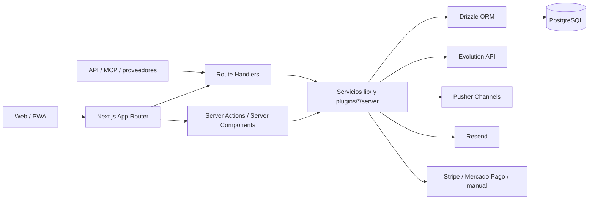
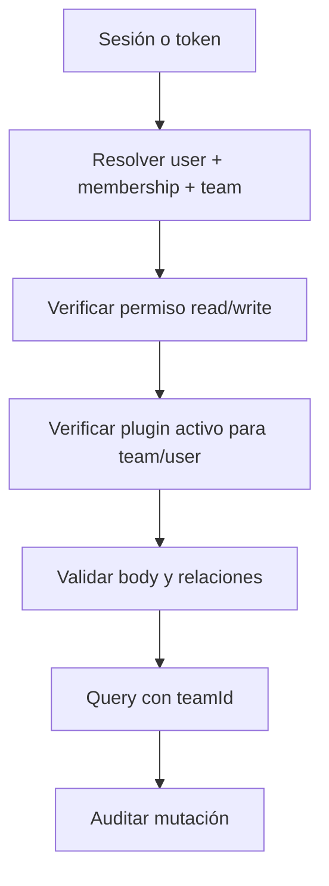
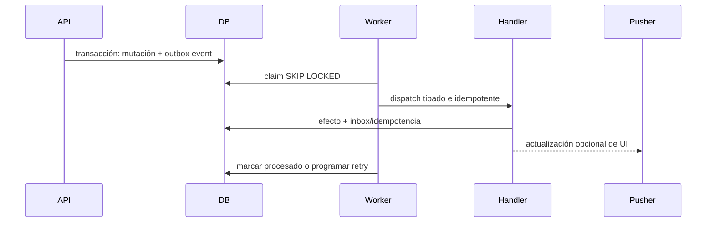

# Arquitectura actual de WhatsPro

> Auditoría técnica del repositorio real `/root/whatsaas` realizada el 14 de agosto de 2026. Este documento describe lo observado en código; no supone infraestructura ni contratos que no estén implementados.

## 1. Resumen ejecutivo

WhatsPro es hoy un monolito modular full-stack construido con Next.js App Router. El núcleo funcional, las APIs y los plugins se despliegan en el mismo proceso y comparten una única base PostgreSQL mediante Drizzle ORM. La modularidad de aplicación ya existe y debe ser el punto de extensión: hay un contrato de manifiesto, un registry, activación por sistema/equipo/usuario, navegación dinámica, un router común de páginas y convenciones `server/` + `ui/`.

La plataforma empresarial debe construirse dentro de ese sistema. No corresponde crear otro frontend, otro backend, otro auth, otro CRM ni otro gestor de tareas.

La secuencia arquitectónica correcta es:

1. **Reutilizar** `teams`, usuarios/membresías, permisos, contactos/clientes, ventas, membresías, tareas, documentos, calendario, notificaciones, auditoría y APIs existentes.
2. **Extender** esas entidades con relaciones y campos empresariales cuando conservan la misma identidad.
3. **Relacionar** por identificadores existentes y siempre dentro de `teamId`.
4. **Especializar** comportamiento en `lib/plugins/<plugin-id>/server` y UI en `ui`.
5. **Crear** una entidad solamente cuando no representa una entidad existente.

Hay cuatro brechas transversales que deben resolverse antes o durante la primera etapa:

- no existe un bus durable de eventos de dominio ni una cola general;
- el aislamiento multi-tenant depende de filtros manuales `teamId`, sin RLS ni repositorio central que lo fuerce;
- el guard genérico de plugins verifica permisos, pero no activación del plugin, y el router de páginas verifica activación pero no el permiso de ruta;
- el historial de migraciones tiene 75 SQL y 59 entradas de journal, con 16 SQL no registrados y prefijos numéricos duplicados.

## 2. Mapa tecnológico confirmado

| Capa | Implementación real | Evidencia |
|---|---|---|
| Framework | Next.js 16.1.1, App Router | `package.json`, `app/`, `next.config.ts` |
| Runtime UI | React 19.2.3, TypeScript estricto | `package.json`, `tsconfig.json` |
| Estilos | Tailwind CSS 4, tokens CSS semánticos, tema claro/oscuro | `app/globals.css`, `components/ui/*` |
| Componentes | Radix UI envuelto en componentes locales, Lucide | `components/ui/*`, `package.json` |
| Datos cliente | SWR; Server Components y Route Handlers en servidor | `components/interface/Sidebar.tsx`, `app/api/**/route.ts` |
| Formularios/validación | React Hook Form y Zod; su uso en APIs no es uniforme | `package.json`, rutas como `calendar/events/route.ts` |
| Base de datos | PostgreSQL | `docker-compose.yml`, `drizzle.config.ts` |
| ORM | Drizzle ORM + `postgres-js` | `lib/db/drizzle.ts`, `lib/db/schema.ts` |
| Auth web | cookie `session` con JWT HS256 (`jose`), password bcrypt | `lib/auth/session.ts` |
| API externa | API key heredada y tokens read-only con hash SHA-256 | `lib/auth/api.ts`, `lib/readonly-api/auth.ts` |
| Tiempo real | Pusher Channels por canal `team-{teamId}` | `lib/pusher-server.ts`, `providers/pusher-provider.tsx` |
| WhatsApp | Evolution API + webhook propio | `lib/evolution.ts`, `app/api/webhook/evolution/route.ts` |
| Email | Resend | `lib/email/index.ts` |
| Internacionalización | `next-intl`, locales `en`, `es`, `pt` | `i18n/request.ts`, `messages/*.json` |
| Edición/diagramas | Tiptap y XYFlow | `lib/plugins/documents`, `components/automation`, `package.json` |
| Despliegue actual | contenedor Node 20, bundle Next atómico, Docker Compose/Traefik | `docker-compose.yml`, `scripts/deploy-next.mjs` |

No se encontró una separación en servicios desplegables independientes. `app/api`, acciones de servidor, dominio y UI se compilan en la misma aplicación.



## 3. Frontend, rutas y navegación

### 3.1 App Router y layouts

- Las páginas localizadas viven bajo `app/[locale]`.
- Los grupos principales son `(login)`, `(dashboard)`, `(admin)` y `(reseller)`.
- `app/[locale]/layout.tsx` carga mensajes, branding por tenant, tema, SWR, Sonner y PWA.
- `app/[locale]/(dashboard)/layout.tsx` monta sidebar, navegación móvil, Pusher y notificaciones globales.
- Toda la rama localizada es `dynamic = 'force-dynamic'` porque el branding depende del `Host`.
- `middleware.ts` aplica i18n y protege una lista de rutas de página. El matcher excluye `api`, por lo cual **cada API debe autenticar y autorizar por sí misma**.

### 3.2 Navegación principal y aplicaciones

`components/interface/Sidebar.tsx` combina:

- entradas core fijas;
- feature flags del plan obtenidas de `/api/features/all`;
- permisos de miembro obtenidos de `/api/team/membership`;
- navegación de plugins obtenida de `/api/plugins/nav`;
- mini apps instaladas obtenidas de `/api/mini-apps`.

Los plugins orientados a aplicaciones se agrupan en el launcher `/apps`. El mapping de iconos es una allowlist de Lucide; un icono desconocido cae en `Plug`. El documento `lib/plugins/README.md` enumera pocos iconos y quedó desactualizado respecto de la allowlist real en `Sidebar.tsx`.

### 3.3 Sistema visual

La base visual reutilizable está en:

- `app/globals.css`: variables semánticas `background`, `foreground`, `primary`, `muted`, `border`, `ring`, charts y sidebar; Manrope; dark mode;
- `components/ui/*`: primitives locales basados principalmente en Radix;
- `components/theme-provider.tsx` y `lib/branding/theme.ts`: tema y personalización por marca blanca.

Un plugin nuevo no debe introducir un design system paralelo. Debe usar tokens semánticos, los componentes existentes, `next-intl` y patrones responsive del dashboard.

## 4. Persistencia y ORM

### 4.1 Base común

`drizzle.config.ts` declara:

- esquema: `lib/db/schema.ts`;
- migraciones: `lib/db/migrations`;
- dialecto: PostgreSQL;
- conexión: `POSTGRES_URL`.

`lib/db/drizzle.ts` crea un cliente `postgres-js` y expone `db = drizzle(client, { schema })`. Se contaron 129 declaraciones `pgTable` en el esquema central.

Patrones persistentes observados:

- entidades de equipo con `teamId` obligatorio y FK a `teams`;
- `createdAt`/`updatedAt` y, cuando corresponde, `createdBy`/`updatedBy`;
- índices que empiezan por `teamId` para consultas tenant-scoped;
- dinero representado mayormente como entero en unidad mínima, aunque también existe `decimal` en el esquema;
- datos flexibles en `jsonb` con tipos TypeScript;
- claves externas con `onDelete` explícito;
- sincronizaciones externas con `externalSource`/`externalId` e índices únicos por equipo.

### 4.2 Entidades núcleo que no deben duplicarse

| Dominio | Entidades existentes relevantes |
|---|---|
| Identidad y tenancy | `users`, `teams`, `teamMembers`, `departments`, `departmentMembers`, `invitations` |
| WhatsApp | `evolutionInstances`, `chats`, `messages`, `messageReactions`, `webhookEvents` |
| CRM | `contacts`, `contactTags`, `tags`, `customFields`, `funnelStages`, `funnelStageGroups` |
| Clientes/ventas | `teamCustomers`, `teamCustomerContacts`, `teamCustomerTransactions`, `teamSales` |
| Membresías | `teamMembershipCompanies`, `teamMembershipPlans`, `teamMembershipSubscriptions`, reglas y candidatos AAPP |
| Trabajo | `teamTaskWorkspaces`, `teamTaskProjects`, `teamTaskColumns`, `teamTaskItems`, relaciones, dependencias, media, plantillas, comentarios |
| Conocimiento | `teamNotes`, documentos/carpetas/links/media y artículos |
| Agenda | `teamEvents`, con departamento, usuario relacionado y contacto |
| Marketing | campañas, drafts, `social*`, `meta*` |
| Finanzas iniciales | `teamFinancialEntries`, `teamFinancialReceipts`, pagos manuales, auditoría y webhooks de pago |
| Plataforma | `teamPlugins`, `teamMemberPlugins`, `pluginSystemStates`, marketplace, notificaciones, auditoría |

### 4.3 Migraciones

- Hay 75 archivos SQL y 59 entradas en `lib/db/migrations/meta/_journal.json`.
- Hay prefijos duplicados: `0022`, `0035`, `0036`, `0037`, `0038`, `0039` y `0052`.
- Los siguientes SQL no figuran como tags del journal: `0013_landing_content`, `0020_marketplace_orders`, `0021_team_marketplace_entitlements`, `0022_apps_and_feature_requests`, `0022_plugin_activation_layers`, `0023_automation_templates`, `0024_docs_data_layer`, `0025_plans_hidden`, `0026_funnel_stage_groups`, `0027_funnel_stage_group_members`, `0028_custom_fields_position`, `0045_hostinger`, `0046_meta_ads`, `0047_meta_ads_tax_visibility`, `0048_documents`, `0049_desktop_preferences`.
- El README advierte explícitamente no ejecutar `pnpm db:migrate` a ciegas cuando el journal esté detrás del esquema real.
- `lib/plugins/core/service.ts` crea tablas de activación con `CREATE TABLE IF NOT EXISTS` en runtime. Esto da compatibilidad histórica, pero mezcla bootstrap de infraestructura con requests.

**Decisión para la expansión:** antes de sumar migraciones empresariales se debe reconciliar y documentar el baseline real. Cada migración nueva debe tener nombre único y monotónico, entrada de journal, forward migration idempotente cuando sea posible y rollback probado en una base efímera. No se deben esconder nuevas tablas detrás de `CREATE TABLE` ejecutado en una request.

## 5. Autenticación, autorización y multi-tenancy

### 5.1 Auth web

- `lib/auth/session.ts` firma un JWT HS256 con `AUTH_SECRET` y lo almacena en cookie `session`, `httpOnly`, `secure`, `sameSite=lax`, vigencia de un día.
- `middleware.ts` renueva la sesión y redirige páginas protegidas sin cookie.
- `getUser()` valida el token, vencimiento y `users.deletedAt`.
- Las contraseñas usan bcrypt con 10 rondas.
- La suplantación administrativa se representa como `impersonatedBy` dentro de la sesión.

### 5.2 Equipo activo

`getTeamForUser()` y `getUserMembership()` usan `findFirst` por `userId`. No existe selector de equipo activo en sesión/cookie ni constraint único visible sobre `team_members(user_id)` o `(team_id,user_id)`. Por lo tanto, el código actual presupone de facto una membresía relevante por usuario; si un usuario tuviera varias, la selección no sería explícita ni determinista desde el contrato de aplicación.

No debe ampliarse la plataforma multiempresa sin decidir una de estas dos invariantes:

1. imponer una sola membresía por usuario; o
2. introducir `activeTeamId` validado contra membresía en la sesión.

### 5.3 Roles y permisos

Existen dos niveles que no deben confundirse:

- `users.role`: rol de plataforma (`admin`, `owner`, `member`, `reseller`) en `lib/auth/roles.ts`;
- `teamMembers.role`: rol dentro del equipo (`owner`, `admin`, `agent`) y JSON `MemberPermissions` en `lib/permissions.ts`.

`MemberPermissions` contiene permisos core y por plugin, usualmente pares `*Read`/`*Write`. Los presets viven en `ROLE_PRESETS`; el mapa de páginas vive en `ROUTE_PERMISSIONS`; el mapa de permisos declarativos del manifest vive en `pluginPermissionMap` dentro de `lib/plugins/core/registry.ts`.

Guard servidor recomendado:

```ts
const context = await getPluginRequestContext('documentsWrite');
if (!context.ok) {
  return NextResponse.json({ error: context.message }, { status: context.status });
}
// Toda consulta y mutación usa context.team.id.
```

Para plugins desactivables, el guard debe además verificar activación, como hacen `getFinanceRequestContext()` y `getFormBuilderRequestContext()`.

### 5.4 API tokens

- `getAuthenticatedTeam()` admite sesión o una API key heredada almacenada en texto en `api_keys.key`.
- La API read-only nueva usa secretos `ro_live_*`, persiste solo SHA-256, admite revocación/vencimiento/scopes y limita a 120 requests/minuto con un mapa en memoria.
- El rate limit en memoria no es coordinado entre réplicas ni durable.
- Los conectores Grok guardan hashes unidireccionales de códigos/tokens y están ligados a equipo y usuario.

### 5.5 Invariante tenant

No hay Row-Level Security de PostgreSQL. El aislamiento depende de incluir `teamId` en cada query y validar que las entidades relacionadas pertenecen al mismo equipo.



Riesgo confirmado: varias FK son simples por `id`, no compuestas por `(team_id,id)`. Por ejemplo, la creación de `teamEvents` acepta `departmentId`, `relatedUserId` y `contactId`; la ruta valida formato pero no comprueba que esas entidades pertenezcan al mismo equipo. La FK evita IDs inexistentes, no relaciones cruzadas entre tenants. Los nuevos servicios deben cargar cada relación con `and(eq(entity.id, id), eq(entity.teamId, context.team.id))` antes de escribir.

## 6. Arquitectura real de plugins

### 6.1 Contrato

El contrato canónico está en `lib/plugins/core/types.ts`:

```ts
type AppPluginManifest = {
  id: string;
  displayName: string;
  activationMode: 'system' | 'global' | 'user' | 'hybrid';
  scopes: ('dashboard.nav' | 'dashboard.page' | 'admin.settings')[];
  routes: { path: string; title: string; scope: PluginScope }[];
  navItems: {
    label: string;
    href: string;
    icon?: string;
    order: number;
    requiredPermission?: string;
  }[];
  settingsSchema: ZodSchema;
  featureFlags: string[];
  install?: PluginLifecycleHandler;
  uninstall?: PluginLifecycleHandler;
};
```

Los 24 manifests existentes están registrados manualmente con imports dinámicos en `lib/plugins/core/registry.ts`. No hay autodiscovery por filesystem.

### 6.2 Activación

| Modo | Resolución actual |
|---|---|
| `system` | siempre activo; se fuerza en `teamPlugins` y `pluginSystemStates` |
| `global` | override de equipo; si falta, default del sistema |
| `user` | activo solo con fila `teamMemberPlugins.enabled = true` |
| `hybrid` | override de usuario; luego equipo; luego default del sistema |

Estado persistido:

- `pluginSystemStates`: default global por plugin;
- `teamPlugins`: instalación, activación y settings por equipo;
- `teamMemberPlugins`: override por usuario/equipo/plugin.

`marketplace` es `system`. `tasks` es `global` pero `ensureSystemPluginStateForTeam()` lo fuerza como siempre activo. Existe además un caso de bootstrap específico para Form Builder y ciertos emails, lo que conviene reemplazar a futuro por reglas explícitas de provisión/entitlement.

### 6.3 Routing UI

La página única `app/[locale]/(dashboard)/plugins/[pluginId]/[[...slug]]/page.tsx`:

1. obtiene equipo y usuario;
2. llama `resolvePluginRouteForTeam()`;
3. verifica que el plugin esté activo y que el path esté declarado en el manifest;
4. resuelve un renderer registrado manualmente en `lib/plugins/core/page-registry.tsx`.

El plugin debe registrar tanto el manifest como sus renderers. Si falta registry de renderer, el sistema entrega un placeholder para plugins sin entrada; si existe entrada pero ningún matcher coincide, retorna 404.

### 6.4 Permisos y brecha de activación

La navegación filtra `requiredPermission`, pero `resolvePluginRouteForTeam()` no comprueba ese permiso. Un usuario puede abrir por URL una página de un plugin global activo aunque la navegación esté oculta; la seguridad real debe estar en las APIs.

Asimismo, `getPluginRequestContext()` valida sesión, membresía y permiso, pero no activación. Esto permite que una API que use solo el guard genérico siga operativa aunque un plugin de usuario esté desactivado. Ejemplo confirmado: las rutas de Documentos usan `getPluginRequestContext('documentsRead'/'documentsWrite')`, mientras Finanzas y Form Builder envuelven el guard y sí consultan `resolveActivePluginsForTeam()`.

**Contrato requerido para la expansión:** un único `getActivePluginRequestContext(pluginId, permission)` debe comprobar sesión, membresía del equipo, permiso y activación. El router de página debe reutilizar el mismo criterio.

### 6.5 Anatomía correcta de un plugin

```text
lib/plugins/<plugin-id>/
├── manifest.ts                 # contrato y settings Zod
├── server/
│   ├── access.ts               # contexto activo + permiso
│   ├── schema.ts               # Zod del dominio/API, no Drizzle duplicado
│   ├── service.ts              # casos de uso tenant-scoped
│   └── ...
├── ui/
│   ├── <Plugin>Dashboard.tsx
│   └── ...
app/api/plugins/<plugin-id>/.../route.ts
lib/db/migrations/<id>_<plugin>.sql
```

Actualmente las tablas Drizzle se declaran en el monolítico `lib/db/schema.ts`; por compatibilidad, un plugin nuevo debe agregar allí únicamente las entidades que realmente necesite y no crear un ORM paralelo. La lógica de dominio sí debe permanecer encapsulada en el directorio del plugin.

```mermaid
flowchart LR
    Manifest[manifest.ts] --> Registry[core/registry.ts]
    Registry --> Activation[resolución system/team/user]
    Registry --> Nav[/api/plugins/nav]
    Activation --> Router[dashboard-loader]
    Router --> Pages[page-registry.tsx]
    Pages --> UI[plugin/ui]
    UI --> API[app/api/plugins/plugin]
    API --> Guard[active plugin + permission]
    Guard --> Service[plugin/server]
    Service --> Schema[(Drizzle schema + migration)]
```

### 6.6 Checklist obligatorio para crear un plugin real

1. Buscar entidades y servicios equivalentes en `lib/db/schema.ts`, `lib/plugins`, `app/api` y `lib/*`.
2. Definir límites: qué reutiliza, extiende, relaciona y, solo al final, qué crea.
3. Crear `manifest.ts` con ID estable, modo de activación, scopes, rutas, navegación, permisos, settings Zod y feature flags.
4. Registrar loader en `lib/plugins/core/registry.ts`.
5. Registrar renderers/matchers en `lib/plugins/core/page-registry.tsx`.
6. Añadir permisos read/write a `MemberPermissions`, todos los presets, `ROUTE_PERMISSIONS` y `pluginPermissionMap`.
7. Crear un access wrapper que valide **permiso + activación**.
8. Implementar dominio en `lib/plugins/<id>/server`, sin SQL ni SDKs externos desde la UI.
9. En cada query, derivar `teamId` del contexto; nunca confiar en `teamId` del body.
10. Validar con Zod body, params, estados, fechas y relaciones tenant-scoped.
11. Crear migración reconciliada e idempotencia para comandos/eventos reintentables.
12. Registrar auditoría de cada mutación relevante con actor, equipo, entidad y metadata suficiente.
13. Exponer Route Handlers bajo `app/api/plugins/<id>` con códigos 400/401/403/404/409/500 coherentes.
14. Incorporar UI con componentes/tokens existentes, `next-intl`, loading/empty/error y accesibilidad.
15. Publicar eventos de dominio mediante el contrato común que se defina; Pusher queda para actualización de UI, no como bus durable.
16. Añadir pruebas unitarias, integración DB, permisos, activación, multi-tenant, migración/rollback y regresión.
17. Documentar variables de entorno y pasos de despliegue.

## 7. APIs y convenciones de backend

Se contaron 278 Route Handlers, 151 bajo `app/api/plugins`. El patrón más consistente es:

- autenticar/autorizar al inicio;
- validar con Zod;
- delegar a servicio del plugin;
- filtrar todo por `context.team.id`;
- retornar `NextResponse.json` con status explícito;
- marcar endpoints dinámicos cuando corresponde.

Buenas referencias:

- `app/api/plugins/calendar/events/route.ts`: Zod, permisos read/write, validación de negocio y notificación;
- `app/api/plugins/documents/documents/route.ts`: Route Handler delgado, servicio y errores de dominio;
- `app/api/plugins/finance/overview/route.ts`: acceso especializado, consultas en paralelo y filtros de equipo;
- `app/api/contacts/import/route.ts`: validación tenant-scoped de varias referencias.

Brechas confirmadas:

- solo 63 de 151 rutas de plugins importan Zod; algunas pueden validar en servicios, por lo que esto es un indicador y no prueba individual de ausencia de validación;
- no existe un middleware común para envolver todas las APIs;
- hay más de un mecanismo de contexto (`getTeamForUser`, `checkRoutePermission`, `getPluginRequestContext`, wrappers especializados, API keys);
- `app/api/webhook/evolution/route.ts` identifica el tenant por `instanceName`, pero no valida `Authorization`, firma ni el `EVOLUTION_WEBHOOK_TOKEN` dentro del handler inspeccionado. Como `middleware.ts` excluye `/api`, el endpoint queda sin autenticación en esa capa;
- `api_keys.key` persiste secretos en texto, a diferencia de los tokens read-only y OAuth nuevos.

## 8. Eventos, jobs, queues y tiempo real

### 8.1 Lo que existe

- Pusher publica eventos de UI como `new-message`, `chat-list-update`, `contact-update`, `task-message-update` y `kanban-stage-update` en `team-{teamId}`.
- Evolution ingresa mensajes por webhook y dispara procesamiento de automatizaciones/IA.
- Pagos tienen webhooks validados e idempotentes mediante `paymentWebhookEvents`.
- `webhookEvents` registra procesamiento de Evolution, aunque no constituye un outbox.
- Los crons HTTP, protegidos por `CRON_SECRET`, son:
  - `aapp-sync`;
  - `membership-reminders`;
  - `publish-social`;
  - `send-scheduled`;
  - `sync-meta-ads`.
- Campañas usan estado en PostgreSQL y una llamada HTTP al procesador; mensajes programados y renovaciones usan tablas como cola operativa.

### 8.2 Lo que no existe

No se encontró paquete o infraestructura de BullMQ, RabbitMQ, Kafka, SQS, Inngest ni un Event Bus/domain-event dispatcher común. Tampoco se encontró patrón transactional outbox/inbox general.

Pusher no debe reutilizarse como bus de dominio: es transporte efímero para UI y sus errores a menudo se capturan para no bloquear el caso de uso. Los crons basados en polling tampoco proveen por sí solos orden, retry estándar, dead-letter ni semántica de entrega.

### 8.3 Decisión para la plataforma empresarial

Extender PostgreSQL primero con un outbox tenant-scoped y handlers idempotentes es la opción de menor divergencia arquitectónica. Un worker/cron puede reclamar eventos con locks y estados. Solo introducir una cola externa si volumen/latencia medidos lo justifican.

Contrato mínimo recomendado para consolidación (aún no implementado):

- `id`, `teamId`, `type`, `aggregateType`, `aggregateId`;
- `payload`, `metadata`, `occurredAt`;
- `status`, `attempts`, `nextAttemptAt`, `processedAt`, `lastError`;
- `idempotencyKey` única por productor/acción;
- inserción en la misma transacción que el cambio de dominio.



## 9. Notificaciones y auditoría

### Notificaciones

`teamNotifications` implementa una bandeja persistida simple con `teamId`, destinatario opcional, tipo, título, body, referencia de entidad, `readAt` y timestamps. Calendario y marketplace escriben allí. En paralelo, los mensajes entrantes generan avisos sonoros/browser desde `GlobalChatNotifications` usando Pusher y Service Worker/PWA.

Debe reutilizarse `teamNotifications` como inbox humano. Para email, WhatsApp o push, hace falta una capa de entrega con preferencias, intentos e idempotencia; esa capa no está generalizada hoy.

### Auditoría

- `activityLogs` registra `teamId`, `userId`, acción, timestamp e IP, con un enum limitado principalmente a auth/CRM.
- `resellerAuditEvents` es una auditoría más rica y durable, separada porque no siempre hay equipo.
- pagos tienen `paymentAuditEvents` y estados auditables específicos.
- el catálogo de apps registra activación/desactivación, pero usa el campo `ipAddress` para guardar el ID del plugin; es una sobrecarga semántica.

Para la plataforma empresarial, `activityLogs` no alcanza para auditoría de dominio: carece de entidad, ID, estado anterior/nuevo, metadata estructurada, correlation ID e idempotency key. Se debe extender o crear un audit envelope común relacionado con el equipo, conservando las tablas especializadas donde sean necesarias por cumplimiento.

## 10. Tests y calidad

Configuración confirmada:

- TypeScript `strict`, `noEmit`;
- 8 tests Node (`node:test`): 4 de automatización y 4 de resellers;
- scripts `test:automation` y `test:resellers` compilan subconjuntos a `/tmp` y ejecutan Node Test Runner;
- script `i18n:check`;
- build de Next mediante `scripts/build-next-preserve-static.mjs`;
- deploy atómico y verificación HTTP/static assets en `scripts/deploy-next.mjs`.

No se encontró workflow en `.github`, configuración de Playwright/Vitest/Jest ni suite automatizada de plugins, API, DB, permisos o multi-tenancy.

El DoD para nuevos plugins debe agregar como mínimo:

- tests unitarios del dominio;
- tests de Route Handlers para 400/401/403/404/409;
- integración PostgreSQL con migración adelante y rollback;
- matriz owner/admin/agent y read/write;
- dos equipos con IDs cruzados para probar aislamiento;
- plugin enabled/disabled en modos global/user/hybrid;
- reintentos e idempotencia de eventos/jobs;
- regresión de CRM, chats, tareas, documentos y membresías reutilizados.

## 11. Marca blanca y tenancy comercial

Existe un tenancy adicional por reseller/host, separado del tenancy operativo por `teamId`:

- `lib/tenant/context.ts` resuelve el host por request;
- `lib/tenant/resolve.ts` mapea dominios activos a reseller y branding;
- `teams.resellerId` es la fuente de verdad comercial para facturación;
- `app/[locale]/layout.tsx` aplica branding y variables CSS por tenant;
- middleware reescribe sitios publicados por slug/subdominio.

Los nuevos plugins deben aislar datos por `teamId`. El `resellerId` solo debe usarse cuando la política, entitlement, branding o facturación sea realmente de reseller. Nunca se debe inferir la propiedad de datos empresariales solamente desde el host.

## 12. Contratos comunes propuestos para la consolidación

Estos contratos son decisiones arquitectónicas recomendadas; **todavía no están implementados**:

1. **`PluginRequestContext` único:** `userId`, `teamId`, membership, permissions, plugin state y actor/impersonator.
2. **`DomainEventEnvelope`:** evento tipado, tenant, aggregate, versionado, idempotencia y correlation.
3. **`AuditEnvelope`:** actor, acción, entidad, before/after, metadata y request context.
4. **`EntityLink`:** relación transversal tipada cuando una FK concreta no sea apropiada; preferir FK real para relaciones estables.
5. **`Money`:** entero en unidad mínima + ISO currency; no mezclar flotantes.
6. **Errores de dominio comunes:** validation, unauthorized, forbidden, not found, conflict, dependency unavailable.
7. **Service boundary:** UI -> API/action -> servicio del plugin -> repositorio/Drizzle; nunca UI -> SDK proveedor.

No se recomienda crear un package independiente ni microservicios en esta primera expansión. Primero debe reducirse la inconsistencia dentro del monolito modular.

## 13. Hallazgos confirmados vs. brechas

### Confirmado

- Monolito modular Next.js + PostgreSQL + Drizzle.
- 24 plugins registrados con manifest y carga dinámica.
- Activación en cuatro modos y persistencia por sistema/equipo/usuario.
- Navegación y routing UI dinámicos.
- Permisos read/write por plugin y roles de equipo.
- `teamId` es el límite de datos operativo dominante.
- Pusher, crons HTTP, notificaciones persistidas, webhooks y auditorías parciales.
- APIs read-only y conectores OAuth/MCP ya constituyen una base de integración.
- Tareas, documentos, calendario, clientes, ventas, membresías y finanzas iniciales ya existen y deben extenderse.

### Brechas confirmadas

- Sin bus/outbox/inbox general ni cola durable común.
- Sin enforcement DB de tenant mediante RLS o claves compuestas.
- Sin selección explícita de equipo activo para usuarios con múltiples memberships.
- Permiso de navegación no aplicado por el router común de páginas.
- Activación no aplicada por el guard genérico de APIs.
- Webhook Evolution sin validación de secreto/firma observada.
- API keys heredadas almacenadas en texto.
- Migraciones desalineadas con journal y numeración duplicada.
- Validación API y formato de errores no uniformes.
- Auditoría general demasiado pobre para trazabilidad empresarial.
- Cobertura automatizada muy reducida y sin CI visible.
- Documentación de iconos de plugins desactualizada.

### No verificable solamente desde el repositorio

- estado real de migraciones aplicado en la base de producción;
- scheduler externo que invoca cada cron y su frecuencia;
- políticas de backup/restore y retención;
- configuración efectiva de Pusher, Resend, Evolution y proveedores;
- número de réplicas del proceso y topología real de Traefik;
- controles de red adicionales delante del webhook Evolution.

## 14. Riesgos priorizados

| Prioridad | Riesgo | Impacto | Mitigación previa a expansión |
|---|---|---|---|
| Crítica | filtros `teamId` omitidos o relaciones cruzadas | fuga/modificación entre clientes | contexto único, repositorios tenant-scoped y tests cruzados |
| Crítica | baseline de migraciones divergente | despliegues parciales o fallos de producción | backup, inventario real, reconciliación y pipeline de migración |
| Alta | APIs accesibles con plugin desactivado | bypass de entitlement/política | guard combinado activación + permiso |
| Alta | webhook Evolution no autenticado en aplicación | inyección/falsificación de eventos | verificar secreto/firma antes de parsear/procesar |
| Alta | ausencia de outbox/idempotencia general | efectos dobles o perdidos | outbox transaccional + handlers idempotentes |
| Alta | selección implícita de primer equipo | operaciones en tenant incorrecto | constraint o activeTeamId explícito |
| Media | auditoría fragmentada | diagnóstico y cumplimiento incompletos | audit envelope común |
| Media | rate limit read-only en memoria | límites distintos por réplica | store compartido si se escala horizontalmente |
| Media | poca automatización de pruebas | regresiones entre plugins | suites DB/API/permisos/tenant en CI |

## 15. Dependencias para el plan maestro

Antes de implementar los plugins empresariales, el coordinador debe resolver con los demás informes:

1. inventario único de entidades a reutilizar, especialmente clientes/contactos, proyectos/tareas, calendario y documentos;
2. modelo de evento/outbox y ownership de cada evento;
3. política de active team y aislamiento de relaciones;
4. envelope de auditoría;
5. reconciliación del historial de migraciones;
6. nomenclatura única de permisos y herramientas IA;
7. orden de extensión de Finanzas existente sin confundirla con pagos/facturación de la propia plataforma;
8. estrategia de relaciones transversales sin crear tablas polimórficas indiscriminadamente.

## 16. Registro del agente

### Archivos analizados

Se inspeccionaron, entre otros:

- `package.json`, `tsconfig.json`, `next.config.ts`, `drizzle.config.ts`, `middleware.ts`, `docker-compose.yml`, `.env.example`;
- `app/layout.tsx`, `app/[locale]/layout.tsx`, `app/[locale]/(dashboard)/layout.tsx`;
- `app/[locale]/(dashboard)/plugins/[pluginId]/[[...slug]]/page.tsx`;
- rutas representativas bajo `app/api`, `app/api/plugins`, `app/api/cron`, `app/api/readonly`, `app/api/v1` y `app/api/webhook`;
- `lib/db/schema.ts`, `lib/db/drizzle.ts`, `lib/db/queries.ts`, `lib/db/activity.ts`;
- los 75 SQL de `lib/db/migrations` y `lib/db/migrations/meta/_journal.json` a nivel de inventario, más migraciones representativas;
- `lib/auth/*`, `lib/permissions.ts`, `lib/tenant/*`, `lib/readonly-api/*`;
- `lib/plugins/README.md`, `lib/plugins/core/*`, los 24 manifests y servicios/rutas representativos;
- `lib/payments/plugin-types.ts`, `lib/payments/plugins/index.ts`;
- `components/interface/Sidebar.tsx`, `components/notifications/GlobalChatNotifications.tsx`, `components/ui/*`, `providers/*`;
- `tests/automation/*`, `tests/resellers/*` y sus tsconfig.

### Archivo modificado

- `docs/business-platform/00-arquitectura-actual.md` (este documento). No se modificó código compartido.

### Decisiones

- Mantener el monolito modular y el registry actual como base.
- Extender entidades existentes antes de crear tablas.
- Estandarizar un guard de plugin que combine auth, membership, permiso, activación y tenant.
- Usar outbox PostgreSQL antes de adoptar infraestructura externa de colas.
- Tratar Pusher únicamente como canal realtime de UI.
- Reconciliar migraciones antes de la primera migración empresarial.

### Riesgos

- aislamiento tenant manual;
- activación/permisos inconsistentes entre UI y API;
- historial de migraciones divergente;
- webhook Evolution sin autenticación observable;
- auditoría y pruebas insuficientes para la escala propuesta.

### Dependencias

- informes de Finanzas, Reuniones, Equipo, Clientes, Operaciones, Conocimiento, Inteligencia, Eventos e IA;
- decisión coordinada sobre eventos, auditoría, active team y migraciones;
- acceso a inventario de esquema real de producción antes de ejecutar DDL.
