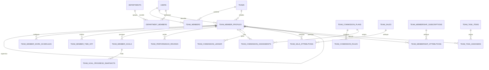
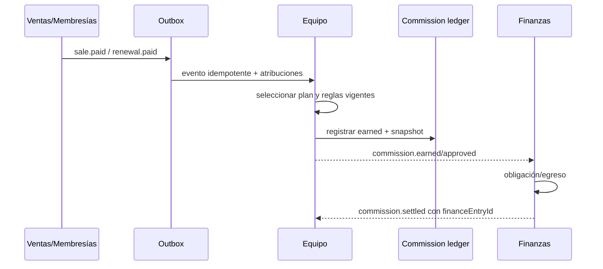

# Plugin Equipo

> Diseño técnico basado en la auditoría del repositorio real `/root/whatsaas` al 14 de agosto de 2026. No implementa código. Aplica estrictamente **REUTILIZAR → EXTENDER → RELACIONAR → ESPECIALIZAR → CREAR SOLO SI NO EXISTE**.

## 1. Decisión de producto

Equipo será una aplicación empresarial dentro del sistema de plugins actual. No será un directorio de usuarios alternativo, un sistema de autenticación, un segundo gestor de proyectos ni un payroll.

Su responsabilidad es convertir la identidad y actividad operativa ya existentes en una capa de gestión de personas:

- perfil empresarial por persona y equipo;
- estructura y responsables;
- objetivos y evaluaciones;
- horario, disponibilidad y ausencias;
- capacidad y carga calculadas sobre trabajo real;
- atribución y comisiones calculadas sobre ventas/membresías reales;
- consultas semánticas para dirección y agentes IA.

Nombre visible: **Equipo**. ID técnico propuesto: `team-management`, para no confundirlo con las rutas core `/api/team` ni con la entidad `teams`. Modo de activación recomendado: `global`, porque la configuración y los datos organizacionales pertenecen al equipo, no a un usuario aislado.

## 2. Resultado de la auditoría

### 2.1 Identidad y acceso existentes

| Entidad/servicio | Qué representa hoy | Decisión |
|---|---|---|
| `users` | identidad global, email, password, rol de plataforma, soft delete | **Reutilizar**; no guardar cargo, salario ni disponibilidad aquí |
| `teams` | tenant operativo y suscripción | **Reutilizar** como límite de datos |
| `teamMembers` | acceso de un usuario a un equipo, rol y permisos | **Reutilizar** para autorización; no duplicar membresías |
| `invitations` | invitaciones a un equipo | **Reutilizar** para altas |
| `departments` | departamentos por equipo | **Reutilizar y extender** |
| `departmentMembers` | relación muchos-a-muchos departamento/usuario | **Reutilizar y endurecer** |
| `activityLogs` | eventos básicos de auth/CRM y acciones textuales | **Reutilizar para auditoría**, no como métrica de productividad |

`users.role` es un rol de plataforma. `teamMembers.role` (`owner`, `admin`, `agent`) y `MemberPermissions` controlan acceso dentro del equipo. La información empresarial debe ser team-scoped: una misma identidad podría desempeñar cargos distintos en equipos distintos.

`getTeamForUser()` y `getUserMembership()` usan `findFirst` por usuario y no existe selección explícita de equipo activo. Este problema transversal debe resolverse antes de permitir múltiples relaciones laborales simultáneas.

### 2.2 Organización existente

`departments` contiene `teamId`, nombre y descripción. `departmentMembers` contiene `departmentId` y `userId`, con unicidad por par, pero no almacena `teamId`, condición de miembro activo, posición dentro del departamento ni indicador de departamento principal.

Las APIs actuales de departamentos (`app/api/departments/*`) validan pertenencia del departamento y del usuario al equipo al agregar miembros. Sin embargo, crear, editar, borrar y administrar miembros exige solamente una sesión con equipo; no aplica hoy un permiso administrativo específico. Equipo no debe duplicar esos endpoints: debe mover su lógica a un servicio compartido y endurecer autorización.

### 2.3 Trabajo y proyectos existentes

Tasks OS ya implementa:

- `teamTaskWorkspaces`;
- `teamTaskProjects`;
- `teamTaskColumns`;
- `teamTaskItems` y subtareas mediante `parentTaskId`;
- checklist, fechas, status y `completedAt`;
- múltiples ubicaciones, relaciones, dependencias, media, comentarios y plantillas;
- servicios tenant-scoped en `lib/plugins/tasks/server/task-os.ts`.

No existen en el modelo actual:

- responsable o varios responsables de tarea;
- miembros de proyecto;
- estimación de horas/minutos;
- registro de tiempo real;
- estado empresarial del proyecto más allá de sus columnas/tareas.

`createdBy` identifica quién creó una tarea/proyecto, no quién debe ejecutarlo. Por lo tanto no sirve para calcular carga ni desempeño.

### 2.4 Ventas existentes

`teamSales` ya almacena venta, contacto, items, importes enteros en unidad mínima, moneda, estados `draft/confirmed/paid/cancelled/refunded`, `paidAt`, vencimiento y auditoría de creación/edición.

No almacena vendedor ni reparto de atribución. `createdBy`/`updatedBy` describen autoría técnica; `contacts.assignedUserId` describe el agente actual del contacto y puede cambiar. Ninguno constituye evidencia confiable de quién vendió. No se deben calcular comisiones retroactivas con esos campos.

Los items de venta son JSON e incluyen `articleId`, nombre, cantidad, precio unitario y total. Son suficientes para reglas por producto si el ledger guarda el snapshot utilizado al calcular.

`teamMembershipSubscriptions` almacena precio, moneda, estado y `paymentStatus`, pero tampoco atribución comercial. Una comisión por renovación necesita atribución explícita y un evento de pago/renovación idempotente.

### 2.5 Agenda y disponibilidad existentes

`teamEvents` ya representa eventos con inicio/fin, asistentes, departamento, un `relatedUserId`, contacto, notas y estado. Equipo debe consumirlos para detectar conflictos y carga de reuniones; no debe crear otro calendario.

Limitaciones:

- `attendees` es una lista de strings, no participantes internos normalizados;
- solo existe un `relatedUserId`;
- no hay tipo de evento ni relación con ausencia;
- las rutas actuales no validan que `departmentId`, `relatedUserId` y `contactId` pertenezcan al mismo equipo.

El informe de Reuniones debe definir participantes normalizados. Equipo consumirá esa relación cuando exista.

### 2.6 Analítica y auditoría existentes

`app/[locale]/(dashboard)/analytics/actions.ts` ya calcula contactos por agente y etapa. Es una métrica comercial parcial, no desempeño integral. La función recibe un `teamId` y no realiza internamente autenticación, por lo que no debe reutilizarse directamente como servicio público sin un contexto seguro.

`activityLogs` registra acción, usuario, equipo, timestamp e IP. Sus acciones no representan esfuerzo, calidad ni resultados; incluso algunos módulos sobrecargan `ipAddress` con IDs o estados. **Cantidad de logs, mensajes enviados o tiempo conectado nunca será un KPI de desempeño.**

## 3. Aplicación del principio fundamental

### Reutilizar

- `users` para nombre/email e identidad;
- `teamMembers` para acceso, rol y permisos;
- `departments`/`departmentMembers` para estructura departamental;
- Tasks OS para proyectos, tareas, fechas y completitud;
- `teamSales` e items para resultado comercial;
- membresías para renovaciones;
- `teamEvents` para ocupación de agenda;
- `teamNotifications` para inbox humano;
- `activityLogs` y el audit envelope futuro para trazabilidad;
- registry, router, permisos y UI del sistema de plugins.

### Extender

- organización departamental con departamento principal y pertenencia tenant explícita;
- Tasks OS con responsables, integrantes de proyecto, estimaciones y, si Operaciones lo aprueba, tiempo real;
- ventas/membresías con atribuciones comerciales explícitas;
- calendario/reuniones con participantes internos normalizados;
- permisos con scopes sensibles de personas, desempeño y compensación.

### Relacionar

- perfil empresarial ↔ usuario/equipo/departamentos/responsable superior;
- objetivo ↔ persona/período/métrica fuente;
- capacidad ↔ horario − ausencias − compromisos;
- carga ↔ asignaciones de tareas/proyectos y estimaciones;
- desempeño ↔ objetivos + trabajo + ventas atribuidas + feedback;
- comisión ↔ atribución + venta/membresía + regla + ledger + Finanzas.

### Especializar

- reglas de disponibilidad, capacidad, objetivos y comisiones en `lib/plugins/team-management/server`;
- visualización y self-service en `lib/plugins/team-management/ui`;
- herramientas IA semánticas que llaman los mismos servicios.

### Crear

Solo se crean registros que no existen: perfil laboral, horarios, ausencias, objetivos, evaluaciones y configuración/ledger de comisiones.

## 4. Límites de dominio

### Equipo posee

- perfil y jerarquía laboral;
- horario contractual/operativo;
- solicitudes y aprobación de ausencias;
- objetivos y evaluaciones;
- reglas y ledger de comisiones;
- cálculo de capacidad de personas;
- políticas de visibilidad de información de personas.

### Otros módulos poseen

- autenticación, usuarios, invitaciones y roles: core;
- departamentos: core compartido, administrado desde Equipo sin copiarlo;
- tareas/proyectos/asignaciones/estimaciones/tiempo: Tasks OS + Operaciones;
- ventas e items: Ventas;
- suscripciones y renovaciones: Membresías;
- eventos/reuniones: Calendario + Reuniones;
- obligaciones/pago de comisiones: Finanzas;
- entrega de notificaciones: infraestructura transversal.

Equipo puede calcular y presentar datos de esos módulos, pero no reescribir su fuente de verdad.

## 5. Modelo conceptual



## 6. Modelo de datos propuesto

Todos los IDs relacionados se validan junto con `teamId` en servicios. Los nombres exactos deben consolidarse con Operaciones, Finanzas y Eventos antes de migrar.

### 6.1 `team_member_profiles` — crear

Perfil laboral team-scoped; no duplica credenciales ni identidad.

| Campo | Tipo conceptual | Regla |
|---|---|---|
| `id` | serial | PK |
| `teamId` | FK teams | obligatorio |
| `userId` | FK users | obligatorio mientras exista la identidad |
| `teamMemberId` | FK teamMembers nullable | vínculo con acceso actual; puede quedar null al offboarding |
| `managerProfileId` | self FK nullable | superior dentro del mismo equipo; sin ciclos |
| `jobTitle` | varchar(160) | cargo |
| `responsibilities` | text | descripción humana |
| `skills` | jsonb string[] | etiquetas normalizadas/validadas, no IDs inventados |
| `seniority` | varchar | `trainee/junior/mid/senior/lead/manager/director/custom` |
| `hireDate` | date nullable | no inferir de `joinedAt` |
| `employmentMode` | varchar | `onsite/remote/hybrid/contractor/custom` |
| `employmentStatus` | varchar | `active/on_leave/terminated` |
| `timezone` | varchar | IANA; default del equipo |
| `weeklyCapacityMinutes` | integer nullable | capacidad contractual; no horas trabajadas |
| `availabilityNote` | text | nota operativa, sin diagnóstico médico |
| `createdBy/updatedBy/createdAt/updatedAt` | auditoría | obligatorios según patrón |

Constraints/índices:

- unique `(teamId,userId)`;
- unique parcial `(teamId,teamMemberId)` cuando no sea null;
- índices `(teamId,employmentStatus)`, `(teamId,managerProfileId)`;
- check capacidad >= 0;
- el servicio impide que una persona sea su propio superior o genere ciclos.

Se elige `userId + teamId` como identidad laboral y `teamMemberId` nullable porque eliminar acceso no debe borrar evaluaciones/comisiones históricas. El proceso de offboarding desactiva acceso y marca el perfil `terminated`; no crea otro usuario.

### 6.2 `department_members` — extender, no reemplazar

Agregar de forma aditiva:

- `teamId`, backfilled desde `departments.teamId`;
- `isPrimary boolean default false`;
- `joinedAt`, `leftAt` opcionales si se necesita historia departamental.

Constraints:

- unique `(teamId,departmentId,userId)`;
- como máximo un departamento primario activo por `(teamId,userId)` mediante índice parcial;
- servicio que valida que departamento, usuario/team membership y perfil pertenecen al mismo equipo.

No agregar un `departmentId` paralelo al perfil: la relación existente continúa siendo la fuente de verdad.

### 6.3 `team_member_work_schedules` — crear

Versiona horarios sin sobrescribir historia:

- `teamId`, `profileId`;
- `timezone` IANA;
- `weeklySchedule` JSON validado: día, intervalos `[start,end]`, minutos de descanso;
- `effectiveFrom`, `effectiveTo` nullable;
- `isDefault`, `createdBy`, timestamps.

La API impide intervalos solapados, minutos negativos y dos horarios efectivos simultáneos. JSON es apropiado porque los siete días forman un agregado único que se valida completo; no se usa para métricas libres.

### 6.4 `team_member_time_off` — crear

- `teamId`, `profileId`;
- `type`: `vacation/sick_leave/license/personal/absence/other`;
- `startsAt`, `endsAt`, `allDay`, zona horaria;
- `requestedMinutes` calculados según horario;
- `status`: `requested/approved/rejected/cancelled`;
- `reason` breve y `privateNotes` con acceso restringido;
- `reviewedByProfileId`, `reviewedAt`, `reviewNote`;
- `calendarEventId` nullable solo si Calendario decide mantener una proyección;
- actor/timestamps.

Una ausencia aprobada es fuente de verdad en esta tabla. Calendario debe mostrarla mediante feed agregado o proyección idempotente, nunca mediante una segunda carga manual.

### 6.5 `team_member_goals` — crear

- `teamId`, `profileId`, `ownerManagerProfileId`;
- `type`: `commercial/operational/personal`;
- `title`, `description`;
- `cadence`: `monthly/quarterly/custom`;
- `periodStart`, `periodEnd`;
- `metricKey` nullable para fuentes calculables;
- `measurementMode`: `automatic/manual/hybrid`;
- `targetValue` decimal o bigint escalado, `unit`, `direction` (`increase/decrease/maintain`);
- `weightBps` entre 0 y 10000;
- `visibility`: `private/manager/team`;
- `status`: `draft/active/achieved/missed/cancelled`;
- timestamps y actores.

Métricas automáticas inicialmente admitidas:

- `sales.paid_amount_attributed`;
- `sales.paid_count_attributed`;
- `tasks.completed_assigned`;
- `tasks.on_time_rate_assigned`;
- `projects.completed_participated` cuando Operaciones defina estado;
- `customers.converted_attributed` solo con atribución verificable.

No se aceptan expresiones SQL arbitrarias ni nombres de tabla enviados desde la UI.

### 6.6 `team_goal_progress_snapshots` — crear

Permite explicar historia y ajustes:

- `teamId`, `goalId`, `measuredAt`;
- `value`, `source`, `sourceWindowStart/End`;
- `breakdown` JSON limitado con conteos/IDs fuente;
- `isManualAdjustment`, `note`, `createdBy`;
- idempotency key para snapshots automáticos.

El valor actual puede calcularse en vivo; los snapshots preservan cierres y auditoría. Una corrección manual no modifica ventas/tareas subyacentes.

### 6.7 `team_performance_reviews` — crear

- `teamId`, `profileId`, `reviewerProfileId`;
- `periodStart`, `periodEnd`;
- `status`: `draft/shared/acknowledged/closed`;
- `rating` nullable y escala declarada;
- `summary`, `strengths`, `improvements`, `feedback`, `nextSteps`;
- `metricSnapshot` JSON con claves, valores, fuente y fecha;
- `sharedAt`, `acknowledgedAt`, timestamps.

La evaluación humana es distinta de las métricas. La IA puede preparar un borrador explicable, pero nunca publicar, sancionar ni modificar compensación automáticamente.

### 6.8 Asignación de trabajo — extensión compartida con Operaciones

Equipo consume; Operaciones debe ser owner técnico de:

- `team_task_assignees(teamId,taskId,profileId,role,allocationBps,assignedAt,assignedBy)`;
- `team_project_members(teamId,projectId,profileId,role,allocationBps,joinedAt,leftAt)`;
- `estimatedMinutes` o una tabla de estimaciones versionadas;
- time entries si se aprueba registrar horas reales.

No se utilizará `createdBy` como assignee. Si una tarea no tiene estimación, la carga se reporta como cantidad de tareas, no como horas ficticias.

### 6.9 Atribución comercial — extensión compartida con Ventas/Membresías

Crear relaciones explícitas, no inferidas:

`team_sale_attributions`:

- `teamId`, `saleId`, `profileId`;
- `role`: `seller/closer/assistant/manager`;
- `shareBps`, entre 0 y 10000;
- `attributedAt`, `attributedBy`;
- unique `(saleId,profileId,role)` y suma validada <= 10000 para roles comisionables.

`team_membership_attributions`:

- igual patrón con `subscriptionId`;
- `role`: `seller/renewal_owner/assistant`;
- vigencia opcional para cambios de responsable de renovación.

Las atribuciones deben quedar congeladas o versionadas al ocurrir `sale.paid`/renovación pagada. Cambiar hoy el agente del contacto no altera comisiones pasadas.

### 6.10 Comisiones — crear

#### `team_commission_plans`

- nombre, moneda/política multimoneda, base (`gross/net/paid`), trigger (`confirmed/paid`), vigencia y estado.

#### `team_commission_rules`

- `planId`, prioridad;
- `ruleType`: `percentage/fixed/tiered/product/renewal/goal_bonus`;
- `rateBps`, `fixedAmount`, currency;
- `articleId` nullable para producto;
- `thresholds` JSON validado y ordenado para escalas;
- filtros explícitos de status/rol;
- vigencia.

#### `team_commission_assignments`

- `teamId`, `profileId`, `planId`, `effectiveFrom/To`;
- unique de vigencia no solapada por perfil/plan.

#### `team_commission_ledger`

- `teamId`, `profileId`, `ruleId`;
- exactamente uno entre `saleId` y `membershipSubscriptionId` mediante check;
- `sourceEventId`/idempotency key;
- `basisAmount`, `commissionAmount`, `currency` en unidad mínima;
- `calculationSnapshot` JSON con regla, items, atribución y redondeo;
- `status`: `provisional/earned/approved/settled/reversed`;
- `reversesLedgerId` nullable;
- `financeEntryId` nullable cuando Finanzas registre obligación/pago;
- timestamps y actores.

Un índice único por `(teamId, sourceEventId, profileId, ruleId)` impide duplicación por retry. Reembolsos/cancelaciones crean reversas; no borran ledger. Importes de monedas distintas no se suman sin una política FX de Finanzas.

## 7. Cálculos y reglas de negocio

### 7.1 Capacidad y disponibilidad

Para un período y persona:

```text
capacidad_programada = minutos del horario efectivo
capacidad_neta = capacidad_programada - ausencias aprobadas
carga_estimada = suma(estimación × allocationBps) de tareas activas superpuestas
utilización = carga_estimada / capacidad_neta
```

Las reuniones pueden mostrarse como **ocupación de agenda** separada. Restarlas de capacidad productiva será una opción de política, porque en algunos equipos las reuniones son trabajo y no indisponibilidad.

Estado “disponible ahora” considera:

- horario y zona de la persona;
- ausencia aprobada vigente;
- evento bloqueante vigente;
- estado laboral activo;
- carga asignada, presentada como recomendación y no como certeza.

Si no existen assignees o estimaciones, el resultado incluye `dataCompleteness` y muestra tareas abiertas/atrasadas, sin fabricar horas.

### 7.2 Desempeño

Desempeño es una vista explicable, no un score opaco. Fuentes:

- avance de objetivos;
- tareas asignadas completadas y a tiempo;
- tareas atrasadas;
- proyectos en los que participa;
- ventas pagadas explícitamente atribuidas;
- feedback/evaluaciones;
- opcionalmente satisfacción/SLA cuando Clientes y Soporte lo provea.

Cada métrica responde: período, numerador, denominador, fuente y completitud. No se compara a personas con roles/períodos distintos sin que el usuario solicite una dimensión comparable.

### 7.3 Comisiones

Flujo:



Reglas:

- porcentaje usa basis × bps / 10000 con redondeo documentado;
- fija usa importe de regla;
- escalonada selecciona tramo según métrica acumulada del período;
- producto calcula solo sobre líneas coincidentes;
- renovación requiere atribución vigente de la suscripción;
- bonus por objetivo se dispara al cerrar el objetivo, una sola vez;
- `preview` no escribe; `calculate/finalize` requiere idempotency key;
- aprobación y pago son acciones separadas.

## 8. Permisos y privacidad

Extender `MemberPermissions`, presets, `ROUTE_PERMISSIONS` y `pluginPermissionMap` con:

- `teamManagementRead`: directorio y datos organizacionales no sensibles;
- `teamManagementWrite`: perfiles, jerarquía y departamentos;
- `teamGoalsManage`: objetivos ajenos y ciclos;
- `teamPerformanceRead` / `teamPerformanceWrite`;
- `teamAvailabilityManage`: aprobar/rechazar ausencias y editar horarios ajenos;
- `teamCompensationRead` / `teamCompensationWrite`.

Política de campo:

| Actor | Puede ver/editar |
|---|---|
| Owner | todo, incluida compensación, salvo privacidad legal configurada |
| Admin/HR autorizado | organización, horarios, ausencias y desempeño según permisos; compensación no implícita |
| Manager | reportes directos, objetivos/feedback y disponibilidad; compensación solo con scope |
| Miembro | directorio básico, su perfil editable permitido, sus horarios, ausencias, objetivos/reviews compartidas y sus comisiones |
| Agente IA | exactamente los permisos/scopes del usuario conectado; nunca privilegio propio |

`privateNotes`, objetivos personales, feedback y compensación no deben salir en endpoints generales ni en Pusher. Las respuestas IA deben redaccionar PII y datos salariales sin `teamCompensationRead`.

Todas las APIs usan un futuro `getActivePluginRequestContext('team-management', permission)`, derivan `teamId` del contexto y validan relaciones por `(teamId,id)`.

## 9. APIs propuestas

Base: `/api/plugins/team-management`.

| Método y ruta | Uso | Regla principal |
|---|---|---|
| `GET /overview` | KPIs de equipo y alertas | rango obligatorio/acotado |
| `GET /members` | directorio filtrable | proyección no sensible |
| `GET /members/:id` | ficha empresarial | field-level policy |
| `PATCH /members/:id` | perfil/jerarquía | write + validación de ciclo |
| `GET /members/:id/workload` | carga/capacidad explicada | fuentes y completitud |
| `GET/POST /schedules` | horarios propios/administrados | vigencias no solapadas |
| `GET/POST /time-off` | listar/solicitar ausencia | self o manage |
| `POST /time-off/:id/decision` | aprobar/rechazar | manage; no autoaprobar propia |
| `GET/POST /goals` | objetivos | subject/visibility policy |
| `PATCH /goals/:id` | editar/cerrar | lock al cerrar período |
| `GET /performance` | métricas explicables | período + perfiles permitidos |
| `POST /reviews` | borrador de evaluación | reviewer autorizado |
| `POST /reviews/:id/share` | publicar | confirmación humana |
| `GET/POST /commission-plans` | configurar reglas | compensationWrite |
| `GET /commissions` | ledger propio/equipo | policy sensible |
| `POST /commissions/preview` | simulación sin persistencia | no altera ledger |
| `POST /commissions/calculate` | cálculo idempotente | event/idempotency key |
| `POST /commissions/:id/approve` | aprobar | segregación configurable |

Departamentos continúan en `/api/departments`, pero se refactorizan a un servicio compartido con Zod, `teamManagementWrite`, auditoría y validación tenant. No se crean rutas espejo.

Respuestas analíticas incluyen:

```json
{
  "period": { "from": "...", "to": "...", "timezone": "..." },
  "data": [],
  "sources": ["team_task_assignees", "team_member_time_off"],
  "dataCompleteness": { "hasAssignments": true, "hasEstimates": false },
  "generatedAt": "..."
}
```

## 10. UI propuesta

Manifest:

- route principal `/plugins/team-management`;
- navegación “Equipo”, icono Lucide soportado;
- settings: timezone, semana laboral, política de disponibilidad y comisión;
- rutas internas `/members/:id`, `/goals`, `/availability`, `/performance`, `/commissions`.

### Panel Equipo

- métrica principal: capacidad disponible de la semana con completitud;
- secundarios: personas disponibles, ausencias próximas, tareas atrasadas asignadas, objetivos en riesgo;
- lista operativa: “requiere decisión” (ausencias, reviews, comisiones);
- no usar ranking general como hero.

### Directorio

- tarjetas/tabla con persona, cargo, departamentos, superior, skills, seniority, modalidad y estado;
- búsqueda y filtros;
- acciones visibles según permiso;
- estados loading/empty/error.

### Ficha de persona

Tabs o secciones:

1. Perfil y responsabilidades.
2. Organización y skills.
3. Objetivos.
4. Desempeño explicable.
5. Disponibilidad/horario/ausencias.
6. Trabajo: proyectos y tareas asignadas enlazando Tasks OS.
7. Comercial: ventas atribuidas.
8. Comisiones, solo con permiso.
9. Historial auditable.

### Disponibilidad

- calendario reutilizado o timeline semanal, no calendario paralelo;
- horario base, ausencias y eventos diferenciados;
- capacidad por persona/departamento;
- alerta de datos incompletos.

### Objetivos y desempeño

- ciclos mensuales/trimestrales;
- objetivo, progreso, fuente y evidencia;
- reviews con flujo draft → shared → acknowledged;
- comparaciones solo entre métricas comparables.

### Comisiones

- simulador antes de guardar;
- planes/reglas con vigencia;
- ledger por persona, source, estado y moneda;
- reversas visibles;
- link a venta/membresía y registro financiero.

La UI usa `components/ui`, tokens de `app/globals.css`, Manrope, Lucide, SWR y `next-intl`; incluye foco visible, teclado, contraste, reduced motion y responsive.

## 11. Eventos

El repositorio no tiene aún bus durable general. Estos nombres son contrato conceptual a consolidar con `80-integracion-eventos.md` y deben publicarse mediante outbox transaccional:

### Produce Equipo

- `team.member.profile_updated`;
- `team.member.manager_changed`;
- `team.member.schedule_updated`;
- `team.time_off.requested`;
- `team.time_off.approved`;
- `team.time_off.rejected`;
- `team.time_off.cancelled`;
- `team.goal.created`;
- `team.goal.progress_updated`;
- `team.goal.achieved`;
- `team.performance.review_shared`;
- `team.commission.calculated`;
- `team.commission.approved`;
- `team.commission.reversed`;
- `team.commission.settled`.

### Consume

- `team.member.joined/removed`;
- `task.assigned/completed/reopened/overdue`;
- `project.member_added/completed`;
- `sale.paid/refunded/cancelled`;
- `membership.renewal_paid/refunded`;
- `meeting.created/updated/cancelled/finished`;
- `finance.commission_settled`.

Handlers de comisión y objetivos son idempotentes. Pusher puede refrescar UI después del commit, pero no transporta eventos de dominio ni datos sensibles.

## 12. Herramientas IA y conectores

Los conectores actuales registran tools semánticas en Grok y exponen MCP para Grok/ChatGPT/Claude. Equipo debe añadir servicios comunes y adaptadores delgados, no reimplementar lógica por proveedor.

### Tools read-only prioritarias

| Tool semántica | Responde |
|---|---|
| `obtener_capacidad_equipo` | capacidad, carga, utilización y completitud por período/departamento |
| `listar_personas_disponibles` | quién está disponible en una ventana y por qué |
| `recomendar_responsable` | candidatos según skills, disponibilidad y carga, con evidencia |
| `listar_tareas_atrasadas_por_responsable` | atrasos reales de Tasks OS |
| `obtener_desempeno_equipo` | métricas comparables con fuentes y período |
| `obtener_resultados_comerciales_equipo` | quién vendió más según atribuciones pagadas |
| `obtener_objetivos_en_riesgo` | objetivos atrasados o sin datos |
| `calcular_comisiones` | preview por período/persona/plan, sin persistir por defecto |
| `listar_ausencias` | disponibilidad autorizada según scopes |

`recomendar_responsable` nunca asigna por sí sola. Devuelve factores y advertencias: skills coincidentes, capacidad neta, reuniones, tareas vencidas, zona horaria y datos faltantes.

### Tools mutables opcionales

- `crear_objetivo_equipo`;
- `solicitar_ausencia`;
- `actualizar_perfil_empresarial`;
- `finalizar_calculo_comisiones`.

Requieren permiso write, validación, confirmación explícita para operaciones sensibles, idempotency key y auditoría. Aprobar ausencias, compartir evaluaciones o aprobar comisiones no debe ser una consecuencia implícita de una consulta.

### Respuestas a preguntas solicitadas

- “¿Quién tiene mayor carga?” → compara carga estimada/capacidad en el mismo rango; si faltan estimaciones, compara conteos y lo declara.
- “¿Quién está disponible?” → horario − ausencia + conflictos de agenda.
- “¿Quién debería atender este proyecto?” → recomendación explicable, no decisión automática.
- “¿Quién vendió más?” → solo ventas pagadas con atribución explícita, agrupadas por moneda o convertidas por Finanzas.
- “¿Quién tiene tareas atrasadas?” → tasks asignadas, status no completado y `dueDate < now`.
- “Calculá las comisiones” → preview reproducible; finalización separada e idempotente.

Privacidad: la IA no recibe notas médicas, feedback privado, objetivos personales ni compensación sin el permiso específico del actor.

## 13. Auditoría y notificaciones

Mutaciones relevantes escriben el audit envelope transversal con actor, impersonator, equipo, entidad, before/after, correlation ID e idempotency key. `activityLogs` puede recibir una entrada resumida para compatibilidad, pero no se sobrecarga `ipAddress` con IDs.

`teamNotifications` se reutiliza para:

- solicitud/decisión de ausencia;
- objetivo próximo a vencer;
- review compartida;
- comisión disponible/aprobada/revertida;
- conflicto grave de capacidad.

Destinatario y contenido respetan privacidad. Emails/WhatsApp se delegan a la futura capa de entrega, no se envían directamente desde el dominio de Equipo.

## 14. Migraciones y rollback

### Precondición

Reconciliar primero el baseline de Drizzle: el repositorio contiene 75 SQL y 59 entradas de journal. No numerar ni aplicar migraciones de Equipo antes de resolver esa divergencia.

### Secuencia aditiva

1. Añadir permisos y manifest, deshabilitado durante rollout.
2. Crear `team_member_profiles`, schedules, time off, goals, snapshots y reviews.
3. Backfill de perfiles desde `(teamId,userId)` de `teamMembers`; `hireDate` queda null, no se copia `joinedAt` como fecha laboral.
4. Extender `departmentMembers` con `teamId` nullable, backfill desde departamento, validar, luego `NOT NULL`; no seleccionar departamento primario automáticamente si una persona tiene varios.
5. Crear tablas de planes/reglas/asignaciones/ledger de comisión.
6. En migraciones coordinadas, crear assignees de Tasks OS y atribuciones comerciales. No backfill desde `createdBy` ni agente actual.
7. Crear índices/checks/FKs luego de validar datos.
8. Registrar outbox handlers y jobs de snapshots detrás de feature flag.
9. Activar primero para un equipo piloto y verificar aislamiento.

### Rollback operativo

1. Desactivar plugin y jobs/consumidores.
2. Detener generación de ledger/snapshots.
3. Mantener tablas y datos para rollback de aplicación sin pérdida.
4. Revertir adaptadores UI/API y permisos cuando ningún consumidor los use.

### Rollback DDL

Solo en desarrollo o con backup/export confirmado:

- quitar FKs compartidas en orden inverso;
- eliminar columnas aditivas de `departmentMembers` después de restaurar constraints anteriores;
- eliminar tablas de Equipo desde ledger hacia perfiles;
- no borrar atribuciones/ledger en producción como rollback normal.

Cada migration debe tener script inverso probado en PostgreSQL efímero, aunque producción prefiera rollback lógico.

## 15. Testing

### QA funcional

- alta y edición de perfil sin modificar `users`;
- jerarquía sin ciclos;
- múltiples departamentos y uno primario;
- solicitud, aprobación, rechazo y cancelación de ausencia;
- objetivos automáticos/manuales y reviews;
- preview/cálculo/aprobación/reversa de comisión.

### QA backend/DB

- checks, FKs, índices y vigencias no solapadas;
- cálculos de horarios con zonas/DST;
- redondeo de bps, tiers, items y monedas;
- idempotencia ante retry de `sale.paid`;
- refund crea reversa, no delete;
- fechas límite y períodos vacíos.

### QA permisos y privacidad

- owner/admin/manager/member;
- self vs report directo vs ajeno;
- compensation scopes;
- objetivos privados y feedback;
- respuestas de tools IA redaccionadas.

### QA multi-tenant

Para cada endpoint/tool, crear team A y B e intentar:

- IDs de perfil, departamento, tarea, proyecto, venta y suscripción cruzados;
- superior de otro team;
- regla/plan de otro team;
- aprobación de ausencia de otro team;
- evento con `teamId` inconsistente.

Todos deben responder 404/403 sin revelar existencia.

### QA integración

- Tasks OS asigna/completa/reabre y actualiza carga/objetivos;
- Venta paga/refunda y actualiza ledger una vez;
- Membresía renueva/refunda;
- ausencia aprobada aparece en calendario sin duplicados;
- comisión aprobada crea obligación financiera una vez;
- notificaciones y outbox reintentan sin duplicar.

### QA regresión

- login/invitaciones/roles;
- departamentos actuales;
- CRM assignment/chat visibility;
- Tasks OS completo;
- Ventas y Membresías;
- Calendario;
- analytics existente.

## 16. Fases de implementación

### Fase 0 — contratos transversales

- reconciliar migraciones;
- contexto único de plugin activo + permisos;
- active team explícito;
- outbox/audit envelope;
- acordar ownership con Operaciones, Ventas, Membresías y Finanzas.

### Fase 1 — directorio y estructura

- manifest/registry/router;
- perfiles, jerarquía y departamentos endurecidos;
- UI directorio/ficha;
- self-service limitado;
- permisos y tests tenant.

### Fase 2 — disponibilidad

- horarios versionados;
- ausencias y aprobaciones;
- feed integrado a Calendario;
- capacidad base y tools de disponibilidad.

### Fase 3 — trabajo y objetivos

- assignees/miembros de proyecto coordinados con Operaciones;
- estimaciones;
- goals y snapshots;
- carga, atrasos y recomendación de responsable.

### Fase 4 — desempeño

- métricas explicables;
- reviews y feedback;
- tendencias sin score opaco;
- tools de desempeño.

### Fase 5 — comisiones

- atribución comercial obligatoria;
- planes/reglas/ledger;
- eventos de ventas/membresías;
- integración Finanzas;
- tools preview/finalize y QA monetario.

## 17. Criterios de aceptación

Equipo estará completo cuando:

- no haya tabla de usuarios paralela;
- toda persona esté ligada a identidad y equipo reales;
- departamento/manager/relaciones sean tenant-safe;
- disponibilidad use horario y ausencias reales;
- carga use asignaciones reales y declare datos faltantes;
- ventas/comisiones usen atribución explícita, no `createdBy`;
- refund/renewal/retry sean idempotentes;
- perfiles, objetivos, feedback y compensación tengan field-level privacy;
- APIs, UI, eventos, auditoría, herramientas IA y tests estén implementados;
- migración y rollback estén probados;
- no haya regresiones en auth, CRM, Tasks OS, Ventas, Membresías ni Calendario.

## 18. Riesgos y dependencias

| Riesgo | Impacto | Mitigación |
|---|---|---|
| inferir assignee/vendedor desde `createdBy` | carga y comisiones falsas | atribución explícita; sin backfill inventado |
| perfiles ligados solo a acceso borrable | pérdida de historia | perfil team/user persistente y offboarding |
| score de desempeño opaco | decisiones injustas | métricas explicables + revisión humana |
| moneda múltiple | totales/comisiones incorrectos | agrupar por currency; FX de Finanzas |
| datos privados en IA/Pusher | fuga interna | field policy, scopes y redacción |
| ausencia y evento duplicados | disponibilidad doblemente restada | source única + proyección idempotente |
| carreras en pago/refund | ledger duplicado | outbox, unique idempotency, transacciones |
| solapamiento con Operaciones | tablas duplicadas | ownership formal de assignees/tiempo |
| migraciones actuales divergentes | despliegue inseguro | reconciliar antes de DDL |

Dependencias obligatorias:

- `00-arquitectura-actual.md`: contexto, permisos, multi-tenancy, plugins y migraciones;
- Operaciones: assignees, miembros de proyecto, estimaciones y tiempo;
- Ventas: atribución y eventos de estado;
- Membresías: atribución de renovación y pago;
- Finanzas: obligación/pago/reversa de comisiones y FX;
- Reuniones: participantes internos y ocupación;
- Eventos: outbox, contratos e idempotencia;
- IA/conectores: registro común de herramientas y policies.

## 19. Registro del agente

### Archivos analizados

- `lib/db/schema.ts` (usuarios, equipos, membresías, departamentos, actividad, ventas, membresías comerciales, eventos y Task OS);
- `lib/db/queries.ts`, `lib/db/activity.ts`;
- `lib/auth/permissions-guard.ts`, `lib/permissions.ts`;
- `app/api/team/*`, `app/api/departments/*`;
- `app/[locale]/(dashboard)/settings/page.tsx` y activity page;
- `lib/plugins/tasks/server/task-os.ts`, `workspaces.ts`, tipos, hooks/UI y `app/api/plugins/tasks/*`;
- `lib/plugins/sales/manifest.ts`, UI y `app/api/plugins/sales/*`;
- `lib/plugins/memberships` y rutas de subscriptions;
- `lib/plugins/calendar` y rutas de events;
- `app/[locale]/(dashboard)/analytics/actions.ts`, page y componentes;
- `lib/plugins/grok-connector/server/actions.ts`, `extended-actions.ts`, OAuth/dashboard;
- core de plugins y patrones de permisos descritos en la auditoría general;
- inventario de migraciones y tests relevante.

### Archivo modificado

- `docs/business-platform/30-equipo.md` (este documento). No se modificó código central.

### Decisiones

- Equipo es un plugin global, no un segundo sistema de usuarios.
- Perfil laboral es team-scoped y conserva historia separada del acceso.
- Departments, Tasks OS, Ventas, Membresías y Calendario siguen siendo fuentes de verdad.
- Assignees y atribuciones son explícitos; jamás se infieren desde autoría.
- Desempeño es explicable y revisión humana; no score automático opaco.
- Comisiones usan ledger inmutable/reversible e integración con Finanzas.
- IA comparte servicios, permisos e idempotencia con las APIs.

### Riesgos

- falta actual de atribución de trabajo y ventas;
- privacidad de desempeño/compensación;
- divergencia de migraciones;
- event bus todavía inexistente;
- fronteras compartidas con Operaciones y Finanzas.

### Dependencias

- contratos consolidados de Eventos, Operaciones, Finanzas, Reuniones e IA;
- definición de active team;
- reconciliación del esquema real de producción;
- aprobación de políticas laborales, privacidad, moneda y comisión por cada tenant.
