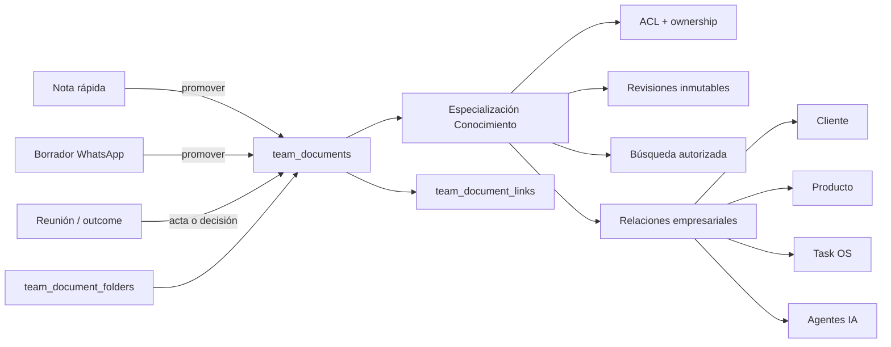
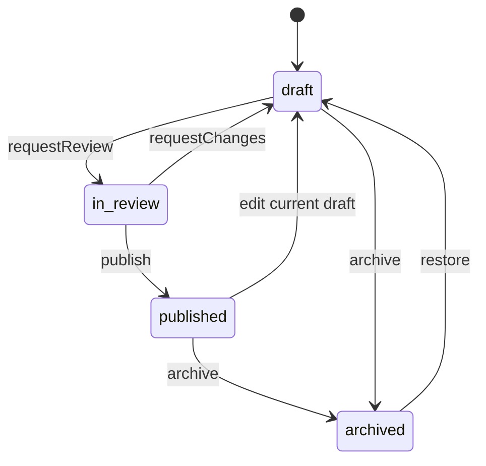
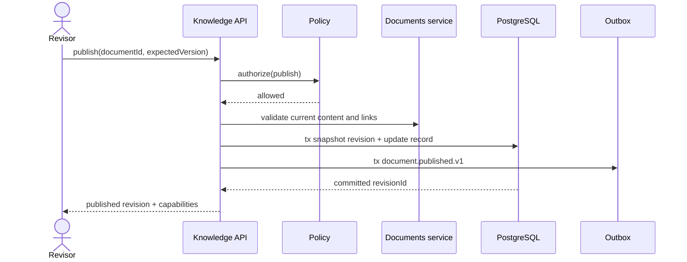

# Conocimiento

## 1. Resumen ejecutivo

WhatsPro ya tiene el núcleo editorial de una memoria empresarial: Documentos guarda contenido estructurado seguro de Tiptap/ProseMirror, texto plano para búsqueda, carpetas anidadas, enlaces internos, backlinks, imágenes, slugs y concurrencia optimista. También existen Notas para captura rápida, Borradores para mensajes de WhatsApp, Task OS para ejecución, y un diseño de Reuniones que ubica actas y decisiones editables en Documentos.

Por lo tanto, **Conocimiento no debe crear otro editor, otra biblioteca de archivos, otro gestor de tareas ni copias de clientes, productos, reuniones o departamentos**. Debe ser una capa de organización, gobierno, búsqueda y acceso sobre recursos existentes, con `team_documents` como cuerpo canónico del conocimiento curado.

Aplicación del principio rector:

1. **Reutilizar:** `team_documents`, `team_document_folders`, `team_document_links`, `team_document_media`, el editor y parser existentes, `team_notes`, `message_drafts`, Task OS, reuniones, usuarios, departamentos, clientes, artículos/productos, permisos, conectores e IA.
2. **Extender:** carpetas con espacios estables; Documentos con una especialización uno-a-uno de conocimiento; permisos; búsqueda; ciclo de publicación; servicios compartidos y catálogo de entidades enlazables.
3. **Relacionar:** documentos con clientes, productos, reuniones, decisiones, tareas, proyectos, departamentos, agentes y herramientas IA mediante referencias validadas, sin snapshots de datos maestros.
4. **Especializar:** tipo documental, ownership, visibilidad, revisión periódica, publicación, revisiones históricas y trazabilidad de fuente.
5. **Crear solo si no existe:** metadatos de conocimiento, revisiones inmutables, etiquetas transversales y ACL por recurso. No existe un equivalente confirmado para esas capacidades.

El resultado es una memoria empresarial utilizable por personas y agentes: la búsqueda distingue contenido publicado de material de trabajo, respeta permisos antes de recuperar o rankear, devuelve fuentes y revisiones, y nunca convierte automáticamente una nota, borrador o inferencia IA en verdad institucional.

Este documento es diseño y auditoría. No implementa migraciones ni runtime.

## 2. Evidencia del repositorio real

### 2.1 Documentos: repositorio editorial canónico

| Evidencia | Hallazgo confirmado | Decisión |
|---|---|---|
| `lib/db/schema.ts` (`teamDocumentFolders`) | Carpetas tenant-scoped, árbol autorreferenciado, `depth`, posición, emoji y auditoría básica. | Reutilizar el árbol como navegación primaria y especializar raíces estables; no crear otro árbol de categorías. |
| `lib/db/migrations/0048_documents.sql` | El CHECK limita la profundidad a cinco; borrar carpeta elimina subcarpetas, pero los documentos pasan a raíz por `ON DELETE SET NULL`. | La taxonomía inicial cabe en cinco niveles. La eliminación de espacios gobernados debe bloquearse o archivarse aunque el comportamiento legacy siga disponible para carpetas ordinarias. |
| `lib/db/schema.ts` (`teamDocuments`) | Guarda título, slug único por team, emoji, JSON ProseMirror, `contentText`, `version`, posición y autores. | El cuerpo continúa aquí. Conocimiento agrega una especialización uno-a-uno, no otra tabla de contenido. |
| `lib/plugins/documents/shared/content.ts` | `parseDocumentJson()` valida contra el schema del editor, elimina URLs no seguras y genera texto plano/enlaces internos. | Toda entrada humana, API o agente debe atravesar este parser o el conversor Markdown existente. Nunca aceptar HTML arbitrario. |
| `lib/plugins/documents/ui/DocumentEditor.tsx` | Editor Tiptap con autosave, debounce, max wait y conflicto `409`; usa extensiones para tablas, listas, checklist, código, imágenes y enlaces a documentos. | Reutilizar el componente. La pantalla de Conocimiento añade metadatos y gobierno alrededor, no un editor alternativo. |
| `lib/plugins/documents/server/documents.ts` | CRUD tenant-scoped, slugs, movimiento, búsqueda, backlinks y control optimista atómico. | Extraer/extender el servicio para aplicar policy de conocimiento en todas las entradas. UI, API y conectores no deben escribir Drizzle en paralelo. |
| `teamDocumentLinks` y `syncLinks()` | Los enlaces documento-documento se recalculan al guardar y se validan contra documentos del mismo team. | Son el grafo editorial canónico y alimentan relacionados/backlinks. No duplicarlos en una tabla de conocimiento. |
| `teamDocumentMedia` y `app/api/plugins/documents/media/route.ts` | Imágenes PNG/JPEG/WebP/GIF/AVIF hasta 8 MB, persistidas bajo `public/uploads/documents/{teamId}`. | Reutilizar imágenes embebidas. La gestión empresarial de archivos sigue perteneciendo a Files/media; Conocimiento referencia archivos, no almacena binarios paralelos. |
| `lib/plugins/documents/manifest.ts` | `documents` es un plugin de activación `user`, con rutas y permisos `documents.read/write`. | Conocimiento puede ser global, reutilizando el módulo editorial sin depender de que cada usuario tenga visible la app Documentos. El contrato común de dependencias/capacidades debe formalizarlo. |

Brechas confirmadas de Documentos:

- `team_documents.version` es **solo contador de concurrencia**. No guarda versiones anteriores ni permite comparar/restaurar.
- `searchDocuments()` usa `ILIKE` sobre título y `contentText`, ordena por actualización y limita resultados. No hay ranking full-text, búsqueda federada, stemming multilingüe, chunks ni embeddings.
- El listado, búsqueda y detalle tienen alcance de team completo; no existen ACL por documento/carpeta, ownership departamental, sensibilidad ni estado de publicación.
- `deleteDocument()` borra físicamente y la UI lo presenta como irreversible. Una fuente publicada necesita archivo y retención por defecto.
- `getPluginRequestContext()` comprueba membresía y permiso, pero no activación. Las APIs de Documentos pueden operar aunque el plugin de usuario esté desactivado.
- La subida de media acepta `documentId` sin verificar que ese documento pertenezca al mismo team. La FK prueba existencia, no coincidencia de `teamId`; es una brecha multi-tenant que debe corregirse antes de reutilizar media para contenido gobernado.
- Las rutas antiguas de Documentos podrían eludir futuras ACL si solo se agregan controles en `/knowledge`. La policy debe residir en el servicio compartido y aplicarse también a árbol, búsqueda, media, Grok y API read-only.

### 2.2 Notas: captura operativa, no conocimiento publicado

| Evidencia | Hallazgo confirmado | Decisión |
|---|---|---|
| `teamNotes` | Texto simple, tags JSON, pin, estados `todo/in_progress/done`, vencimiento y autores. | Conservar para ideas, pendientes y seguimientos rápidos. |
| `app/api/plugins/notes/route.ts` y `[id]/route.ts` | CRUD con Zod, permisos `notesRead/notesWrite` y filtro por `teamId`. | La acción “Promover a conocimiento” crea un documento y relación; no cambia la semántica de la nota. |
| `NotesDashboard.tsx` y `NoteEditor.tsx` | Kanban, tarjetas, lista, timeline y calendario; el propio header dice “Tareas”. | Hay solapamiento visual/semántico con Task OS. Conocimiento no debe adoptar estos estados ni convertir Notas en un segundo workflow documental. |
| `lib/plugins/notes/manifest.ts` | Plugin global y configuración de vistas. | Es fuente opcional de captura; no dependencia dura del plugin Conocimiento. |

No se indexan notas como verdad institucional por defecto. La búsqueda federada puede mostrarlas en una sección “Material de trabajo” solo si el actor tiene `notesRead`; los agentes usan contenido publicado salvo que soliciten explícitamente fuentes no curadas.

### 2.3 Borradores: biblioteca de mensajes, no base de conocimiento

| Evidencia | Hallazgo confirmado | Decisión |
|---|---|---|
| `messageDrafts` | Contenido de mensaje estático/dinámico, placeholders, metadata IA, contacto, asignado, departamento, etapas/tareas JSON y archivo. | Mantener como material de comunicación. Un borrador puede ser fuente de una plantilla documental, pero no se reclasifica en sitio. |
| `messageDraftCategories`, `messageDraftTags`, `messageDraftTagLinks` | Taxonomía específica de la biblioteca de mensajes. | No reutilizar sus tags como taxonomía empresarial: tienen ownership y semántica de drafts. |
| `DraftEditorModal.tsx` | Textarea orientada a WhatsApp, variables `[[...]]`, generación IA y workflow embebido. | No es editor de conocimiento. Promover copia contenido normalizado a un documento y conserva relación de procedencia. |
| `app/api/drafts/generate/route.ts` | El prompt obliga a devolver un borrador listo para WhatsApp, sin Markdown. | No usar este pipeline para SOP, políticas o documentación técnica. |
| `lib/drafts/bootstrap.ts` | Crea/ajusta tablas en runtime si faltan. | Patrón histórico que no debe repetirse: Conocimiento usa migraciones versionadas, nunca DDL durante requests. |
| rutas `app/api/drafts/**` | Un único permiso booleano `drafts` habilita lectura y escritura. | La búsqueda federada debe respetar ese permiso; no asumir permiso de conocimiento equivalente. |

### 2.4 Task OS: ejecución y plantillas operativas

| Evidencia | Hallazgo confirmado | Decisión |
|---|---|---|
| `teamTaskItems`, checklists, dependencias, comentarios y media | Task OS ya administra ejecución, estado, responsables y fechas. | Un SOP describe cómo trabajar; una tarea registra que se ejecuta. No copiar estados o checklist vivo al documento. |
| `teamTaskTemplates` | Plantillas `task`, `project` y `labels` con payload JSON. | Vincular playbooks/SOP a plantillas Task OS. El tipo documental `template` es plantilla editorial, no reemplazo de `teamTaskTemplates`. |
| `teamTaskRelations` | Relación polimórfica tenant-scoped con origen/destino/tipo/metadata y unicidad. | Preferir su generalización coordinada como registry común de relaciones empresariales; no crear `team_knowledge_entity_links` ad hoc. |
| `TaskEntityType` en `task-os.ts` | El servicio solo valida `workspace`, `project`, `task`, `contact`, `customer`. | Ampliar mediante validadores registrados para `document`, `team_note`, `draft`, `calendar_event`, `sale`, `article` y futuros tickets. No aceptar tipos libres sin validación tenant-aware. |

### 2.5 Reuniones: fuente de actas y decisiones

`docs/business-platform/20-reuniones-comunicaciones.md` ya establece:

- `team_events` conserva la agenda temporal;
- el expediente de reunión conserva resumen, transcript y outcomes;
- `team_meeting_outcomes` representa decisiones/compromisos propuestos y aprobados;
- el acta editable vive en `team_documents` mediante `minutesDocumentId`;
- Task OS es fuente de verdad una vez creado un compromiso ejecutable;
- IA propone y cita evidencia, con revisión humana por defecto.

Conocimiento agrega clasificación, publicación, búsqueda, revisión y ACL al documento de acta. No copia agenda, participantes, transcript completo ni estado del outcome. Una decisión relevante puede publicarse como documento tipo `decision`, enlazado al outcome y al evento.

### 2.6 API read-only y conectores: brecha crítica de autorización

El repositorio ya expone `documents`, `document-folders`, `document-links`, `document-media`, `notes`, `drafts`, Tasks y otros recursos en `lib/readonly-api/catalog.ts`. Grok/ChatGPT/Claude también reciben herramientas genéricas de lectura y acciones `whatspro_manage_document`, `whatspro_manage_document_folder` y `whatspro_manage_note`.

Hallazgos de seguridad confirmados:

- `readOnlyApiTokens.scopes` se carga y devuelve, pero `app/api/readonly/v1/[[...path]]/route.ts` no lo usa para autorizar recursos.
- El MCP OAuth conoce `userId`, pero `whatspro_list_records`/`get_record` llama al catálogo solo con `teamId`; ignora permisos del miembro y futuras ACL.
- El catálogo devuelve contenido estructurado y texto completo de todos los documentos del team.
- Las acciones Grok de Documentos sí exigen `documentsWrite`, pero no conocen clasificación, publicación ni ACL por recurso.

**Consecuencia:** no se debe habilitar contenido restringido en Conocimiento mientras estas rutas puedan saltar la policy. La autorización debe ocurrir antes de listar, buscar, recuperar, generar chunks o construir contexto IA.

## 3. Ownership y límites de dominio

| Capacidad | Fuente de verdad | Conocimiento hace | Conocimiento no hace |
|---|---|---|---|
| Cuerpo editorial | Documentos | Reutiliza editor, parser, contenido y enlaces internos. | No crea editor/HTML/almacenamiento alternativo. |
| Árbol principal | Carpetas de Documentos | Declara espacios estables y reglas de gobierno. | No crea otro árbol desconectado. |
| Captura rápida | Notas | Promueve o enlaza con procedencia. | No adopta estados `todo/done`. |
| Mensajes reutilizables | Borradores | Puede promover una fuente a plantilla/guía. | No modifica placeholders ni workflows de WhatsApp. |
| Ejecución | Task OS | Enlaza SOP/checklists a tareas y plantillas. | No replica responsables, fechas o estado de tarea. |
| Reunión | Meetings/Calendar | Clasifica actas y decisiones publicadas. | No copia transcript, participantes o agenda. |
| Cliente | Customers/CRM | Relaciona documentación del cliente. | No crea cliente/contacto paralelo. |
| Producto/servicio | Articles/Sales/servicio canónico | Relaciona documentación y playbooks. | No copia catálogo, precios o stock. |
| Archivo binario | Files/media | Referencia archivo y aplica visibilidad. | No crea storage paralelo. |
| Identidad y estructura | Users/Team Members/Departments | Define owner y ACL con IDs reales. | No duplica usuarios, roles o departamentos. |



## 4. Taxonomía empresarial

### 4.1 Espacios primarios

Usar raíces de `team_document_folders` con `knowledgeKey` estable y nombre editable:

1. `company` — **Empresa**
   - Dirección
   - Ventas
   - Marketing
   - Operaciones
   - Desarrollo
   - Administración
   - Soporte
2. `processes` — **Procesos**
3. `customers` — **Clientes**
4. `products` — **Productos**
5. `meetings` — **Reuniones**
6. `artificial_intelligence` — **Inteligencia Artificial**

`knowledgeKey` no cambia al traducir o renombrar. `name` es presentación. No crear automáticamente una carpeta por cada cliente, producto o reunión: eso escala mal y duplica el modelo. Esos contextos se resuelven con relaciones empresariales y vistas virtuales.

El árbol físico responde “¿dónde vive principalmente?”. Las etiquetas responden “¿qué temas toca?”. Las relaciones responden “¿a qué entidad real pertenece?”. Son dimensiones distintas.

### 4.2 Tipos documentales

Enumeración inicial cerrada en dominio, ampliable por migración/versión de contrato:

| Clave | Uso |
|---|---|
| `sop` | Procedimiento operativo estándar controlado. |
| `procedure` | Secuencia concreta para realizar una actividad. |
| `guide` | Orientación práctica no necesariamente obligatoria. |
| `policy` | Norma empresarial aprobada. |
| `playbook` | Estrategia repetible con decisiones y variantes. |
| `research` | Investigación con fuentes y vigencia. |
| `minutes` | Acta de reunión enlazada al evento. |
| `decision` | Decisión aprobada, contexto, responsable y fecha. |
| `faq` | Pregunta/respuesta curada. |
| `prompt` | Prompt reutilizable sin secretos. |
| `template` | Plantilla editorial de documento. |
| `technical_documentation` | Arquitectura, API, runbook o documentación técnica. |

No crear tablas por tipo. Todos usan el editor de Documentos y la misma especialización. Las validaciones pueden exigir metadatos distintos: una política requiere owner y revisión; un acta requiere relación a reunión; un prompt no puede contener credenciales; una decisión debe enlazar el outcome o registrar fuente humana.

## 5. Modelo de datos propuesto

### 5.1 Extensión mínima de `team_document_folders`

Columnas aditivas:

| Columna | Tipo/uso |
|---|---|
| `knowledge_key` | `varchar(64) NULL`; clave estable para espacios gobernados. Único parcial por `(team_id, knowledge_key)` cuando no es null. |
| `folder_kind` | `varchar(24) NOT NULL DEFAULT 'folder'`; `folder`, `space`, `section`. |
| `is_governed` | `boolean NOT NULL DEFAULT false`; impide borrado/movimiento accidental sin `knowledgeManage`. |

No se cambia `parentId`, `depth`, posición, emoji ni ownership existentes. El límite de cinco niveles sigue vigente. Si una empresa necesita navegación más profunda, primero medir; las relaciones y tags reducen la necesidad de árboles profundos.

### 5.2 Nueva `team_knowledge_records`

Especialización uno-a-uno de un documento, solo cuando se incorpora a la memoria curada:

| Columna | Regla |
|---|---|
| `document_id PK/FK -> team_documents.id ON DELETE CASCADE` | Identidad compartida; un documento tiene como máximo un registro de conocimiento. |
| `team_id FK -> teams.id ON DELETE CASCADE` | Defensa tenant e índice; el servicio exige coincidencia con el documento. |
| `knowledge_type` | Uno de los doce tipos definidos. |
| `status` | `draft`, `in_review`, `published`, `archived`. |
| `visibility` | `team`, `department`, `restricted`, `private`. |
| `owner_user_id` | Usuario miembro responsable, nullable. |
| `owner_department_id` | Departamento del mismo team, nullable. |
| `review_frequency_days` | Nullable, positivo y acotado; política de revisión. |
| `reviewed_at`, `next_review_at` | Vigencia verificable; índice por team/fecha/estado. |
| `published_revision_id` | Revisión inmutable publicada; nullable hasta publicar. |
| `published_at`, `published_by` | Auditoría de publicación. |
| `created_by`, `updated_by`, timestamps | Actor y trazabilidad. |

Invariantes:

- documento, folder, owner y departamento pertenecen al mismo `teamId`;
- `published` exige `publishedRevisionId`, owner y fecha de próxima revisión cuando el tipo/política lo requiera;
- `private` exige owner; `department` exige ownerDepartmentId;
- archivar no elimina contenido ni revisiones;
- restaurar de archivo vuelve a `draft`, nunca directamente a `published`;
- el documento actual puede continuar editándose como draft; las respuestas canónicas de agentes usan la revisión publicada hasta una nueva publicación.

### 5.3 Nueva `team_document_revisions`

`team_documents.version` continúa siendo token de concurrencia. La historia se guarda aparte:

- `id`, `teamId`, `documentId`;
- `revisionNumber` secuencial y único por documento;
- `documentVersion` observado al crear el snapshot;
- snapshot de `title`, `emoji`, `content`, `contentText`;
- `contentHash` para deduplicar;
- `source`: `manual`, `publish`, `restore`, `note_promotion`, `draft_promotion`, `meeting`, `ai_assisted`, `import`;
- `changeSummary` nullable;
- `createdBy`, `createdAt`;
- índice `(teamId, documentId, revisionNumber DESC)`.

No generar una revisión por cada autosave de 800 ms. Crear checkpoint explícito al solicitar revisión/publicar/restaurar y, opcionalmente, un checkpoint coalescido tras una ventana de edición relevante. Restaurar copia una revisión al documento actual y crea una **nueva** revisión; nunca reescribe la historia.

### 5.4 Nuevas etiquetas de conocimiento

`team_knowledge_tags`:

- `id`, `teamId`, `name`, `normalizedName`, `color`, timestamps;
- único `(teamId, normalizedName)`.

`team_knowledge_document_tags`:

- `teamId`, `documentId`, `tagId`, `createdBy`, `createdAt`;
- único `(documentId, tagId)`;
- servicio valida el mismo team en ambos lados.

No reutilizar `tags` de CRM ni `messageDraftTags`: sus relaciones y permisos pertenecen a contactos y mensajes.

### 5.5 Nueva `team_knowledge_acl_entries`

ACL mínima para documento o folder, con herencia:

- `id`, `teamId`;
- `resourceType`: `document` o `folder`;
- `resourceId`;
- `subjectType`: `team`, `department`, `user`;
- `subjectId` nullable solo para `team`;
- `capability`: `read`, `edit`, `publish`, `manage`;
- `effect`: `allow`, `deny`;
- `createdBy`, timestamps;
- unicidad por recurso/sujeto/capability.

Como recurso y sujeto son polimórficos, no hay FK completa posible. El servicio debe usar un registry cerrado de validadores y verificar `(teamId, id)` antes de insertar. Las queries nunca confían en IDs aportados por el cliente.

Precedencia recomendada:

1. aislamiento por `teamId` obligatorio;
2. owner del team conserva acceso de emergencia auditado;
3. `deny` explícito en documento;
4. `allow` explícito en documento;
5. ACL de carpeta más cercana, luego ancestros;
6. baseline de `visibility` y permisos del miembro;
7. sin regla aplicable, denegar.

Mover un documento entre carpetas recalcula su acceso efectivo y muestra una previsualización antes de confirmar si pierde/gana audiencia. Los permisos efectivos no se materializan al comienzo; si el volumen lo requiere, una caché derivada puede reconstruirse desde ACL y árbol.

### 5.6 Relaciones empresariales

No crear una tabla específica de links de conocimiento. Usar:

- `team_document_links` para enlaces editoriales documento-documento;
- el contrato común derivado de `team_task_relations` para relaciones a entidades empresariales.

Tipos mínimos requeridos en el registry común:

- `document`, `team_note`, `draft`;
- `customer`, `contact`;
- `article`/producto o servicio canónico que confirme el plan maestro;
- `calendar_event`, `meeting_outcome` cuando existan;
- `workspace`, `project`, `task`, `task_template`;
- `department`, `user` cuando una relación contextual no sea ownership;
- `ai_tool`, `automation` para prompts/procedimientos IA;
- `sale` y futuro `ticket` solo cuando su entidad canónica esté confirmada.

Relaciones semánticas: `documents`, `applies_to`, `derived_from`, `minutes_for`, `decision_from`, `procedure_for`, `template_for`, `supersedes`, `references`. `metadata` guarda contexto mínimo, nunca copias completas de la entidad.

Si el plan transversal decide crear `team_entity_relations`, debe hacerse una sola vez para todos los plugins y mantener alias/compatibilidad de `team_task_relations`. Conocimiento no debe anticipar una tabla competidora.

### 5.7 Lo que expresamente no se crea

- `knowledge_documents` con otro cuerpo o HTML;
- árbol `knowledge_folders` paralelo;
- tabla por tipo documental;
- copia de notas, drafts, transcripts, tareas, clientes o productos;
- storage binario propio;
- historial de ejecución duplicado de Task OS;
- embeddings como fuente de verdad;
- DDL de bootstrap durante requests.

## 6. Ciclo de vida y servicios de dominio



Servicios canónicos propuestos en `lib/plugins/knowledge/server`:

```ts
createKnowledgeDocument(ctx, input)
classifyExistingDocument(ctx, documentId, metadata)
updateKnowledgeMetadata(ctx, documentId, patch)
requestKnowledgeReview(ctx, documentId, input)
publishKnowledgeDocument(ctx, documentId, expectedVersion)
archiveKnowledgeDocument(ctx, documentId, reason)
restoreKnowledgeDocument(ctx, documentId)
createDocumentRevision(ctx, documentId, reason)
restoreDocumentRevision(ctx, documentId, revisionId)
promoteNoteToKnowledge(ctx, noteId, input)
promoteDraftToKnowledge(ctx, draftId, input)
linkKnowledgeEntity(ctx, documentId, target)
authorizeKnowledgeResource(ctx, resource, capability)
searchKnowledge(ctx, query, filters)
```

Reglas:

- `ctx` contiene actor, `teamId`, membresía, permisos, activación y correlation/idempotency key;
- clasificar no publica;
- promover copia una vez dentro de una transacción, registra `derived_from` e idempotency key, y preserva el original;
- solicitar revisión puede crear una tarea Task OS enlazada si está activo y el actor tiene `tasksWrite`; no se crea un workflow paralelo;
- editar un documento publicado abre/modifica el draft actual, pero la revisión publicada sigue siendo la fuente canónica hasta republicar;
- publicar crea snapshot inmutable, valida links/ownership, actualiza `publishedRevisionId` y emite evento en la misma transacción/outbox;
- borrado de un documento clasificado se traduce a archivo. Hard delete requiere `knowledgeManage`, confirmación explícita, política de retención y auditoría;
- cualquier entrada por Documents API, Knowledge API, Grok, ChatGPT, Claude, Codex o automatización usa los mismos servicios/policies.

## 7. Búsqueda, recuperación y versionado

### 7.1 Estado actual

- Documentos: `ILIKE(title/contentText)` y orden por `updatedAt`.
- Notas y Drafts: filtros/búsquedas propias, no unificadas.
- `contentText` ya es una proyección segura y suficiente para un primer índice textual.
- No se confirmó `pgvector`, servicio de embeddings ni motor externo.

### 7.2 Búsqueda lexical inicial

Fase inicial sin infraestructura nueva:

- índice GIN de expresión sobre `to_tsvector('simple', title || ' ' || content_text)` para soportar español, inglés y portugués sin elegir un stemmer incorrecto por documento;
- `websearch_to_tsquery('simple', query)` y ranking `ts_rank_cd`;
- filtros por tipo, estado, espacio, owner, departamento, tag, entidad relacionada, vigencia y fecha;
- ACL aplicada en SQL/servicio **antes** de rankear/paginar;
- búsqueda canónica por defecto: `published` y `publishedRevisionId`;
- opción humana “Incluir borradores propios/material de trabajo” explícita;
- resultados con título, tipo, extracto, owner, estado, revisión, fecha de revisión y motivo de acceso.

Para contenido publicado, el texto buscado/resuelto debe provenir de la revisión publicada, no necesariamente del draft actual.

### 7.3 Búsqueda federada

Una vista “Todo” puede combinar adaptadores:

- conocimiento publicado;
- documentos ordinarios, si `documentsRead`;
- notas, si `notesRead`;
- borradores, si `drafts`;
- actas/transcripts según permisos de Meetings;
- tareas según `tasksRead`.

Cada resultado conserva `sourceType`, `sourceId`, `curationStatus` y permiso de origen. No se copian registros a una tabla única. Para agentes, `buscar_conocimiento_empresa` usa solo conocimiento publicado salvo `include_working_material=true` autorizado.

### 7.4 Semántica/embeddings en fase posterior

Solo después de aprobar proveedor y almacenamiento vectorial:

- crear chunks derivados por revisión publicada, con heading path, offsets, hash, modelo y dimensión;
- embeddings se regeneran al publicar/archivar o cambiar modelo;
- autorización se evalúa antes de recuperar y nuevamente antes de devolver contexto;
- nunca incluir contenido de un documento no autorizado en un prompt, log, caché compartida o índice global;
- filtros tenant/ACL no pueden depender únicamente de post-filtrado de los primeros vecinos;
- conservar citas `documentId/revisionId/chunk` y texto fuente;
- si no hay backend vectorial aprobado, mantener FTS; no guardar arrays JSON ineficientes fingiendo búsqueda semántica.

Una eventual `team_knowledge_chunks` es infraestructura derivada y diferible, no requisito de la primera migración ni fuente de verdad.

## 8. Permisos, activación y multi-tenancy

### 8.1 Permisos nuevos

Añadir al contrato común:

- `knowledgeRead`;
- `knowledgeWrite`;
- `knowledgePublish`;
- `knowledgeManage`.

La IA reutiliza `aiAgent` junto con `knowledgeRead/Write`; no se necesita otro booleano solo para buscar. Generar un borrador exige `aiAgent + knowledgeWrite`; publicar siempre exige `knowledgePublish` y no puede delegarse al modelo sin confirmación/política explícita.

Presets sugeridos para revisión del plan maestro:

- owner: todos;
- admin: read/write/publish/manage según política del producto;
- agent: read por defecto para contenido `team`, write/publish/manage false; ACL puede conceder acceso departamental o específico.

Compatibilidad con Documentos:

- documento sin `team_knowledge_record`: siguen `documentsRead/Write`;
- documento clasificado: exige policy de Conocimiento y ACL; `documentsRead/Write` por sí solo no debe saltarla;
- la app Documentos debe filtrar u ocultar clasificados no autorizados;
- media, links, backlinks, búsqueda y API read-only usan la misma policy.

### 8.2 Activación

Manifest propuesto:

- `id: 'knowledge'`;
- `activationMode: 'global'`;
- rutas `/plugins/knowledge`, `/plugins/knowledge/doc/:id`, `/plugins/knowledge/review`;
- navegación “Conocimiento” con `knowledge.read`;
- dependencia de código/capacidad `documents-core`; integraciones opcionales `notes`, `tasks`, `meetings`, `ai-chat`, `files`.

El `AppPluginManifest` actual no declara dependencias. El plan maestro debe agregar `dependencies/optionalDependencies` o un contrato de capabilities. No resolverlo con comprobaciones ad hoc ni activar silenciosamente apps de usuario.

### 8.3 Aislamiento

- toda query, update y delete usa `(teamId, id)`;
- toda referencia se resuelve con validador de entidad tenant-aware;
- IDs ajenos responden 404, no 403, para no filtrar existencia;
- ACL se evalúa con membresía actual; quitar un usuario/departamento invalida acceso/cache;
- crear media debe validar `team_documents.teamId` antes de escribir archivo/registro;
- archivos físicos se sirven con un mecanismo autorizado o URL firmada antes de soportar conocimiento restringido; el path público actual no protege confidencialidad;
- read-only API y MCP requieren scopes de recurso y actor/policy; un token técnico necesita grants explícitos, no acceso implícito a todo el team;
- búsquedas, exports, backlinks, notificaciones y eventos no revelan títulos de documentos no autorizados.

## 9. APIs propuestas

La API de Conocimiento es una fachada de gobierno; el contenido delega a Documentos:

| Método y ruta | Función |
|---|---|
| `GET /api/plugins/knowledge` | Home/resumen: espacios, recientes autorizados, pendientes de revisión y favoritos futuros. |
| `POST /api/plugins/knowledge/documents` | Crea documento + especialización + primera revisión en transacción. |
| `POST /api/plugins/knowledge/documents/:id/classify` | Incorpora un documento ordinario sin copiar su cuerpo. |
| `GET /api/plugins/knowledge/documents/:id` | Agregado autorizado: documento, metadata, revisión publicada, tags, links y capacidades efectivas. |
| `PATCH /api/plugins/knowledge/documents/:id` | Metadata y/o contenido vía servicio compartido, con `expectedVersion`. |
| `POST /api/plugins/knowledge/documents/:id/request-review` | Crea checkpoint y opcional tarea de revisión. |
| `POST /api/plugins/knowledge/documents/:id/publish` | Publicación transaccional e idempotente. |
| `POST /api/plugins/knowledge/documents/:id/archive` | Archivo reversible. |
| `POST /api/plugins/knowledge/documents/:id/restore` | Restaura como draft. |
| `GET /api/plugins/knowledge/documents/:id/revisions` | Historia autorizada y paginada. |
| `POST /api/plugins/knowledge/documents/:id/revisions/:revisionId/restore` | Copia una revisión como nueva versión actual. |
| `GET /api/plugins/knowledge/search` | FTS autorizado con filtros y cursor. |
| `GET/POST/DELETE /api/plugins/knowledge/tags` | Catálogo y asignación tenant-safe. |
| `GET/POST/DELETE /api/plugins/knowledge/acl` | Policy por folder/documento; solo `knowledgeManage`. |
| `POST /api/plugins/knowledge/promote/note/:id` | Promoción idempotente de nota. |
| `POST /api/plugins/knowledge/promote/draft/:id` | Promoción idempotente de borrador. |
| `POST/DELETE /api/plugins/knowledge/documents/:id/relations` | Relaciones mediante registry común. |
| `POST /api/plugins/knowledge/templates/:id/use` | Copia controlada de un documento tipo `template`. |

Contratos comunes: Zod, límites de contenido, paginación por cursor, errores 400/401/403/404/409/422/500, `Idempotency-Key` para promoción/publicación/restauración, ETag/version para concurrencia y respuesta de capabilities (`canRead/canEdit/canPublish/canManage`). El cliente nunca envía `teamId`, autor efectivo ni revisión publicada arbitraria.

No duplicar `/api/plugins/documents/**`; primero refactorizar ambos fachadas para llamar a repositorios/policies compartidos.

## 10. UI propuesta

### 10.1 Home de Conocimiento

`/plugins/knowledge`:

- búsqueda principal visible al inicio;
- navegación lateral por los seis espacios existentes;
- filtros por tipo, tag, owner, departamento, estado y revisión;
- secciones “Publicado recientemente”, “Necesita revisión”, “Mis borradores” y “Sin clasificar”;
- vista virtual por Cliente, Producto, Reunión o Proceso basada en relaciones, no carpetas duplicadas;
- CTA “Nuevo documento” y menú “Promover nota/borrador” según permisos;
- badges explícitos `Borrador`, `En revisión`, `Publicado`, `Desactualizado`, `Restringido`.

### 10.2 Detalle

Reutilizar `DocumentEditor`/extensiones y envolverlo con:

- breadcrumb del árbol existente;
- tipo, owner, departamento, tags, visibilidad y próxima revisión;
- estado de publicación y revisión publicada actual;
- relaciones a cliente/producto/reunión/tarea/proyecto;
- backlinks existentes;
- panel de revisiones, comparación textual y restauración;
- acciones de solicitar revisión, publicar y archivar condicionadas por capabilities;
- aviso claro cuando el usuario edita un draft mientras consumidores siguen leyendo la revisión publicada.

Los documentos tipo `template` ofrecen “Usar plantilla”, que crea un documento nuevo; nunca editar el original para cada uso.

### 10.3 Integraciones contextuales

- ficha de cliente: pestaña “Conocimiento” filtrada por relación a cliente;
- reunión: abrir acta publicada y decisiones, sin incrustar transcript por defecto;
- Task OS: abrir SOP/playbook relacionado y crear tarea de revisión;
- artículo/producto: documentación, FAQ y playbooks relacionados;
- IA: mostrar citas con título, revisión, fecha y enlace autorizado.

Responsive y accesibilidad: paneles como sheets en móvil, teclado completo, foco visible, labels, contraste, reduced motion, estados vacío/carga/error/403 y ninguna acción crítica solo en hover.

## 11. Eventos e integración

### 11.1 Eventos producidos

- `document.created.v1` — documento clasificado creado;
- `document.updated.v1` — draft actual modificado, sin incluir contenido completo en payload;
- `document.review_requested.v1`;
- `document.published.v1` — incluye `documentId`, `revisionId`, tipo y relaciones mínimas;
- `document.archived.v1`;
- `document.review_due.v1`;
- `document.relation_added.v1`;
- `document.access_changed.v1`.

### 11.2 Eventos consumidos

- `meeting.finished`: no publica automáticamente; habilita/proponen acta y revisión desde Meetings;
- evento de acta creada/aprobada de Meetings: clasifica/enlaza idempotentemente;
- `task.completed`: puede sugerir actualizar un SOP vinculado, nunca reescribirlo solo;
- `customer.created` o producto creado: no crea carpetas/documentos vacíos por defecto;
- cambios de membresía/departamento: invalidan caches de autorización;
- baja/archivo de entidad relacionada: conserva el documento y marca relación histórica, no borra conocimiento.

El repositorio no tiene bus/outbox durable genérico confirmado. Usar el contrato transversal del plan maestro: mutación y outbox en una transacción, envelope tenant/version/correlation, consumidores idempotentes, retry y dead-letter. Pusher y `teamNotifications` sirven a UI, no sustituyen eventos de dominio.



## 12. IA y conectores

### 12.1 Herramientas semánticas

- `buscar_conocimiento_empresa`: consulta publicada con filtros, citas y ACL.
- `obtener_procedimiento`: resuelve el SOP/procedimiento publicado aplicable a una entidad/contexto.
- `obtener_contexto_cliente`: devuelve documentos autorizados vinculados, no toda la ficha del cliente.
- `listar_conocimiento_desactualizado`: owner, revisión vencida y criticidad.
- `proponer_actualizacion_documento`: genera un patch/borrador con fuentes; no publica.
- `crear_borrador_de_conocimiento`: crea un draft clasificado a partir de instrucciones/fuentes autorizadas.
- `promover_nota_a_conocimiento` y `promover_borrador_a_conocimiento`: operación explícita e idempotente.
- `solicitar_revision_documento`: usa ciclo y Task OS.
- `publicar_documento`: requiere permiso, versión esperada y confirmación explícita.
- `obtener_plantilla` y `crear_desde_plantilla`.

Mantener `whatspro_manage_document` para compatibilidad CRUD de documentos ordinarios, pero al tocar un documento clasificado debe delegar al servicio de Conocimiento y aplicar ACL/lifecycle. Las herramientas semánticas son preferidas porque expresan intención y reducen errores.

### 12.2 Grounding seguro

- contexto por defecto: revisión publicada vigente;
- cada afirmación recuperada incluye cita a documento/revisión/sección;
- borradores, notas, drafts y transcripts se etiquetan como no curados;
- contenido de documentos es dato no confiable: no puede redefinir permisos ni instrucciones del sistema;
- secretos detectados se bloquean/alertan, especialmente en documentos tipo `prompt` o documentación técnica;
- outputs IA guardan proveedor/modelo/promptVersion, fuentes y actor, pero no razonamiento interno;
- publicación y cambios de ACL nunca ocurren por inferencia silenciosa;
- agentes externos reciben solo herramientas y recursos permitidos por OAuth scope + permisos del miembro + ACL.

## 13. Migraciones y rollback

Orden coordinado; el número real se asigna al implementar tras reconciliar branches:

1. aprobar guard combinado, dependencia de plugins, relaciones comunes, auditoría y outbox;
2. agregar permisos a `MemberPermissions`, presets, `ROUTE_PERMISSIONS` y `pluginPermissionMap`;
3. extender `team_document_folders` de forma aditiva;
4. crear `team_knowledge_records`, `team_document_revisions`, tags/link y ACL con índices/checks;
5. agregar índice FTS de Documentos/revisiones publicadas tras verificar PostgreSQL y costo de build;
6. desplegar policy compartida en servicios/rutas de Documentos, media, read-only y conectores antes de clasificar contenido restringido;
7. registrar manifest/renderers y seed idempotente de espacios;
8. clasificar documentos solo por decisión del usuario; existentes permanecen ordinarios;
9. al clasificar un documento existente, crear primera revisión/checkpoint; no auto-publicar;
10. habilitar promoción de notas/drafts y actas con relaciones/idempotencia.

Seed:

- equipos existentes: job/migración de datos idempotente crea raíces con `knowledgeKey`;
- equipos nuevos: lifecycle de instalación/creación de team, no DDL runtime;
- si existe una carpeta raíz homónima, una previsualización decide si se adopta; no marcar contenido del usuario como gobernado solo por coincidencia de nombre.

Rollback:

- primero revertir código/manifest manteniendo tablas y columnas aditivas;
- documentos existentes siguen accesibles por Documents porque el cuerpo no se movió;
- no hacer `DROP` automático de revisiones, ACL o metadatos con datos reales;
- un rollback material exige exportación, ventana de mantenimiento y migración explícita;
- remover índice FTS puede hacerse sin perder fuente; embeddings/chunks son reconstruibles;
- nunca resetear `team_documents.version` ni borrar revisiones publicadas.

## 14. Pruebas y criterios de aceptación

### 14.1 Unitarias

- taxonomía y keys estables;
- enumeraciones/tipos y reglas de lifecycle;
- autorización por visibility, owner, departamento, ACL de documento y herencia de carpeta;
- precedencia allow/deny y cambio de membresía;
- hash/deduplicación y numeración de revisiones;
- publicar/archivar/restaurar;
- promoción idempotente;
- ranking/filtros FTS y selección de revisión publicada;
- registry de relaciones y validación tenant.

### 14.2 Backend/DB

- creación documento + record + revisión + outbox es atómica;
- fallo de tag/owner/relación revierte todo;
- clasificación de documento de otro team devuelve 404;
- media rechaza `documentId` de otro team y limpia archivo si falla DB;
- ACL de folder se hereda y mover recalcula acceso;
- concurrencia conserva `409` y no crea revisión publicada incorrecta;
- dos publicaciones/reintentos con misma key producen una sola revisión/evento;
- restore crea revisión nueva y no muta historial;
- hard delete no está disponible mediante ruta legacy para conocimiento gobernado.

### 14.3 Permisos y conectores

- matriz owner/admin/agent/custom permissions;
- documento team/department/restricted/private;
- usuario removido de departamento pierde acceso;
- Documents tree/search/backlinks no filtran títulos restringidos;
- read-only token sin scope no descubre ni lee `documents`/`knowledge`;
- MCP aplica `userId`, permisos y ACL a list/get/search;
- Grok write scope sin `knowledgePublish` no publica;
- agente con acceso a un cliente no hereda automáticamente documentos restringidos del cliente;
- exports, notificaciones y eventos respetan minimización.

### 14.4 Funcionales/E2E

- crear SOP, solicitar revisión, aprobar/publicar y encontrarlo;
- editar publicado manteniendo visible la revisión publicada anterior;
- comparar/restaurar revisión;
- promover nota y draft sin alterar original;
- crear acta desde reunión y verla en espacio Reuniones/cliente;
- enlazar SOP a task template y abrirlo desde Task OS;
- archivar/restaurar;
- mover entre carpetas con preview de audiencia;
- vistas 360/768/1440 px, teclado, lector de pantalla y reduced motion;
- regresión completa de Documentos ordinarios, Notas, Drafts y Tasks.

### 14.5 IA/seguridad

- respuesta con citas y revisión correcta;
- prompt injection dentro de un documento no cambia instrucciones/permisos;
- no recuperar chunks no autorizados ni siquiera en top-k intermedio;
- diferencia visible entre publicado y material de trabajo;
- fuente archivada/desactualizada se señala;
- publicación IA exige confirmación y expected version;
- contenido con secretos/PII aplica política de redacción/retención.

## 15. Fases de implementación

### Fase 0 — Contratos y cierre de brechas

- aprobar guard combinado activación+permiso;
- cerrar autorización de read-only/MCP y media cross-tenant;
- aprobar relación empresarial común, outbox, auditoría y dependencia de plugins;
- extraer policy/repository compartido de Documentos.

### Fase 1 — Gobierno básico

- migraciones de records, roots, tipos, ownership y lifecycle;
- UI de home/detalle reutilizando DocumentEditor;
- publicar/archivar y permisos;
- tags, relaciones y pruebas multi-tenant.

### Fase 2 — Revisiones y flujos

- revisiones inmutables, diff y restore;
- revisión mediante Task OS;
- promoción Nota/Draft;
- integración con actas/decisiones de Meetings.

### Fase 3 — Búsqueda y conectores seguros

- FTS y búsqueda federada autorizada;
- herramientas semánticas;
- scopes de recursos en read-only/MCP;
- eventos/outbox, observabilidad y alertas de revisión.

### Fase 4 — Semántica opcional

- proveedor de embeddings y backend vectorial solo tras decisión técnica;
- chunks por revisión publicada, citas y reindexado;
- evaluación de calidad, costo, latencia, privacidad y recall por idioma.

## 16. Riesgos y mitigaciones

| Riesgo | Evidencia/impacto | Mitigación |
|---|---|---|
| Bypass de ACL por rutas legacy | Documents, read-only y MCP hoy consultan por team, no por recurso/actor. | Policy única en service/repository y scopes efectivos antes de habilitar restringidos. |
| Fuga por archivos públicos | Media vive en `public/uploads`. | Storage autorizado/URLs firmadas para restringidos; no prometer confidencialidad antes. |
| Media cross-tenant | Route no valida team del `documentId`. | Resolver documento por `(teamId,id)` antes de escribir; cleanup transaccional/compensación. |
| Confundir contador con historial | `version` actual solo evita overwrite. | Revisiones inmutables separadas; mantener ambos conceptos. |
| Duplicar taxonomías | Folders, note tags, draft tags y CRM tags ya existen con semánticas distintas. | Folders para ubicación, tags propios para temas, relaciones para entidades. |
| Árbol por cliente/producto | Explosión de carpetas y datos desactualizados. | Vistas virtuales por relaciones a entidades canónicas. |
| Conocimiento obsoleto | No hay owner/review actual. | Owner, nextReviewAt, alertas, estado y dashboard de vigencia. |
| IA trata borrador como verdad | Catálogo expone todo el contenido. | Publicado por defecto, provenance, citas y flags de curación. |
| Embeddings filtran contenido | Top-k global seguido de post-filtro puede revelar. | Prefiltro tenant/ACL, índices segregados o estrategia que garantice filtro antes de retorno. |
| Autosave infla historial | Editor guarda cada 800 ms/5 s. | Checkpoints coalescidos y revisiones explícitas al revisar/publicar. |
| Borrado irreversible | `deleteDocument()` físico. | Archive por defecto y hard delete gobernado/auditado. |
| Solapamiento Notas/Tasks | Notes UI se presenta como “Tareas”. | Mantener captura separada y enlazar/promover; no incorporar su workflow. |
| Dependencia Documents user-scoped | Knowledge global necesita editor core. | Capability/dependency formal; reutilizar módulo sin activar launcher silenciosamente. |
| Relaciones polimórficas débiles | `team_task_relations` valida pocos tipos. | Registry cerrado tenant-aware y contrato transversal coordinado. |
| Migraciones concurrentes | Varios plugins diseñan tablas/eventos compartidos. | Numerar solo en implementación coordinada, archivos/commits pequeños y revisión del plan maestro. |

## 17. Dependencias

- **Arquitectura actual:** guard de plugin, manifest dependencies/capabilities, permisos, auditoría, migraciones y service boundary.
- **Reuniones y Comunicaciones:** entidad de acta, outcome/decisión y eventos; Conocimiento no redefine Meetings.
- **Operaciones/Task OS:** tareas de revisión, plantillas y relación empresarial común.
- **Clientes y Soporte:** timeline y entidad ticket canónica para documentación postventa.
- **Equipo:** ownership, departamentos y cambios de membresía/ACL.
- **Integración y Eventos:** outbox, envelope, idempotencia, retries y review due scheduler.
- **IA y Conectores:** scopes efectivos, actor context, catálogo semántico, citas y protección contra prompt injection.
- **Files:** storage autorizado y lifecycle de archivos para documentación restringida.
- **Articles/productos:** confirmar la entidad canónica de producto/servicio antes de registrar el validador.

## 18. Hallazgos confirmados vs decisiones pendientes

### Confirmado

- Documentos ya es el editor y repositorio estructurado adecuado.
- Carpetas, links, backlinks, contentText y concurrencia optimista existen.
- No existen revisiones históricas, lifecycle, ownership documental ni ACL por recurso.
- Search es `ILIKE`, no semántico/full-text rankeado.
- Notas y Drafts son dominios operativos distintos.
- Task OS ya posee ejecución, plantillas y una relación polimórfica limitada.
- Meetings ya decidió guardar actas editables en Documentos.
- API read-only/MCP exponen contenido por team sin aplicar scopes de recurso/ACL de miembro.
- Media de Documentos requiere corrección tenant y el path público no implementa confidencialidad.

### Pendiente de consolidación

- nombre/forma final del contrato común de relaciones (`team_task_relations` ampliada vs tabla común compatible);
- contrato de dependencias/capabilities de manifests;
- esquema final de outbox/auditoría;
- backend de archivos privados;
- entidad canónica de producto/servicio y ticket;
- proveedor/vector store para búsqueda semántica;
- presets finales de `knowledgePublish/Manage`;
- retención legal/operativa por team y clasificación de sensibilidad.

## 19. Informe del agente

### Archivos analizados

- `AGENTS.md`
- `lib/db/schema.ts`
- `lib/db/migrations/0015_draft_category_position.sql`
- `lib/db/migrations/0016_draft_ai_metadata.sql`
- `lib/db/migrations/0019_notes_calendar_plugins.sql`
- `lib/db/migrations/0048_documents.sql`
- `lib/plugins/documents/manifest.ts`
- `lib/plugins/documents/server/documents.ts`
- `lib/plugins/documents/server/folders.ts`
- `lib/plugins/documents/server/slug.ts`
- `lib/plugins/documents/shared/content.ts`
- `lib/plugins/documents/shared/extensions.ts`
- `lib/plugins/documents/shared/markdown.ts`
- `lib/plugins/documents/ui/DocumentsApp.tsx`
- `lib/plugins/documents/ui/DocumentEditor.tsx`
- `lib/plugins/documents/ui/FolderTree.tsx`
- `app/api/plugins/documents/**`
- `lib/plugins/notes/manifest.ts`
- `lib/plugins/notes/ui/NotesDashboard.tsx`
- `lib/plugins/notes/ui/NoteEditor.tsx`
- `app/api/plugins/notes/route.ts`
- `app/api/plugins/notes/[id]/route.ts`
- `lib/drafts/bootstrap.ts`
- `lib/drafts/payload.ts`
- `components/drafts/DraftBoard.tsx`
- `components/drafts/DraftEditorModal.tsx`
- `components/drafts/DraftWorkflowCanvas.tsx`
- `components/drafts/types.ts`
- `app/api/drafts/**`
- `lib/plugins/tasks/server/task-os.ts`
- `app/api/plugins/tasks/relations/route.ts`
- `app/api/plugins/tasks/templates/route.ts`
- `docs/business-platform/20-reuniones-comunicaciones.md`
- `docs/business-platform/00-arquitectura-actual.md`
- `lib/permissions.ts`
- `lib/plugins/core/types.ts`
- `lib/plugins/core/registry.ts`
- `lib/plugins/core/runtime-permissions.ts`
- `lib/readonly-api/auth.ts`
- `lib/readonly-api/catalog.ts`
- `app/api/readonly/v1/[[...path]]/route.ts`
- `app/api/plugins/grok-connector/mcp/route.ts`
- `lib/plugins/grok-connector/server/extended-actions.ts`

### Archivo modificado

- `docs/business-platform/60-conocimiento.md` (único archivo).

### Decisiones principales

- `team_documents` conserva el cuerpo y `team_document_folders` la navegación primaria.
- Conocimiento es una especialización uno-a-uno con lifecycle, ownership, ACL, revisiones y búsqueda.
- `team_documents.version` y revisión histórica son conceptos distintos.
- Notas/Drafts se promueven de forma explícita e idempotente; nunca se convierten automáticamente en verdad institucional.
- Task OS conserva ejecución y revisiones operativas; Meetings conserva transcript/outcomes; Conocimiento conserva actas/decisiones publicadas.
- La taxonomía usa seis espacios estables, tipos documentales y relaciones a entidades reales.
- IA consulta publicado por defecto, con citas y autorización previa a recuperación.
- No debe clasificarse contenido restringido hasta cerrar bypasses en APIs legacy, read-only, MCP y media pública.

### Riesgos principales

- bypass de ACL por servicios y conectores existentes;
- exposición de media en paths públicos;
- confundir autosave/version con historial;
- duplicación de relaciones/taxonomías entre agentes;
- crecimiento de revisiones e índices;
- contenido obsoleto o IA tratando fuentes no curadas como oficiales.

### Dependencias críticas

- aprobación del guard combinado de plugins y permissions;
- contrato común de relaciones, outbox y auditoría;
- coordinación con Meetings, Operaciones, Equipo, Files e IA/Conectores;
- decisión de producto/servicio, ticket, storage privado y búsqueda vectorial.

### Próximo paso recomendado

No implementar aún. Consolidar este diseño en `99-plan-maestro.md`, resolver primero autorización común (incluidos read-only/MCP/media), relaciones y eventos, y luego ejecutar Fase 0 con una prueba de policy end-to-end antes de crear la primera clasificación restringida.
