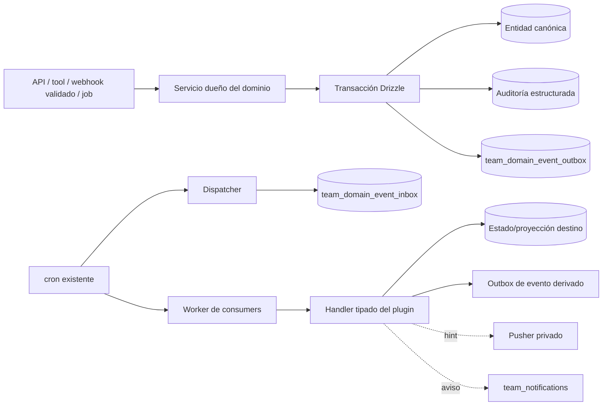
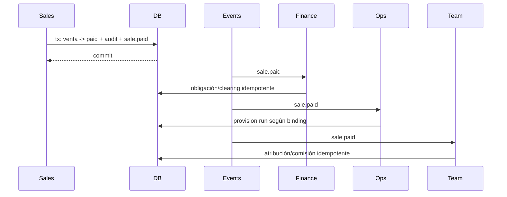

# Integración y Eventos

> Auditoría y diseño técnico sobre el repositorio real `/root/whatsaas`, realizada el 14 de agosto de 2026. Este documento no implementa código. Aplica **REUTILIZAR → EXTENDER → RELACIONAR → ESPECIALIZAR → CREAR SOLO SI NO EXISTE**.

## 1. Resumen ejecutivo

WhatsPro no tiene hoy un Event Bus ni una cola durable general. Sí tiene piezas valiosas que deben conservarse:

- PostgreSQL y transacciones Drizzle como fuente de verdad;
- Pusher para avisos efímeros de interfaz;
- `team_notifications` como bandeja humana persistida;
- `activity_logs` y auditorías especializadas;
- `webhook_events` para trazas de Evolution;
- `payment_webhook_events` para idempotencia de Stripe/Mercado Pago;
- tablas operativas con estados que funcionan como colas específicas;
- cinco crons HTTP protegidos con `CRON_SECRET` y scripts pensados para PM2 o un scheduler externo;
- polling/SWR como fallback visual.

La expansión empresarial no debe añadir Kafka, RabbitMQ, Redis/BullMQ ni otro servicio antes de medir que PostgreSQL no alcanza. La base correcta para la primera etapa es un **outbox/inbox PostgreSQL transaccional**, dentro del monolito modular actual, con un registry tipado de productores y consumidores.

La semántica será **at-least-once**: un evento puede entregarse más de una vez y todo handler debe ser idempotente. No se promete “exactly once”, especialmente cuando intervienen Evolution, Meta, email o proveedores de pago.

Decisiones principales:

1. Un hecho de dominio se inserta en outbox dentro de la misma transacción que cambia el agregado.
2. Un dispatcher materializa una entrega inbox por consumidor registrado.
3. Workers reclaman entregas con lease y `FOR UPDATE SKIP LOCKED`, procesan fuera de la transacción de claim y registran éxito, retry o dead letter.
4. El orden solo se garantiza por consumidor y agregado, nunca de forma global.
5. Pusher no transporta hechos de dominio; solo indica a la UI que vuelva a leer el estado canónico.
6. `team_notifications` informa a personas, pero no sustituye outbox/inbox.
7. `activity_logs` y los eventos de dominio no se confunden: auditoría responde “quién hizo qué”; eventos responden “qué hecho ocurrió para otros módulos”.
8. Los webhooks entrantes conservan sus adaptadores especializados y, una vez validados, traducen hechos externos a eventos canónicos. Nunca se propaga el payload bruto del proveedor a todos los plugins.
9. Los plugins no se llaman por HTTP entre sí dentro del monolito. Sus consumidores invocan servicios de dominio compartidos con contexto tenant y una clave idempotente.

## 2. Evidencia de la arquitectura actual

### 2.1 Panorama confirmado

`docs/business-platform/00-arquitectura-actual.md` confirma un monolito modular Next.js 16, React 19, PostgreSQL y Drizzle. No hay servicios desplegables independientes ni infraestructura general de mensajería. `package.json` no contiene BullMQ, RabbitMQ, Kafka, SQS, Inngest o equivalente.

El proceso actual es:

```text
Route Handler / Server service / webhook / cron
  -> modifica PostgreSQL
  -> a veces escribe activityLogs o una tabla especializada
  -> a veces llama directamente otro servicio
  -> a veces publica Pusher
  -> retorna
```

El problema no es la ausencia de una tecnología externa. Es que los efectos posteriores a una mutación no tienen un contrato durable común.

### 2.2 Pusher: realtime de UI, no bus

Evidencia principal:

- `lib/pusher-server.ts` crea el cliente servidor.
- `providers/pusher-provider.tsx` crea un cliente navegador.
- `app/[locale]/(dashboard)/layout.tsx` monta el provider para el equipo.
- `app/[locale]/(dashboard)/dashboard/layout.tsx`, `KanbanBoard.tsx` y `dashboard/chat/[jid]/page.tsx` suscriben y actualizan caches SWR.
- `app/api/webhook/evolution/route.ts`, `lib/automation/engine.ts`, `lib/db/system-messages.ts`, `lib/plugins/tasks/server/task-os.ts`, `lib/plugins/tasks/server/contact-tasks.ts`, `lib/plugins/ai-chat/*`, Grok y mensajes programados publican eventos.

Eventos Pusher observados:

| Canal/evento actual | Uso real |
|---|---|
| `team-{teamId}` / `new-message` | insertar/mostrar mensajes |
| `chat-list-update` | refrescar resumen y orden de conversaciones |
| `message-status-update` | sent/delivered/read |
| `message-origin-update` | identificar origen programado |
| `message-reaction` | reacción de mensaje |
| `contact-update` | refrescar contacto |
| `kanban-stage-update` | mover contacto en CRM |
| `chat-status-update` | estado IA/automatización |
| `task-message-update/delete` | proyección de tarea dentro del chat |
| `qr-update-needed`, `connection-status` | conexión de instancia |

Pusher se invoca normalmente después del commit y muchos errores se capturan para no romper el caso de uso. Esa es la semántica correcta para una pista visual, pero no para Finanzas, Operaciones, tickets o procesamiento IA.

Brecha de seguridad a corregir: el cliente observado se suscribe a nombres `team-{id}` y no se encontró endpoint de autenticación de canales privados. Antes de enviar payloads empresariales, migrar a canales privados/presence autenticados o mantener solo hints mínimos sin datos sensibles. El navegador siempre debe volver a consultar una API autorizada.

### 2.3 Auditoría actual

`activity_logs` en `lib/db/schema.ts` guarda solamente:

- `teamId`;
- `userId` nullable;
- `action` textual;
- `timestamp`;
- `ipAddress`.

`lib/db/activity.ts` captura y oculta errores. Además, varias áreas usan `ipAddress` para guardar IDs/referencias que no son direcciones IP. En `app/api/contacts/route.ts`, `logActivity()` se llama dentro de una callback transaccional, pero usa `db` global en vez del `tx`; por lo tanto, mutación y log no son atómicos.

Existen auditorías mejor especializadas:

- `reseller_audit_events`, con actor y metadata JSON;
- `payment_audit_events`, con proveedor, referencia, transición, actor y metadata;
- `marketplace_order_status_events`, con before/after y motivo.

No se debe convertir `activity_logs` en cola ni usar outbox como historial de cumplimiento. El plan maestro debe aprobar un audit envelope separado; durante la transición puede mantenerse un resumen compatible en `activity_logs`.

### 2.4 Webhook de Evolution

`app/api/webhook/evolution/route.ts`:

- resuelve tenant por `instanceName`;
- normaliza e inserta mensajes en una transacción;
- deduplica `messages.upsert` por PK de `messages.id`;
- registra después una fila en `webhook_events` como `processed` o `duplicate`;
- actualiza Pusher;
- ejecuta automatización directamente y, si no aplica, agenda IA con memoria de proceso;
- ante excepción general responde HTTP 200 con un cuerpo de error.

`webhook_events` no es hoy inbox durable: no tiene payload, unique de idempotencia, intentos, lease, `nextAttemptAt` ni retry. El helper de logging ignora fallos. Para errores sin tenant intenta insertar `teamId=0`, porque la tabla no posee FK a `teams`.

Riesgo crítico confirmado: aunque existe `EVOLUTION_WEBHOOK_TOKEN` y una ruta que lo devuelve a usuarios autenticados, el setup de instancia no adjunta ese token al webhook y el handler inspeccionado no verifica header, firma ni bearer. `middleware.ts` excluye `/api`. Primero se debe autenticar la fuente; recién después persistir y procesar asincrónicamente.

El debounce IA de `lib/plugins/ai-chat/service.ts` usa `Map` y `setTimeout` en memoria. Un reinicio pierde el trabajo; varias réplicas no comparten el estado. Es válido solo como optimización temporal, no como job durable.

### 2.5 Webhooks de pago

El bounded context Payments está mejor protegido:

- Stripe valida `stripe-signature` en `lib/payments/plugins/index.ts`.
- Mercado Pago valida `x-signature` solo si existe `webhookSecret`; su `validateConfig()` actual exige access token pero no exige ese secreto.
- ambos insertan `payment_webhook_events` con `onConflictDoNothing()` antes de aplicar el evento;
- ambos escriben `processed` o `failed` y auditoría especializada.

Sin embargo, hay dos fallos de reintento:

1. La migración `0050_resellers.sql` crea unique parcial tanto por `event_id` como por `payment_id`. Distintos eventos legítimos sobre el mismo pago/suscripción pueden quedar descartados por compartir `payment_id`. `payment_id` debe ser índice de consulta, no unique general.
2. Si el primer intento queda `failed`, el retry del proveedor choca con el unique, se interpreta como duplicado y devuelve éxito sin volver a procesar. Una fila fallida debe poder reclamarse de forma segura o quedar en retry/DLQ.

`manual_payments`, `payment_webhook_events` y `payment_audit_events` cobran el plan de la plataforma/reseller. No representan automáticamente el ingreso operativo de un cliente de WhatsPro. Solo un adaptador con `teamId` y rol económico inequívoco puede publicar el evento empresarial `payment.received`.

### 2.6 Crons, polling y colas específicas

Crons HTTP confirmados:

| Ruta | Función | Estado/cola real |
|---|---|---|
| `/api/cron/aapp-sync` | sincronizar AAPP por conexión | upserts e IDs externos |
| `/api/cron/membership-reminders` | recordatorios de membresías | JSON `remindersSent` por suscripción |
| `/api/cron/publish-social` | publicar targets sociales | `social_posts` + `social_post_targets` |
| `/api/cron/send-scheduled` | mensajes programados y renovaciones AAPP | `team_scheduled_messages` + `team_aapp_renewal_candidates` |
| `/api/cron/sync-meta-ads` | sincronizar cuentas/insights | `meta_ads_sync_runs` y timestamps de cuenta |

Los scripts `scripts/aapp-sync.js`, `membership-reminders.js`, `publish-social.js`, `send-scheduled.js` y `sync-meta-ads.js` llaman esas rutas. El README sugiere PM2 para AAPP, pero `docker-compose.yml` no declara scheduler y `package.json` no inicia workers. La frecuencia y ejecución real en producción no son verificables solamente desde el repositorio.

Patrones reutilizables:

- AAPP renewals hace claim condicional `approved -> sending`, evitando que dos workers envíen el mismo candidato.
- Meta Ads y AAPP usan upserts con IDs externos.
- Social Publisher registra `attemptCount`, `lastAttemptAt`, estados y errores.
- `meta_ads_sync_runs` da trazabilidad del job.
- campañas cambian leads de `PENDING -> SENDING -> SENT/FAILED`.

Brechas:

- mensajes programados normales consultan vencidos sin claim atómico; dos ticks pueden enviar duplicados;
- Social Publisher selecciona `pending` y luego actualiza sin condición de estado; puede haber carrera y un crash deja `publishing` sin lease;
- el anti-solapamiento de Meta hace select y luego insert sin constraint que cierre la carrera;
- campañas reclaman lotes con update no condicionado y `/api/campaigns/process` falla abierto si `CRON_SECRET` no está configurado;
- varios scripts usan fallback `dev-cron-secret`;
- no hay política común de backoff, jitter, máximo de intentos, lease vencido, DLQ o métricas;
- algunos GET de cron producen efectos laterales;
- Pusher/polling visual no corrige efectos de dominio perdidos.

SWR y polling se mantienen como fallback de lectura: chats usan 5/10 segundos si Pusher no está disponible; Escritorio refresca cada minuto; campañas cada 5 segundos y Social Publisher cada 15. Polling de navegador no debe ejecutar integraciones ni deadlines.

### 2.7 Hooks, listeners y jobs inexistentes

No se encontró `EventEmitter`, registry de domain handlers, listener común, outbox/inbox, BullMQ, broker ni job runner general. Las integraciones actuales son llamadas directas entre funciones, fetch interno, timers en memoria o polling de tablas.

Ejemplos de acoplamiento a migrar gradualmente:

- Evolution llama directamente `processAutomation()` o `scheduleAIProcessing()`;
- reuniones futuras necesitarían encadenar IA, tareas y documentos;
- Sales hoy escribe `team_sales` sin emitir transiciones;
- Calendar escribe `team_notifications` directamente;
- Task OS actualiza mensajes vinculados y Pusher dentro de su servicio;
- campañas hacen un `fetch()` fire-and-forget al mismo monolito y esperan que el cron lo retome.

## 3. Aplicación del principio rector

### Reutilizar

- PostgreSQL, Drizzle y `db.transaction()`;
- patrón de crons HTTP + script/scheduler externo;
- ids externos y uniques de sincronizaciones;
- estados/attempts de colas especializadas;
- Pusher para hints visuales;
- `team_notifications` para notificación humana;
- tablas de webhook especializadas y verificadores de firma;
- servicios de dominio de cada plugin;
- registry manual de plugins como precedente para un registry explícito de consumers.

### Extender

- `webhook_events` para convertirlo en inbox durable de Evolution;
- `payment_webhook_events` para retry/lease correcto y dedupe por evento;
- crons para claim, lease, backoff y fail-closed;
- servicios actuales para que reciban un `tx` y emitan hechos atómicos;
- permisos y auditoría estructurada;
- Pusher a canales privados o payloads mínimos.

### Relacionar

- eventos con `teamId`, agregado, actor, correlación y causación;
- cada inbox delivery con el outbox exacto;
- webhook externo con el evento canónico derivado;
- jobs deadline con la entidad y versión/fecha que originó el hecho;
- eventos con notificaciones, proyecciones y acciones IA sin copiar entidades.

### Especializar

- producer/consumer por plugin;
- política de orden por agregado;
- reintentos según error;
- adaptadores de Stripe, Mercado Pago, Evolution, AAPP y Meta;
- proyecciones para Inteligencia.

### Crear solo si no existe

Se justifican tres tablas transversales nuevas:

1. streams/secuencias de agregado;
2. outbox de hechos canónicos;
3. inbox de entregas por consumidor, cuya condición `dead_letter` constituye la DLQ.

No se crea un broker, otro backend, otra base ni una tabla de evento por plugin.

## 4. Arquitectura propuesta



No hay llamadas circulares entre plugins. Un producer no conoce consumidores. Un consumer conoce su propio servicio destino y el schema público del evento.

### 4.1 Estructura de código propuesta

```text
lib/events/
├── envelope.ts              # tipos comunes y Zod
├── catalog.ts               # nombres, versiones y schemas
├── registry.ts              # subscriptions explícitas
├── outbox.ts                # emitDomainEvent(tx, ...)
├── dispatcher.ts            # outbox -> inbox
├── worker.ts                # claim, lease, retry y DLQ
├── errors.ts                # Retryable/Permanent/Conflict
├── retry-policy.ts
├── observability.ts
└── realtime.ts              # hints Pusher sanitizados

lib/plugins/<plugin>/server/events.ts
app/api/cron/domain-events/dispatch/route.ts
app/api/cron/domain-events/process/route.ts
app/api/cron/domain-events/deadlines/route.ts
scripts/domain-events.js
```

El catálogo y registry son manuales y versionados, coherentes con `lib/plugins/core/registry.ts`. No se hace autodiscovery mágico por filesystem.

## 5. Envelope canónico

```ts
type DomainEvent<TPayload> = {
  id: string;                    // UUID generado por la aplicación
  type: string;                  // p.ej. "sale.paid"
  schemaVersion: number;         // versión del payload, comienza en 1
  producer: string;              // plugin/servicio dueño
  teamId: number;
  aggregate: {
    type: string;                // "sale", "meeting", "task"
    id: string;                  // texto para soportar IDs actuales/futuros
    sequence: number;            // orden monotónico dentro del agregado
  };
  occurredAt: string;            // ISO UTC, asignado por servidor/DB
  actor: {
    type: 'user' | 'system' | 'connector' | 'webhook' | 'job';
    id: string | null;
    impersonatedByUserId?: number | null;
  };
  correlationId: string;         // toda la operación/workflow
  causationId: string | null;     // evento padre, si existe
  idempotencyKey: string;         // estable para el hecho del productor
  payload: TPayload;
  metadata: {
    source?: string;
    requestId?: string;
    traceparent?: string;
    synthetic?: boolean;
  };
};
```

Reglas:

- `teamId`, actor y timestamps se derivan del contexto servidor; no se aceptan ciegamente desde el body.
- `id` identifica esta publicación; `idempotencyKey` identifica el hecho lógico y evita publicarlo dos veces.
- `aggregate.sequence` se obtiene del stream común, no de `updatedAt` ni del orden de llegada.
- `correlationId` se genera al inicio si no existe y se propaga a servicios, eventos, logs y auditoría.
- `causationId` es el ID del evento que disparó el handler, no una etiqueta libre.
- payloads monetarios usan unidad mínima + currency; no números float.
- no incluir tokens, API keys, texto completo de chats, notas privadas, transcripciones, archivos, números de cuenta o payload bruto de proveedor.
- el consumer vuelve a cargar la entidad con `teamId` y aplica su política de acceso/campos.

### 5.1 Versionado

- El nombre expresa el hecho, no la versión: `meeting.finished`, no `meeting.finished.v2`.
- Un cambio incompatible incrementa `schemaVersion` y agrega schema Zod nuevo.
- Consumers deben declarar versiones soportadas. Durante despliegue rolling soportan al menos la versión anterior y la nueva.
- No se reutiliza un campo con otro significado.
- Borrar/renombrar campos exige nueva versión y contract tests.
- Eventos desconocidos o versiones no soportadas no se descartan: quedan en DLQ con error permanente visible.

### 5.2 Nombres

- sustantivo singular + hecho en pasado o transición: `contact.created`, `task.completed`;
- minúsculas y puntos;
- no usar nombres de UI, ruta ni proveedor en eventos canónicos;
- un mismo hecho tiene un solo nombre y productor.

Normalizaciones para consolidar informes:

- usar `sale.*`, no `sales.*`;
- usar `time_entry.approved`, no el alias ambiguo `worklog.approved`;
- `payment.received` pertenece a Finanzas operativa; pagos del plan WhatsPro usan un evento de plataforma separado;
- no emitir a la vez `finance.entry.overdue` y `receivable.overdue` para la misma mora;
- `calendar.event.created` puede existir para agenda general, pero una reunión emite además `meeting.created` únicamente cuando se crea su expediente especializado en la misma transacción.

## 6. Modelo de datos propuesto

### 6.1 `team_domain_event_streams`

Secuencia técnica por agregado, sin agregar una columna `version` a todas las tablas actuales:

| Campo | Regla |
|---|---|
| `id` | bigint/serial PK |
| `teamId` | FK `teams`, not null |
| `aggregateType` | varchar(80), not null |
| `aggregateId` | varchar(191), not null |
| `lastSequence` | bigint, not null, default 0 |
| `createdAt`, `updatedAt` | timestamptz |

Unique `(teamId, aggregateType, aggregateId)`. `emitDomainEvent` bloquea/actualiza esta fila dentro de la transacción y asigna la siguiente secuencia.

### 6.2 `team_domain_event_outbox`

| Campo | Propósito |
|---|---|
| `id uuid` | PK global, generado antes de insertar |
| `teamId` | tenant obligatorio |
| `type`, `schemaVersion`, `producer` | contrato |
| `aggregateType`, `aggregateId`, `aggregateSequence` | stream y orden |
| `partitionKey` | `teamId:aggregateType:aggregateId` |
| `idempotencyKey` | dedupe lógico del producer |
| `correlationId`, `causationId` | trazabilidad |
| `actorType`, `actorId`, `impersonatedByUserId` | origen técnico |
| `payload`, `metadata` | JSON validado/sanitizado |
| `occurredAt`, `availableAt` | tiempo del hecho y de despacho |
| `status` | `pending`, `dispatching`, `dispatched`, `dead_letter` |
| `attempts`, `lockedAt`, `lockedUntil`, `lockedBy` | lease del dispatcher |
| `dispatchedAt`, `lastError` | operación |
| `createdAt` | persistencia |

Constraints/índices:

- unique `(teamId, producer, idempotencyKey)`;
- unique `(teamId, aggregateType, aggregateId, aggregateSequence)`;
- índice `(status, availableAt, occurredAt)`;
- índice `(teamId, type, occurredAt desc)`;
- índice `correlationId`;
- índice `(aggregateType, aggregateId, aggregateSequence)`.

El payload es inmutable. Solo cambian columnas operativas de dispatch.

### 6.3 `team_domain_event_inbox`

Una fila representa la entrega de un evento a un consumer específico:

| Campo | Propósito |
|---|---|
| `id` | bigint/serial PK |
| `teamId`, `eventId` | tenant y FK al outbox |
| `consumer` | nombre estable, p.ej. `finance.sale-paid.v1` |
| `consumerVersion` | versión del handler/proyección |
| `partitionKey`, `aggregateSequence` | orden eficiente |
| `orderingMode` | `strict` o `none` |
| `status` | `pending`, `processing`, `retry`, `succeeded`, `skipped`, `dead_letter` |
| `attempts`, `maxAttempts` | control de retry |
| `availableAt` | próximo intento |
| `lockedAt`, `lockedUntil`, `lockedBy` | lease recuperable |
| `firstAttemptAt`, `lastAttemptAt`, `processedAt` | observabilidad |
| `errorCode`, `lastError` | error sanitizado |
| `resultMetadata` | IDs de efectos, nunca secretos |
| `redriveCount`, `lastRedrivenAt`, `lastRedrivenBy` | operación DLQ |
| `createdAt`, `updatedAt` | timestamps |

Constraints/índices:

- unique `(eventId, consumer, consumerVersion)`;
- índice `(status, availableAt)`;
- índice `(consumer, status, availableAt)`;
- índice `(teamId, status, updatedAt)`;
- índice `(consumer, partitionKey, aggregateSequence)`;
- FK/constraint que impida relacionar inbox de un team con outbox de otro.

No se crea otra tabla DLQ: `status='dead_letter'` en inbox conserva evento, consumer, intentos, error y redrives sin duplicar datos.

### 6.4 Evolución de inboxes externos

#### `webhook_events`

Extender, no reemplazar:

- `externalEventKey` e idempotency unique parcial por `(teamId, instanceName, externalEventKey)`;
- `payload` normalizado/cifrado si hace falta reprocesar;
- `attempts`, `maxAttempts`, `availableAt`;
- `lockedAt`, `lockedUntil`, `lockedBy`;
- `lastError`, `lastAttemptAt`, `processedAt`;
- estados `received`, `processing`, `retry`, `processed`, `duplicate`, `ignored`, `dead_letter`.

Retención corta para payload de WhatsApp y redacción en UI/logs. Para `messages.upsert`, la key estable principal es event kind + message ID; para updates se agrega la transición normalizada. Eventos sin ID estable usan hash canónico de campos permitidos, no el body arbitrario.

#### `payment_webhook_events`

Preservar tabla y firma de providers, pero:

- retirar unique general por `paymentId`; conservarlo como índice;
- dedupe principal por `(provider, tenant/reseller, eventId)`;
- cuando el proveedor no dé event ID, usar fallback documentado por topic + entity + transición + request ID/hash;
- agregar `attempts`, `availableAt`, leases y clasificación de error;
- permitir reclamar `failed/retry` en vez de responder “duplicate”;
- publicar evento canónico solo después de validar tenant, monto, moneda y transición.

Un webhook inválido no entra al domain outbox. Se responde 4xx y se registra un security log sin secretos.

En producción, Mercado Pago debe exigir un mecanismo verificable de autenticidad; no se habilita el path sin firma únicamente porque haya access token para consultar la entidad después.

## 7. Contratos de runtime

### 7.1 Emisión transaccional

```ts
await db.transaction(async (tx) => {
  const sale = await salesService.markPaid(tx, command);
  await auditService.record(tx, auditEnvelope);
  await emitDomainEvent(tx, {
    type: 'sale.paid',
    producer: 'sales',
    teamId: command.teamId,
    aggregate: { type: 'sale', id: String(sale.id) },
    idempotencyKey: `sale:${sale.id}:paid:${sale.paidTransitionKey}`,
    correlationId: command.correlationId,
    actor: command.actor,
    payload: salePaidPayload(sale),
  });
});
```

`emitDomainEvent`:

1. valida el evento contra el catálogo y limita tamaño;
2. adquiere/actualiza el stream del agregado;
3. si ya existe idempotency key, retorna el evento existente sin consumir otra secuencia;
4. inserta outbox con hora de servidor;
5. nunca dispara handlers dentro de la transacción.

No usar triggers SQL como producer principal: no conocen actor, permiso, correlation ni intención de negocio. Los cambios deben pasar por servicios comunes; rutas web, MCP, IA, imports y crons usan el mismo servicio.

Mutaciones reintentables de API/conector aceptan `Idempotency-Key`; el servidor valida longitud/namespace, lo liga a team + comando y devuelve `X-Correlation-Id`. La idempotency key del comando y la del evento pueden relacionarse, pero no son intercambiables. Una acción interactiva sin key externa recibe una key generada por el servicio; no se deriva de timestamp o nombre.

Si una entidad nace directamente en un estado avanzado, se publican los hechos reales en secuencia dentro de la misma transacción. Por ejemplo, crear una venta inicialmente `paid` emite `sale.created` y luego `sale.paid`; no obliga a los consumers a inferir la transición desde el payload de created.

### 7.2 Registry de consumidores

```ts
type EventSubscription<T> = {
  name: string;
  eventType: string;
  schemaVersions: number[];
  consumerVersion: number;
  pluginId: string | 'core';
  activation: 'always' | 'when_plugin_active';
  ordering: 'strict' | 'none';
  maxAttempts: number;
  handle(event: DomainEvent<T>, ctx: EventHandlerContext): Promise<HandlerResult>;
};
```

El dispatcher materializa todas las subscriptions coincidentes. Si un plugin opcional está desactivado, registra `skipped: plugin_inactive`; al activarlo se ejecuta un backfill explícito desde fuentes canónicas, no se reproduce ciegamente toda la historia.

Consumers obligatorios de integridad usan `activation='always'`. Un consumer nunca importa rutas/UI del producer.

### 7.3 Claim y lease

El worker:

1. abre transacción corta;
2. selecciona un lote vencido con `FOR UPDATE SKIP LOCKED`;
3. respeta orden strict: no reclama una secuencia si existe una anterior no resuelta para el mismo consumer/partition;
4. marca `processing`, worker ID y `lockedUntil`;
5. hace commit;
6. ejecuta el handler fuera del lock;
7. persiste `succeeded`, `retry`, `skipped` o `dead_letter` mediante compare-and-set del lease.

Un worker caído deja lease vencido; otro lo recupera. Ninguna llamada remota ocurre manteniendo locks PostgreSQL.

### 7.4 Resultado y errores

- `RetryableEventError`: timeout, 429, 5xx, dependencia temporal, lock/version conflict.
- `PermanentEventError`: schema no soportado, relación inválida definitiva, política no permitida.
- error inesperado: retryable hasta el máximo, luego DLQ.
- `skipped` es terminal y requiere motivo explícito: plugin inactivo, política desactivada o hecho no aplicable.

Backoff recomendado inicial, con jitter: 30 s, 2 min, 10 min, 1 h, 6 h, luego hasta 24 h; máximo por consumer, normalmente 8–10. `Retry-After` válido del proveedor prevalece dentro de límites.

## 8. Garantías: idempotencia, orden y concurrencia

### 8.1 Garantía real

- Persistencia de evento: atómica con el hecho de dominio.
- Entrega: al menos una vez por consumer.
- Orden: monotónico por consumer + stream cuando `strict`.
- No hay orden global entre contactos, ventas, tareas o teams.
- No hay exactly-once para efectos externos.

### 8.2 Idempotencia del consumer

La unique del inbox evita dos ejecuciones normales simultáneas, pero no elimina el caso “efecto ocurrió y el proceso murió antes de marcar success”. Cada efecto debe tener una defensa en la tabla destino:

- Finance: unique `sourceEventId`/`idempotencyKey` en entry, movement y allocation;
- Operaciones: unique por sale line/binding/run;
- comisiones: unique por fuente/versión/persona;
- meeting outcomes: unique por meeting/run/outcome;
- notificaciones: unique por `(eventId, userId, notificationType)`;
- proveedores externos: pasar idempotency key si la API lo soporta;
- si el proveedor no la soporta, persistir dispatch intent y reconciliar estados `unknown` antes de reenviar.

Nunca usar “buscar por nombre y si no existe crear” como dedupe.

### 8.3 Orden estricto

Eventos de transición sobre el mismo agregado usan orden estricto: `sale.confirmed -> sale.paid -> sale.refunded`, `task.created -> task.completed`, `meeting.created -> meeting.finished`.

Si una entrega strict llega a DLQ, las posteriores del mismo consumer/partition quedan bloqueadas y visibles hasta reintentar o marcar skip con motivo. Esto evita procesar `refunded` antes de `paid`. Otros agregados y teams continúan.

Eventos analíticos independientes pueden declarar `ordering='none'` para mayor throughput.

### 8.4 Idempotency keys de deadlines

Scanners no emiten en cada tick. Ejemplos:

- `receivable:{id}:overdue:{dueOn}:{policyVersion}`;
- `payable:{id}:due:{dueOn}:{thresholdDays}:{policyVersion}`;
- `membership:{id}:expiring:{endDate}:{thresholdDays}`;
- `membership:{id}:expired:{endDate}`;
- `task:{id}:overdue:{dueDate}:{taskScheduleVersion}`;
- `meta:{campaignId}:performance_alert:{ruleId}:{periodStart}:{periodEnd}`.

Si cambia fecha/regla/versión se genera un hecho nuevo y explicable.

## 9. Catálogo canónico y ownership

### 9.1 CRM y clientes

| Evento exacto | Productor único | Se emite cuando | Payload mínimo | Consumidores previstos |
|---|---|---|---|---|
| `contact.created` | servicio Contact/CRM | se inserta un contacto real, manual, importado o por automatización | `contactId`, `source`, `chatId?`, `funnelStageId?`, `assignedUserId?` | Clientes, Inteligencia, automatizaciones post-create |
| `contact.stage_changed` | servicio Contact/CRM | `oldStageId != newStageId` | `contactId`, `previousStageId`, `nextStageId`, `changedAt` | Comercial, Inteligencia, automatizaciones |
| `customer.created` | servicio Customers | se inserta `team_customers`, incluida conversión/sync | `customerId`, `source`, `primaryContactId?`, `createdAt` | Soporte/onboarding, Finanzas, Inteligencia |

El Pusher `kanban-stage-update` es solo proyección de `contact.stage_changed`. Crear contacto desde API, automatización, import o conector debe converger en el mismo servicio productor.

### 9.2 Ventas y Finanzas

| Evento exacto | Productor único | Regla | Payload mínimo | Consumidores |
|---|---|---|---|---|
| `sale.created` | Sales | insert exitoso de venta | `saleId`, `customerId?`, `contactId?`, `status`, `currency`, `totalMinor`, line IDs/service IDs | Finanzas, Operaciones, Equipo, Inteligencia |
| `sale.confirmed` | Sales | primera transición efectiva a confirmed | IDs, currency/total, dueDate, attribution IDs | Finanzas CxC, Operaciones según binding |
| `sale.paid` | Sales | transición efectiva a paid, no mero PATCH repetido | IDs, `paidAt`, currency/total, seller attribution, reconciliation state | Finanzas, Operaciones, Equipo/comisiones, Inteligencia |
| `sale.cancelled` | Sales | transición efectiva | `saleId`, previous status, reason? | Finanzas, Operaciones, Equipo |
| `sale.refunded` | Sales | transición efectiva con referencia | `saleId`, amount/currency, refund reference | Finanzas/reversa, Equipo/comisiones |
| `payment.received` | Finance | movimiento operativo posteado y aplicado, con rol económico claro | `movementId`, `accountId`, `amountMinor`, `currency`, allocation IDs, customerId? | Sales reconciliation, Operaciones policy, Inteligencia |
| `receivable.overdue` | Finance deadline scanner | CxC abierta cruza due date/regla | `receivableId`, `customerId?`, balance minor/currency, dueOn, daysOverdue | Clientes/Health, alertas, Inteligencia |
| `payable.due` | Finance deadline scanner | CxP abierta entra en ventana | `payableId`, counterparty ID/type, balance minor/currency, dueOn, thresholdDays | Dirección, alertas, Inteligencia |

`sale.paid` no inventa cuenta de cobro. Finance puede crear una obligación/clearing según política, y `payment.received` se produce solo al postear el movimiento real.

Los webhooks Stripe/Mercado Pago del plan WhatsPro pueden emitir `platform_payment.status_changed` dentro de Payments. No se convierten en `payment.received` del team salvo adaptador explícito con beneficiario, team, monto, moneda y referencia conciliada.

### 9.3 Membresías

| Evento exacto | Productor único | Regla | Payload mínimo | Consumidores |
|---|---|---|---|---|
| `membership.created` | Memberships service/adaptador AAPP | nueva subscription canónica | `subscriptionId`, customer/contact, plan, start/end, billingType, price/currency, source | Finanzas, Clientes/onboarding, Inteligencia |
| `membership.expiring` | scanner Memberships | entra en ventana configurada; dedupe por threshold | `subscriptionId`, customerId?, endDate, thresholdDays, planId? | Clientes, Operaciones renewal, avisos |
| `membership.expired` | Memberships service/scanner | transición efectiva a expired | IDs, endDate, previous status | Clientes/Health, Finanzas, Operaciones |

Eventos complementarios coordinados: `membership.payment_status_changed`, `membership.renewal_due`, `membership.renewal_paid`, `membership.refunded`. Los recordatorios enviados son efectos de consumers; no definen por sí solos que la membresía expiró.

### 9.4 Reuniones y soporte

| Evento exacto | Productor único | Regla | Payload mínimo | Consumidores |
|---|---|---|---|---|
| `meeting.created` | Meetings sobre Calendar | evento + expediente meeting comprometidos | `meetingId/eventId`, type, starts/ends, participant IDs autorizados | Equipo/capacidad, notificaciones, Inteligencia |
| `meeting.finished` | `finishMeeting()` | transición única por cierre/version | `meetingId/eventId`, `finishedAt`, transcriptVersion?, outcome policy | pipeline IA, Operaciones, Conocimiento |
| `ticket.created` | futuro servicio Clientes/Soporte | ticket canónico insertado | `ticketId`, customer/contact, category, priority, SLA, department/assignee | notificaciones, Operaciones, Inteligencia |
| `ticket.resolved` | Clientes/Soporte | transición efectiva a resolved | `ticketId`, `resolvedAt`, resolution category, SLA result | Customer Health, Conocimiento, Inteligencia |

Eventos adicionales de Reuniones ya acordados: `meeting.updated`, `meeting.canceled`, `meeting.transcript.ready`, `meeting.ai_processed`, `meeting.outcomes.applied`.

Clientes/Soporte agrega como contratos complementarios:

- `customer.updated`;
- `customer.onboarding.created/started/blocked/completed`;
- `ticket.assigned`, `ticket.first_responded`, `ticket.sla_warning`, `ticket.sla_breached`, `ticket.closed`, `ticket.reopened`;
- `customer.health.changed`, `customer.health.critical`;
- `customer.feedback.received`;
- `customer.renewal_due/contacted/renewed/lost`;
- `customer.expansion_suggested`, siempre como recomendación y nunca venta automática.

El nombre `meeting.completed` mencionado en el informe de Soporte se normaliza a `meeting.finished`, ya acordado por Reuniones; no se publican ambos. `message.received` y `message.sent` pertenecen al servicio WhatsApp/Messages, llevan solo `messageId`, `chatId`, dirección/origen y timestamp, y se consumen para soporte únicamente cuando el ticket está enlazado explícitamente. El cuerpo/media permanece en Messages y se recupera con autorización de chat.

La propuesta `team_support_ticket_events` del dominio Soporte es la bitácora interna navegable del ticket —asignaciones, mensajes enlazados, pausas SLA, resolución y reaperturas—, no el transporte entre plugins. En la misma transacción, el servicio puede guardar esa fila y un único evento outbox para las transiciones públicas. Ambos comparten correlation/event reference; no se replican todos los detalles de la bitácora en el payload transversal.

### 9.5 Proyectos, tareas y documentos

| Evento exacto | Productor único | Regla | Payload mínimo | Consumidores |
|---|---|---|---|---|
| `project.created` | servicio central Task OS | proyecto Task OS insertado; Operaciones incluye perfil en misma tx | `projectId`, `workspaceId`, source, operationProjectId? | Operaciones, Equipo, Inteligencia |
| `project.completed` | Operaciones/servicio Project | transición efectiva a completed; hoy Task OS no tiene estado de proyecto | `projectId`, operationProjectId?, completedAt, completion policy result | Finanzas/rentabilidad, Equipo, Inteligencia |
| `task.created` | servicio central Task OS | item insertado | `taskId`, project/column, parent, kind?, due/start/end | Equipo/carga, Inteligencia |
| `task.completed` | servicio central Task OS | estado cruza a done; una sola vez por transición | `taskId`, projectId, completedAt, assignee IDs si existen | Operaciones, Equipo/objetivos, Inteligencia |
| `task.overdue` | scanner Tasks/Operaciones | task abierta cruza dueDate | `taskId`, projectId, dueDate, assignee IDs, daysOverdue | Equipo, Operaciones, alertas, Inteligencia |
| `document.created` | Documents service | documento canónico + links iniciales comprometidos | `documentId`, folderId?, classification?, createdAt | Conocimiento/indexación, reuniones/actas, Inteligencia |

`task.status` y columna Kanban hoy pueden divergir. Antes de activar `task.completed`, Task OS debe definir la transición canónica; mover a una columna llamada “Completado” no puede inferirse por texto.

Eventos complementarios de Operaciones: `work_order.created/started/blocked/unblocked/completed/canceled`, `deliverable.ready`, `approval.requested/decided`, `blocker.created/resolved`, `time_entry.submitted/approved`, `capacity.threshold_exceeded`, `operation.cost_recognized`.

Conocimiento propuso inicialmente nombres con sufijo como `document.published.v1`. Este documento los normaliza a nombre estable + `schemaVersion` en el envelope:

- `document.updated`;
- `document.review_requested`;
- `document.published`;
- `document.archived`;
- `document.review_due`;
- `document.relation_added`;
- `document.access_changed`.

`document.created` pertenece al servicio Documents para todo documento canónico. Cuando nace ya clasificado, su payload mínimo puede incluir `classification`; Conocimiento no vuelve a emitir otro “created”. Publicación crea revisión/snapshot y `document.published` atómicamente, sin incluir el contenido. Los cambios de ACL y eventos no pueden revelar ni siquiera el título de documentos que el consumidor/actor no esté autorizado a descubrir.

### 9.6 Meta Ads

| Evento exacto | Productor único | Regla | Payload mínimo | Consumidores |
|---|---|---|---|---|
| `meta.insights.synced` | adaptador Meta Ads | run finaliza ok/partial con rango definido | `syncRunId`, accountId, since/until, counts, status | Finanzas devengado, evaluador de alertas, Inteligencia |
| `meta.performance_alert` | evaluador de reglas Meta | métrica cruza threshold y dedupe por campaña/período/regla | `campaignId`, accountId, metric, actual, threshold, direction, period, ruleId | Dirección/Marketing, notificaciones, Inteligencia |

El sync no emite una alerta por sí mismo. Primero publica `meta.insights.synced`; un consumer determinista evalúa reglas y produce `meta.performance_alert`.

### 9.7 Eventos de Equipo

Se respetan los contratos propuestos por Equipo: `team.member.profile_updated`, `team.member.manager_changed`, `team.member.schedule_updated`, `team.time_off.*`, `team.goal.*`, `team.performance.review_shared` y `team.commission.*`.

Equipo consume `task.assigned/completed/reopened/overdue`, `project.member_added/completed`, `sale.paid/refunded/cancelled`, `membership.renewal_paid/refunded`, `meeting.*` y `finance.commission_settled`. Datos salariales, feedback y notas privadas nunca viajan por Pusher ni payloads generales.

### 9.8 Inteligencia y Control

Inteligencia consume hechos canónicos para invalidar/actualizar proyecciones reconstruibles y evaluar alertas. No se convierte en productor de hechos de ventas, dinero, salud del cliente, tareas o tickets.

Produce únicamente lifecycle propio:

- `intelligence.metric_snapshot_updated`;
- `intelligence.projection_failed/recovered`;
- `intelligence.data_quality_degraded/recovered`;
- `intelligence.alert_opened/updated/acknowledged/snoozed/resolved`;
- `intelligence.priority_changed`, opcional como hint durable de cambio material.

El nombre `meta.insights_synced` del informe de Inteligencia se normaliza al contrato ya acordado `meta.insights.synced`. Un `receivable.overdue`, `ticket.sla_breached` o `meta.performance_alert` puede abrir/actualizar una alerta idempotente, pero no se vuelve a emitir bajo otro nombre de dominio. El fingerprint de alerta incluye team, alert key, entidad/scope y período lógico. Un reconcile periódico compara proyecciones con fuentes canónicas y repara desvíos sin fabricar historia no disponible.

## 10. Flujos coordinados

### 10.1 Venta pagada



Cada consumer avanza independientemente. Fallar Operaciones no revierte la venta ni bloquea Finanzas. Correlation ID permite ver el workflow completo.

### 10.2 `meeting.finished`

1. `finishMeeting()` valida permisos/tenant y actualiza Calendar + details.
2. En la misma transacción audita e inserta `meeting.finished`.
3. Consumer de IA crea/reutiliza un run por event ID.
4. Si falta transcripción, deja estado esperando y otro evento `meeting.transcript.ready` reanuda.
5. Persiste resultados propuestos con evidencia y publica `meeting.ai_processed`.
6. Un humano autorizado aprueba.
7. Servicios Task/Documents/Calendar crean efectos con idempotency keys derivadas del outcome.
8. Reuniones publica `meeting.outcomes.applied`.

El cierre es exitoso aunque IA esté caída. Pusher/notificación tampoco condicionan el commit.

### 10.3 Deadlines

Un cron común de deadlines ejecuta scanners registrados por dominio con lotes e índices tenant-first. Cada scanner consulta entidades candidatas y llama `emitDomainEvent()` con key estable. El unique del outbox vuelve inocuo repetir el scan.

No se crea una copia de receivables/tasks/memberships en la infraestructura de jobs. El scanner lee la tabla canónica.

### 10.4 Webhook entrante

```text
request proveedor
  -> validar firma/token antes de confiar en tenant/payload
  -> normalizar externalEventKey
  -> insertar/claim inbox especializado
  -> responder 2xx tras persistencia durable
  -> worker procesa con lease
  -> mutación canónica + audit + domain outbox en una transacción
  -> inbox externo processed/retry/DLQ
```

Si el proveedor exige respuesta sincrónica se conserva el contrato HTTP, pero la persistencia durable sucede antes del 2xx.

## 11. Pusher, notificaciones y auditoría

### 11.1 Pusher

- Mantener nombres de UI actuales durante la transición.
- Publicar solo después del commit.
- El payload lleva IDs/version/hint, no entidad sensible completa.
- Migrar a `private-team-{teamId}` con endpoint de auth que valide sesión/membership.
- El cliente, al recibir hint, revalida API/SWR.
- Fallo de Pusher no cambia estado del evento ni del negocio.
- No reintentar Pusher infinitamente; polling es fallback.

Pusher puede ser llamado directamente post-commit para UX inmediata o desde un consumer best-effort. En ambos casos sigue fuera de garantías de dominio.

### 11.2 `team_notifications`

Se reutiliza como inbox humano. Un consumer de notificación decide destinatarios y crea filas con unique por evento/destinatario/tipo. No copiar payload completo ni crear una notificación por cada evento técnico.

Ejemplos accionables: ticket crítico, CxC vencida, aprobación pendiente, meeting outcomes listos, DLQ que requiere operador. `calendar.event.updated` actual debe tratarse como tipo de notificación, no como domain event.

### 11.3 Auditoría

El contrato común de auditoría debe escribirse en la transacción del comando y guardar actor, impersonator, team, acción, entidad, before/after permitido, motivo, correlation e idempotency. Outbox no reemplaza ese registro y puede tener una retención menor.

`activity_logs` puede recibir resúmenes por compatibilidad, pero:

- no sobrecargar `ipAddress`;
- usar el mismo `tx`;
- no ocultar fallos de auditoría crítica;
- `userId ON DELETE CASCADE` no debe borrar evidencia empresarial nueva.

## 12. Jobs, APIs y operación

### 12.1 Jobs reutilizando el patrón actual

Rutas internas propuestas:

| Método/ruta | Función |
|---|---|
| `POST /api/cron/domain-events/dispatch` | reclamar outbox y materializar inboxes |
| `POST /api/cron/domain-events/process` | procesar lote de inbox deliveries |
| `POST /api/cron/domain-events/deadlines` | ejecutar scanners registrados |
| `POST /api/cron/inbound-events/process` | procesar Evolution/payments pendientes cuando se desacoplen |

Requisitos:

- fail closed si falta secreto;
- sin default `dev-cron-secret`;
- POST para efectos laterales;
- secreto de worker separado/rotatable o al menos `CRON_SECRET` en Fase 1;
- timeout y batch bounded;
- respuesta con counts y correlation/run ID, nunca payloads;
- safe para invocación concurrente gracias a claim/lease;
- script `scripts/domain-events.js` consistente con los scripts existentes.

El despliegue debe comprobar quién agenda estas rutas; hoy no está en Docker Compose. SLO inicial realista: dispatch/proceso menor a 60 segundos si scheduler corre cada minuto. Reuniones IA puede usar frecuencia más corta cuando exista un scheduler comprobado.

### 12.2 APIs de observabilidad

| Ruta propuesta | Acceso | Uso |
|---|---|---|
| `GET /api/settings/domain-events/health` | `integrationEventsRead` | backlog/redacted health del team |
| `GET /api/settings/domain-events/events` | `integrationEventsRead` | búsqueda por type/aggregate/correlation |
| `GET /api/settings/domain-events/deliveries/:id` | read; payload según permiso | timeline de intentos |
| `POST /api/settings/domain-events/deliveries/:id/redrive` | `integrationEventsManage` | reintento con motivo |
| `POST /api/settings/domain-events/deliveries/:id/skip` | manage + confirmación | desbloqueo strict auditado |
| `GET /api/admin/domain-events/health` | admin plataforma | salud global sin cruzar payloads |

No exponer POST genérico para fabricar eventos de dominio. Eventos nacen de comandos de negocio. Un endpoint admin de replay solo redrive una entrega existente o ejecuta un backfill explícito/versionado.

### 12.3 Permisos

Permisos transversales propuestos:

- `integrationEventsRead`: metadata y estado del propio team;
- `integrationEventsPayloadRead`: payload permitido/redactado;
- `integrationEventsManage`: redrive/skip con confirmación y motivo.

Owner/admin los reciben según preset; agentes no ven la consola por defecto. Jobs internos usan identidad de servicio, no una sesión humana. Conectores/IA no reciben acceso CRUD a outbox/inbox; pueden usar tools semánticas de diagnóstico o redrive solo con scope, confirmación y auditoría.

Un handler background no “hereda” permisos futuros del actor. El comando original ya fue autorizado. Si el workflow requiere una nueva decisión sensible —aprobar comisión, aplicar outcomes IA, enviar comunicación, mover dinero— se crea un estado pendiente y un usuario autorizado ejecuta un comando nuevo.

## 13. Observabilidad y DLQ

Métricas mínimas por consumer/type/team, sin labels de alta cardinalidad en el sistema métrico:

- eventos emitidos y dispatchados;
- inbox pending/retry/processing/dead letter;
- edad del outbox/inbox más antiguo;
- latencia `occurredAt -> succeeded` p50/p95/p99;
- intentos y errores por código;
- leases recuperados;
- partitions strict bloqueadas;
- throughput por minuto;
- payloads rechazados por schema/tamaño;
- eventos `skipped` por plugin/política.

Logs estructurados incluyen `eventId`, `teamId`, type, consumer, attempt, correlation, duration y outcome; nunca imprimen payload completo, credenciales, mensajes o PII.

Alertas operativas:

- outbox pendiente mayor al SLO;
- DLQ nueva;
- tasa de retry/error supera threshold;
- worker no ejecutado dentro de su ventana;
- lease recovery repetido;
- una partition crítica bloqueada;
- mismatch de schema/consumer.

### 13.1 Redrive seguro

- El evento original permanece inmutable.
- Redrive actualiza la delivery a `retry`, incrementa `redriveCount` y conserva intentos/error previos.
- Exige motivo y auditoría.
- Para efectos externos, primero consulta/reconcilia el resultado anterior.
- Un skip manual deja estado terminal, actor y motivo; nunca borra la fila.
- Redrive masivo requiere dry-run, filtro tenant/type/consumer y límite de lote.

### 13.2 Retención

Propuesta inicial, configurable y sujeta a políticas legales:

- outbox dispatchado: 90 días;
- inbox succeeded/skipped: 30–90 días;
- retries/DLQ: hasta resolución + 180 días;
- payload de webhook WhatsApp: mínimo necesario, por ejemplo 7–30 días;
- auditoría: política separada y más larga.

Un job de purga elimina primero inboxes terminales y luego outbox huérfano elegible, por lotes. Nunca borra eventos pendientes, retry, processing o DLQ.

## 14. Seguridad y multi-tenancy

- Toda fila de stream/outbox/inbox lleva `teamId` y todos los índices/queries operativos respetan tenant.
- La aplicación, no el request, asigna `teamId`.
- Registry consumers recibe `teamId` del evento validado y carga relaciones con `and(id, teamId)`.
- No hay suscripción pública de un team a otro.
- La UI admin nunca mezcla payloads entre teams.
- Payloads se validan con Zod al emitir y al consumir.
- Tamaño máximo inicial recomendado: 64 KB; referencias a documentos/archivos, no contenido.
- Secrets y datos sensibles quedan en tablas propietarias con sus permisos.
- Webhooks validan autenticidad antes de mutar o publicar.
- Correlation/request IDs externos se validan en formato/longitud; si no, se regeneran.
- Mensajes de error se sanitizan antes de guardar/mostrar.

RLS no existe hoy. La infraestructura reduce riesgo con composite constraints y repositorios tenant-scoped, pero no sustituye los tests multi-tenant exigidos.

## 15. Migraciones y rollback

### 15.1 Prerrequisito

`00-arquitectura-actual.md` encontró 75 SQL, 59 entradas de journal, 16 archivos no registrados y prefijos repetidos. No agregar DDL hasta reconciliar baseline real de producción, backup y journal.

### 15.2 Secuencia aditiva

1. Crear `team_domain_event_streams`.
2. Crear `team_domain_event_outbox` con constraints/índices.
3. Crear `team_domain_event_inbox` y FK/composite tenant.
4. Agregar permisos, sin activar consola a agentes.
5. Extender `webhook_events` de manera nullable/backward-compatible.
6. Extender `payment_webhook_events`, reemplazando unique de `paymentId` por índice después de auditar duplicados reales.
7. Añadir índices de deadline a tablas canónicas solo según `EXPLAIN`.
8. Desplegar registry/worker con dispatch desactivado.
9. Activar emisión para un producer piloto y consumer observador.

No hay backfill automático de `*.created`: inventaría un tiempo de ocurrencia histórico y podría disparar side effects. Plugins nuevos hacen bootstrap idempotente desde tablas canónicas. Si se necesita un evento sintético, usa `metadata.synthetic=true`, idempotency namespace `backfill:*` y consumers explícitamente habilitados para aceptarlo.

### 15.3 Feature flags de rollout

- `DOMAIN_EVENTS_EMIT`;
- `DOMAIN_EVENTS_DISPATCH`;
- flag por consumer crítico;
- `DOMAIN_EVENTS_SHADOW_MODE` para ejecutar comparación sin aplicar efecto;
- `INBOUND_EVENTS_ASYNC` por proveedor.

Los flags son transición, no sustituyen activación/permisos de plugins.

### 15.4 Rollback

Rollback seguro de aplicación:

1. desactivar nuevos producers;
2. detener dispatch de nuevos eventos;
3. drenar o congelar deliveries conocidas;
4. volver temporalmente al path directo anterior por feature flag;
5. conservar tablas y datos para diagnóstico/redrive;
6. corregir forward y reactivar.

No dropear tablas en producción como primera respuesta. Un down migration destructivo se usa únicamente en base efímera y después de verificar que no hay pending/retry/DLQ. Cambiar schemas conserva consumers N/N-1 durante rolling deploy.

## 16. Transición incremental

### Fase 0 — Hardening y contratos

- reconciliar migraciones;
- cerrar autenticación de Evolution;
- corregir dedupe/retry de pagos;
- aprobar envelope, naming, catálogo, audit y permisos;
- mover mutaciones clave a servicios comunes con `tx`;
- hacer que crons fallen cerrados y eliminar secrets default.

### Fase 1 — Infraestructura en shadow mode

- crear streams/outbox/inbox;
- registry, dispatcher, worker, leases y health;
- producer piloto `document.created` o `contact.created`;
- consumer observador sin side effect;
- pruebas de concurrencia y fallo.

### Fase 2 — Eventos de Etapa 1

- Sales y Finanzas: `sale.*`, CxC/CxP y pagos operativos;
- Reuniones: `meeting.created/finished` y pipeline IA durable;
- mantener Pusher y paths legacy durante comparación;
- activar consumers uno por uno con idempotencia destino.

### Fase 3 — Postventa y Operaciones

- Customers/tickets/onboarding;
- `project.*`, `task.*`, work orders y approvals;
- deadline scanner común;
- eliminar hooks directos cuando paridad y métricas estén aprobadas.

### Fase 4 — Equipo, Conocimiento e Inteligencia

- atribución, objetivos/comisiones y time off;
- `document.created`/clasificación/indexación;
- proyecciones read-model de Inteligencia;
- alertas Meta y prioridades diarias.

### Fase 5 — Inbound y escala

- Evolution async durable;
- payment retries/DLQ consolidados;
- leases para colas específicas existentes;
- evaluar broker externo solo si backlog, latencia o throughput medidos exceden PostgreSQL. El envelope/registry no cambia; se reemplaza el transport adapter.

## 17. Pruebas

### 17.1 Unitarias

- schema de cada evento y versión;
- payload máximo/redacción;
- idempotency key;
- secuencia de aggregate stream;
- backoff+jitter y clasificación de errores;
- selección de subscriptions por activación/versión;
- deadline keys y cambios de fecha/regla.

### 17.2 Integración PostgreSQL

- mutación y outbox commit/rollback juntos;
- dos emisiones concurrentes con la misma key producen una fila;
- secuencias concurrentes quedan únicas/monotónicas;
- dispatcher repetido no duplica inbox;
- varios workers con `SKIP LOCKED` no procesan la misma lease activa;
- crash y lease expiry permiten recuperación;
- orden strict bloquea posteriores y `none` no;
- retry llega a success o DLQ;
- redrive conserva historia;
- purge no toca pendientes/DLQ;
- FK/queries impiden cruzar teams.

### 17.3 Contract tests por producer

- `contact.created` desde UI, import, automatización y conector;
- stage change no emite si no cambió;
- `sale.paid` una vez ante PATCH repetido/concurrente;
- webhook duplicado/fallido/retry de Stripe y Mercado Pago;
- `membership.expiring/expired` por fecha y timezone;
- `meeting.finished` no se pierde aunque IA falle;
- `ticket.resolved` una vez por transición;
- `task.completed` respeta la transición canónica;
- `document.created` solo después de documento/links válidos;
- Meta alerta solo al cruzar regla/dedupe.

### 17.4 Consumers

- entrega duplicada no duplica movement/proyecto/tarea/comisión/notificación;
- evento fuera de orden queda bloqueado o converge según política;
- plugin inactivo produce skip y bootstrap posterior correcto;
- error permanente a DLQ;
- acción sensible queda pending y no se autoaprueba;
- payload de otro team es rechazado aunque IDs existan.

### 17.5 Webhooks, jobs y resiliencia

- firma/token válido e inválido;
- no responder 2xx antes de persistencia cuando corresponde;
- dos ticks de cron simultáneos;
- proceso muere después del efecto y antes de success;
- proveedor 429/5xx/timeouts;
- worker detenido y backlog alertado;
- Pusher caído: dominio completo y polling recupera UI;
- scheduler ausente detectado por heartbeat/alerta.

### 17.6 Regresión y carga

- chats, automation, AI, scheduled messages, campañas, Social y Meta siguen operando;
- pagos plataforma/reseller no se convierten en ingresos del team;
- pruebas con muchos teams y un team ruidoso sin starvation;
- batch/índices con millones de outbox/inbox históricos;
- migración forward y rollback de aplicación sobre copia anonimizada.

## 18. Límites y no objetivos

- No implementar todos los plugins desde este documento.
- No agregar broker externo en la primera etapa.
- No reemplazar Pusher para realtime visual.
- No usar outbox como data warehouse ni auditoría permanente.
- No enviar payloads de dominio directamente a agentes externos.
- No ofrecer CRUD público de eventos.
- No prometer exactly-once.
- No garantizar orden entre agregados distintos.
- No convertir automáticamente pagos del plan WhatsPro en Finanzas del cliente.
- No migrar todas las colas específicas de una vez; se endurecen gradualmente.
- No fabricar eventos históricos sin política de backfill.

## 19. Riesgos y mitigaciones

| Riesgo | Impacto | Mitigación |
|---|---|---|
| producer fuera de transacción | evento perdido o fantasma | service + tx obligatorio, tests commit/rollback |
| consumer no idempotente | dinero/tareas/mensajes duplicados | unique en destino + sourceEventId |
| paymentId unique actual | se pierden transiciones legítimas | eventId como dedupe, paymentId solo índice |
| failed webhook marcado duplicate | retry perdido | reclaim retryable + lease/DLQ |
| Evolution sin autenticación | inyección de mensajes/eventos | firma/token antes de persistir |
| Mercado Pago permite webhook sin secret | evento no autenticado antes de consulta/aplicación | exigir secret/firma en producción y fallar cerrado |
| Pusher público por team ID | fuga de hints/datos | private channel + payload mínimo + API revalidation |
| scheduler no configurado | backlog silencioso | heartbeat, health, deploy checklist y alerta |
| múltiples workers | carreras/duplicados | SKIP LOCKED + lease + CAS + idempotencia |
| poison event strict | bloquea agregado | DLQ visible, redrive/skip auditado |
| plugin activado tarde | perdió historia | bootstrap desde fuente, no replay ciego |
| payload sensible | fuga lateral/retención | minimización, redacción, permisos y TTL |
| crecimiento de tablas | degradación DB | índices, batch purge, partición solo al medir |
| fan-out excesivo | backlog/locks | registry explícito, consumers agregados, backpressure |
| side effect externo ambiguo | duplicado al retry | provider idempotency o dispatch+reconcile |
| eventos contradictorios | métricas dobles | un hecho/un productor/nombre canónico |
| migraciones divergentes | despliegue parcial | reconciliar journal/baseline antes de DDL |
| team ruidoso | starvation | batch/fairness por team y límites por consumer |

## 20. Decisiones y dependencias para el plan maestro

### Decisiones que deben quedar aprobadas

1. PostgreSQL outbox/inbox es el transporte inicial oficial.
2. Pusher queda fuera del dominio.
3. At-least-once + idempotencia destino es la garantía contractual.
4. El catálogo anterior fija ownership y nombres exactos.
5. `payment.received` es financiero operativo, no evento bruto del payment provider.
6. Deadline events se deduplican por entidad + fecha + regla/versión.
7. DLQ es estado durable de inbox; no una tabla/copia paralela.
8. Plugin inactivo hace skip y posterior bootstrap, salvo consumer de integridad always-on.
9. Auditoría estructurada es separada pero comparte actor/correlation y transacción.
10. No hay replay genérico que fabrique comandos ni side effects.

### Dependencias

- **Arquitectura:** guard auth+activación+permiso, active team, baseline de migraciones y audit envelope.
- **Finanzas:** uniques `sourceEventId`, movimientos/allocations, rol económico y scanners CxC/CxP.
- **Reuniones:** `finishMeeting`, runs IA/outcomes y permisos de aplicación.
- **Equipo:** ownership de assignees/tiempo, atribuciones y privacidad.
- **Clientes y Soporte:** entidad ticket, health score y onboarding.
- **Operaciones:** estado canónico de proyecto/tarea, template provisioning y costs.
- **Conocimiento:** clasificación/indexación de documentos sin copiar contenido al evento.
- **Inteligencia:** read models, reglas/alertas y prioridades sin consultar payloads sensibles indiscriminadamente.
- **IA y conectores:** tools semánticas, scopes, confirmaciones y propagación de actor/correlation/idempotency.
- **DevOps:** scheduler real, rotación de secretos, métricas/alertas, backups y restore.

## 21. Registro del agente

### Archivos y áreas analizados

- `docs/business-platform/00-arquitectura-actual.md`;
- `docs/business-platform/10-finanzas.md`;
- `docs/business-platform/20-reuniones-comunicaciones.md`;
- `docs/business-platform/30-equipo.md`;
- `docs/business-platform/40-clientes-soporte.md`;
- `docs/business-platform/50-operaciones.md`;
- `docs/business-platform/60-conocimiento.md`;
- `docs/business-platform/70-inteligencia-control.md`;
- `package.json`, `docker-compose.yml`, `README.md`, `.env.example`;
- `lib/db/schema.ts`, `lib/db/drizzle.ts`, `lib/db/activity.ts`, `lib/db/system-messages.ts`;
- `lib/db/migrations/0018_payment_webhook_events.sql`, `0050_resellers.sql`, `0052_reseller_payment_hardening.sql` y journal/inventario general;
- `lib/pusher-server.ts`, `providers/pusher-provider.tsx` y sus subscribers del dashboard/chat;
- `app/api/webhook/evolution/route.ts`, `app/api/instance/setup/route.ts`, `app/api/settings/webhook-token/route.ts`;
- `lib/payments/plugin-runtime.ts`, `lib/payments/plugins/index.ts`, `mercadopago.ts`, `manual.ts`, `audit.ts`, `lib/payments/stripe.ts` y rutas webhook;
- todos los handlers bajo `app/api/cron/*`;
- scripts `aapp-sync.js`, `membership-reminders.js`, `publish-social.js`, `send-scheduled.js`, `sync-meta-ads.js`;
- `lib/plugins/scheduled-messages/aapp-renewals.ts`, `schedule.ts` y tablas relacionadas;
- `lib/ads/sync.ts`, `lib/social/publisher.ts`, campañas y sus estados;
- `lib/automation/engine.ts`, `lib/plugins/ai-chat/service.ts`, tools y conectores;
- servicios/rutas representativas de Contactos, Clientes, Sales, Memberships, Calendar, Tasks, Documents, Finance y Meta Ads;
- búsquedas globales de Pusher, polling, hooks, listeners, jobs, queues, retries e idempotencia.

### Archivo modificado

- `docs/business-platform/80-integracion-eventos.md` (único archivo de este agente).

### Hallazgos principales

- No existe bus/queue general; PostgreSQL es la base reusable correcta.
- Pusher es efímero y actualmente no se observó autenticación de canales privados.
- Evolution no verifica el secreto disponible y no tiene inbox/retry durable.
- Payments valida firmas e intenta dedupe, pero el unique por `paymentId` y el manejo de failed pueden perder eventos legítimos/retries.
- Existen buenos patrones aislados de claim, attempt, run e idempotencia, pero no una política común.
- El scheduler productivo no está declarado en Docker Compose; solo hay scripts/README.
- Varias mutaciones centrales no emiten hechos y algunos efectos directos/in-memory se pierden al reiniciar.

### Decisiones

- streams + outbox + inbox PostgreSQL;
- registry tipado/manual;
- at-least-once, orden por agregado e idempotencia en destino;
- extender inboxes de webhook existentes;
- conservar Pusher/notificaciones/auditoría con responsabilidades separadas;
- transición por feature flags y shadow mode.

### Riesgos

- auth de Evolution, retries de pago, scheduler desconocido y multi-tenancy manual son bloqueantes de producción;
- migraciones divergentes impiden agregar DDL con seguridad inmediata;
- un consumer sin unique/idempotency puede duplicar efectos financieros u operativos;
- canales realtime y payloads pueden filtrar datos si no se minimizan/autentican.

### Próximo paso recomendado

Aprobar este contrato junto con Arquitectura, Finanzas, Reuniones, Equipo, Clientes/Soporte, Operaciones, Conocimiento, Inteligencia e IA. Después ejecutar únicamente Fase 0 y un piloto en shadow mode; no activar aún automatizaciones financieras, provisioning ni pipeline IA sobre eventos hasta superar pruebas de concurrencia, tenant, retry y rollback.
