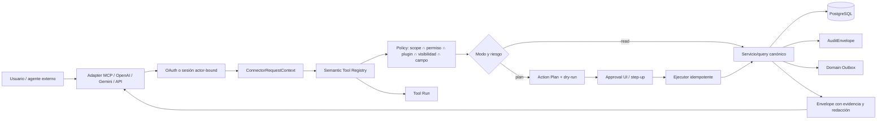
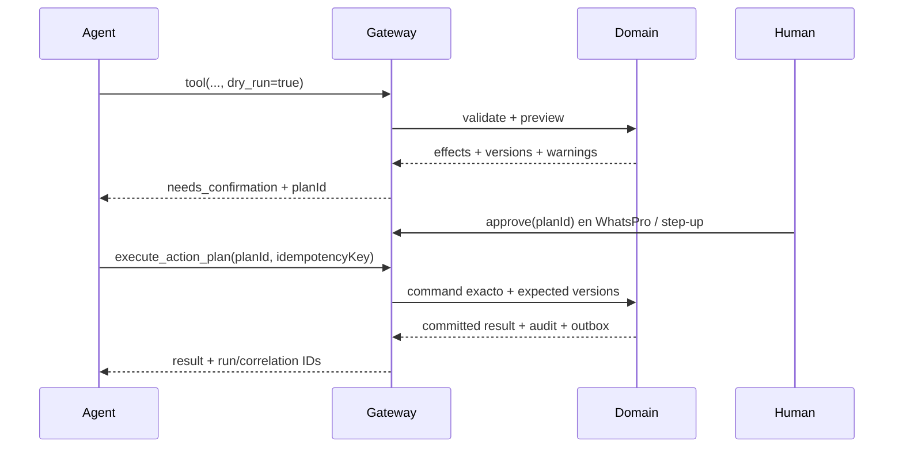

# IA y Conectores

> Auditoría y diseño técnico sobre el repositorio real `/root/whatsaas`, realizada el 14 de agosto de 2026. Este documento no implementa código. Aplica **REUTILIZAR → EXTENDER → RELACIONAR → ESPECIALIZAR → CREAR SOLO SI NO EXISTE**.

## 1. Decisión ejecutiva

WhatsPro ya posee tres conectores de agentes (`grok-connector`, `chatgpt-connector` y `claude-code-connector`), un servidor MCP remoto compartido, OAuth con authorization code + PKCE, una API read-only/OpenAPI, proveedores OpenAI/Gemini, tools configurables para el agente de WhatsApp y un conjunto amplio de acciones MCP. No corresponde construir una integración nueva por proveedor ni exponer los plugins empresariales como CRUD genérico.

La expansión debe crear una única **capa de capacidades semánticas de WhatsPro**, independiente del proveedor:

1. los servicios de cada dominio siguen siendo la única autoridad de lectura y mutación;
2. un registry tipado describe tools, recursos, permisos, scopes, riesgo, dry-run, confirmación e idempotencia;
3. MCP, ChatGPT, Codex, Claude, Grok y agentes propios son adaptadores del mismo registry;
4. la autorización efectiva es siempre la intersección entre conexión, miembro, plugin, entidad y campo;
5. toda acción sensible sigue el ciclo inspeccionar → planificar/dry-run → aprobar → ejecutar → auditar;
6. el modelo nunca ejecuta SQL, no recibe secretos y no decide por sí mismo una aprobación;
7. el outbox/inbox de `80-integracion-eventos.md` transporta hechos de dominio, mientras los runs y approvals del gateway dan trazabilidad al comando del agente;
8. las herramientas semánticas devuelven evidencia, frescura, calidad y datos faltantes antes de una narrativa.

Prioridades de seguridad antes de ampliar el catálogo:

- eliminar la vinculación hardcodeada a `noelia@whatspro.uno` y ligar cada conexión al usuario autenticado que la inicia;
- aplicar scopes reales a cada recurso/tool; hoy `whatspro:read` y `whatspro:write` son demasiado amplios;
- impedir que el catálogo read-only y las tools genéricas salten permisos, `chatVisibility` o ACL de documentos;
- reemplazar `confirm: true` por una aprobación verificable vinculada al plan exacto;
- hacer durable y estructurada la auditoría de tool runs;
- cifrar o externalizar las API keys IA, hoy persistidas como texto;
- prohibir mutaciones concurrentes dentro de un batch JSON-RPC hasta garantizar orden e idempotencia.

## 2. Evidencia del repositorio real

### 2.1 Configuración, sesiones y proveedores IA

| Evidencia | Capacidad confirmada | Límite confirmado |
|---|---|---|
| `lib/db/schema.ts` — `ai_configs` | Una configuración por team, provider/model, prompt, attachments, temperatura y tokens máximos. | `apiKey` es `text`; solo OpenAI/Gemini; no hay secret reference, versión de prompt ni política por caso de uso. |
| `lib/db/schema.ts` — `ai_sessions` | Historia/status vinculados a un chat. | No tiene `teamId`, provider/model/run/costo; pertenece a conversación WhatsApp y no debe reutilizarse para reuniones o agentes internos. |
| `lib/db/schema.ts` — `ai_tools` | Tools configurables por team con acciones y mensaje final. | Son tools del agente que atiende al contacto, no capacidades empresariales internas; `confirmationMessage` se envía después de ejecutar. |
| `lib/plugins/ai-chat/service.ts` | Selecciona OpenAI/Gemini, conserva 20 mensajes, ejecuta tool calls hasta cinco vueltas y permite handover humano. | Las tools se ejecutan inmediatamente; no hay permiso del actor humano, dry-run común, aprobación, run durable ni idempotencia general. El debounce vive en un `Map` de proceso. |
| `lib/plugins/ai-chat/tools.ts` | Acciones compuestas: etapa CRM, agente, campo, nota, tag, media y automatización. | Una tool puede ejecutar varias acciones secuenciales y quedar parcialmente aplicada; no hay transacción ni compensación común. |
| `providers/openai.ts` y `providers/gemini.ts` | Tool calling, adjuntos y audio/multimodal. | OpenAI usa Chat Completions; Gemini puede descargar URLs remotas. No existe allowlist/defensa SSRF común, política de tamaño/retención ni telemetría de tokens/costo. |
| `server/structured-output.ts` | Extrae JSON y valida resultado con Zod. | El contrato se obtiene buscando llaves en texto, no mediante structured output nativo; no persiste run, fuentes, prompt version o reintentos. |

`app/api/chats/[id]/ai-summary`, `improve-reply` y `app/api/drafts/generate` demuestran reutilización del proveedor del team para asistencia puntual. Este provider adapter sí se extiende; no se reutiliza el loop de atención al contacto como motor de administración empresarial.

### 2.2 API read-only y OpenAPI

`app/api/readonly/v1/[[...path]]/route.ts`, `lib/readonly-api/auth.ts`, `catalog.ts` y `openapi.ts` ofrecen:

- bearer token `ro_live_*`, secreto almacenado solo como SHA-256;
- expiración, revocación, último uso y scopes JSON;
- CORS, OpenAPI 3.1, catálogo y guía para IA;
- paginación de hasta 100 filas;
- filtrado tenant por `teamId` directo o relación padre;
- exclusión manual de algunas credenciales.

Brechas confirmadas:

1. `authenticateReadOnlyApi()` devuelve `scopes`, pero la ruta no los evalúa. `read:*` es informativo.
2. El contexto no devuelve `createdBy`; por tanto, las consultas no revalidan membership, permisos actuales, `chatVisibility` ni plugin activo.
3. El catálogo expone chats completos, mensajes, contactos/notas, documentos completos, AI prompts, tasks, finanzas y otros recursos a cualquier token válido del team.
4. La exclusión de columnas es una denylist manual; un campo sensible nuevo puede quedar expuesto por defecto.
5. `listReadOnlyResource()` aplica tenant, pero no políticas de entidad/campo. Conocimiento ya identificó que esto saltaría sus ACL.
6. El MCP reutiliza directamente este catálogo, por lo que hereda la misma amplitud.
7. Los rate limits viven en memoria; no coordinan réplicas y se reinician con el proceso.

La API read-only se conserva para exportación/controlada y compatibilidad, pero deja de ser la fuente principal de razonamiento de los agentes. Debe migrar a proyecciones allowlist y scopes exigibles.

### 2.3 MCP compartido

`app/api/plugins/grok-connector/mcp/route.ts` implementa Streamable HTTP MCP stateless con protocolo `2025-06-18`. Las rutas de ChatGPT y Claude importan directamente sus handlers; esto confirma que ya existe un buen punto único de transporte.

Catálogo actual:

- discovery/lectura: `whatspro_list_resources`, `whatspro_list_records`, `whatspro_get_record`, `whatspro_ai_context`;
- CRM/customer/membership: nueve actions en `server/actions.ts`;
- administración genérica: veintidós actions en `server/extended-actions.ts`, incluida `whatspro_delete_record` irreversible;
- automatizaciones: guía, inspección, folders, flow, node y edge en `server/automation-actions.ts`.

Hallazgos:

- `tools/list` muestra todas las actions si existe el scope global `whatspro:write`; no filtra por permisos efectivos, plugin o sensibilidad.
- las lecturas reciben solo `teamId`; ignoran `userId` y visibilidad del miembro;
- las mutaciones sí llaman `assertPermission()` y algunas comprueban plugin activo, pero cada handler decide de forma ad hoc;
- el audit actual guarda el ID de entidad en `activity_logs.ipAddress`;
- el batch JSON-RPC ejecuta mensajes con `Promise.all`; dos writes pueden correr en paralelo y reordenarse;
- los errores son texto libre dentro de `isError`, sin códigos estables, retryability ni correlation ID;
- el endpoint permite CORS `*`, válido para un bearer resource, pero exige redacción estricta y resource binding correcto.

### 2.4 Patrón valioso de automatizaciones

`lib/plugins/grok-connector/server/automation-actions.ts` es la mejor base actual para acciones de alto impacto:

- `whatspro_automation_guide` publica el catálogo real de nodos y propiedades;
- `whatspro_inspect_automation` devuelve grafo, versión y análisis;
- `whatspro_replace_automation_flow` separa `validate` de `save`;
- usa el catálogo/schema/normalizer compartidos de Automation;
- exige `expected_updated_at` para guardar;
- actualiza el grafo atómicamente;
- detecta conflictos de versión;
- desactiva o impide activar flujos que requieren revisión manual.

Este patrón se generaliza a todos los dominios. No se copia su `confirm: boolean`: borrar/activar/mover dinero necesita una aprobación emitida por WhatsPro y ligada al hash del plan.

### 2.5 OAuth y conexiones

`lib/plugins/grok-connector/server/oauth.ts`, los endpoints bajo `app/api/plugins/grok-connector/oauth` y `app/.well-known/*` ya implementan:

- dynamic client registration para clientes públicos;
- authorization code de un solo uso;
- PKCE S256 obligatorio;
- resource indicator ligado al endpoint MCP;
- access tokens de una hora y refresh tokens de 30 días;
- secretos/códigos almacenados con SHA-256;
- rotación de refresh token y revocación por familia;
- link code temporal;
- activación user-scoped mediante `team_member_plugins`;
- metadata de authorization server/protected resource.

Brechas:

- Grok, ChatGPT y Claude están restringidos por constantes a `noelia@whatspro.uno`; `resolveGrokTarget()` selecciona globalmente esa identidad. No es multiusuario ni apto para los demás tenants.
- Las tablas y secretos se llaman `grok_*`, aunque ya son compartidos por tres conectores.
- Solo existen `whatspro:read` y `whatspro:write`; `scopesForResource()` devuelve ambos para cualquier resource.
- Si un authorize request omite `scope`, pide lectura y escritura.
- El consentimiento describe familias amplias, no tools/campos sensibles concretos.
- La reutilización de un refresh ya usado devuelve `invalid_grant`, pero no revoca automáticamente toda la familia como señal de posible robo.
- DCR y rate limiting usan memoria local.
- El access token mantiene prefijo `grok_access_` para todos los adaptadores.

Claude además ofrece un token legacy de 90 días en `read_only_api_tokens` para STDIO. Es read-only, pero conserva todas las brechas de permisos del catálogo. El remote MCP con OAuth debe ser el camino recomendado para Claude y Codex; un PAT/STDIO futuro debe ser actor-bound y con scopes granulares.

### 2.6 Permisos, plugins y auditoría

`lib/permissions.ts` tiene permisos por dominio y `chatVisibility`; `lib/plugins/core/registry.ts` resuelve activación system/global/user/hybrid por team/miembro. Los conectores son plugins `activationMode: 'user'`. Estas piezas deben reutilizarse en cada request.

`activity_logs` solo guarda team, usuario, acción, timestamp e `ipAddress`, con FK de usuario `ON DELETE CASCADE`. No soporta de forma durable:

- actor connector/client/token;
- tool/version/risk;
- before/after o resumen del efecto;
- correlation/causation/idempotency;
- input/output redacted/hash;
- plan/approval;
- latency/provider/model/costo;
- fallos o intentos.

`80-integracion-eventos.md` separa correctamente auditoría de eventos: el tool run registra quién solicitó/ejecutó; el outbox registra qué hecho ocurrió para otros plugins.

### 2.7 Tests y migraciones

No se encontraron tests específicos para OAuth, MCP, API read-only, connector actions o el loop IA. Las tablas base de IA nacen en `0000_illegal_apocalypse.sql`; `0064_read_only_api_tokens.sql` y `0065_grok_connector.sql` agregan los conectores. Arquitectura detectó divergencia entre archivos SQL y journal, por lo que ningún número de migración nuevo se asigna hasta reconciliar el baseline real.

## 3. Aplicación del principio rector

### Reutilizar

- provider adapters OpenAI/Gemini y validación Zod;
- servidor MCP compartido y aliases de ruta por proveedor;
- OAuth authorization code + PKCE, resource binding, hash de secretos, refresh rotation y revocación;
- activación `team_member_plugins`, permisos y chat visibility;
- servicios canónicos de cada plugin;
- catálogo/schema/normalizer y validate/save de automatizaciones;
- API read-only para casos de exportación acotada;
- outbox/inbox, correlation e idempotencia de `80-integracion-eventos.md`;
- auditorías especializadas de pagos y el AuditEnvelope transversal propuesto;

### Extender

- OAuth con targets dinámicos y scopes granulares;
- el MCP compartido con registry semántico y discovery filtrado;
- contexto de request con actor, conexión, permisos, plugins y policy de campos;
- dry-run/expected version/idempotency como contrato común;
- API read-only con actor y enforcement de scopes/policies;
- proveedores IA con secret storage, prompt version, model runs, cuotas y redacción;
- automatizaciones para usar approval receipts en activación/borrado;

### Relacionar

- tool run con team, actor, client/token, plan, approval, eventos y entidades afectadas;
- resultado con fuentes canónicas, metric/revision/version y links autorizados;
- scopes OAuth con permisos internos y capacidades activas;
- plan de acción con versiones esperadas de los agregados;
- model run con sources autorizadas y el tool run que lo originó;

### Especializar

- tools semánticas por intención de negocio;
- policies por riesgo/dominio/campo;
- adapters MCP/OpenAI/Gemini y futuros providers;
- recursos de conocimiento, métricas y entidades con proyecciones seguras;
- approvals financieras, publicación documental y activación de automatizaciones;

### Crear solo si no existe

- registry común de tools/capabilities en código;
- tool runs durables;
- planes y aprobaciones verificables;
- model-run metadata común cuando no exista un run especializado;
- scopes/capabilities granulares y policy engine de acceso.

No se crea otro backend, otra base, un tool set por proveedor, otro agente de WhatsApp, otro CRUD de entidades ni una copia de datos empresariales.

## 4. Fronteras y ownership

| Responsabilidad | Dueño |
|---|---|
| lógica de caja, movement, ticket, reunión, task, documento, métrica | servicio del dominio correspondiente |
| schema público, riesgo, permisos/scopes y adapter de una tool | registry IA/conectores, aprobado por el dominio |
| autenticación de conexión y token | Connector/Auth gateway |
| autorización de entidad/campo | permission/policy service + dominio |
| inferencia y structured output | AI provider/model-run service |
| plan y aprobación | Action Plan service; policy del dominio |
| mutación final y evento | servicio de dominio dentro de transacción |
| tool-run audit | AI Connector gateway |
| domain event | productor canónico y outbox |
| realtime | Pusher como hint; no autorización ni dominio |

Separaciones obligatorias:

- `ai_sessions` continúa siendo sesión del chat WhatsApp.
- Los runs `team_meeting_ai_runs` continúan siendo del pipeline de reuniones.
- Las revisiones/indexación de conocimiento pertenecen a Conocimiento.
- El gateway conserva metadatos comunes, no duplica outputs de cada dominio.
- Inteligencia explica y navega; sus tools no modifican Finanzas/CRM/Tasks/Tickets.

## 5. Arquitectura propuesta



Estructura sugerida, coherente con el monolito modular:

```text
lib/ai-gateway/
├── context.ts
├── registry.ts
├── schemas.ts
├── errors.ts
├── policy.ts
├── redaction.ts
├── action-plans.ts
├── approvals.ts
├── tool-runs.ts
├── model-runs.ts
└── adapters/
    ├── mcp.ts
    ├── internal.ts
    └── readonly.ts

lib/plugins/<plugin>/server/ai-tools.ts
app/api/ai/capabilities/route.ts
app/api/ai/action-plans/[id]/*
app/api/plugins/<connector>/mcp/route.ts   # aliases conservados
```

El registry es manual y versionado, como `lib/plugins/core/registry.ts`; no se hace autodiscovery mágico por filesystem.

## 6. Contratos comunes

### 6.1 Contexto de conexión

```ts
type ConnectorRequestContext = {
  teamId: number;
  actorUserId: number;
  memberRole: string;
  permissions: MemberPermissions;
  chatVisibility: 'all' | 'assigned' | 'department';
  activePluginIds: string[];
  connectorId: 'grok' | 'chatgpt' | 'claude' | 'codex' | 'internal' | string;
  oauthClientId: string | null;
  credentialId: number | null;
  scopes: string[];
  correlationId: string;
  requestId: string;
  locale: string;
  timezone: string;
};
```

Invariantes:

- `teamId` y `actorUserId` se resuelven desde la credencial/sesión, nunca desde argumentos de la tool;
- membership, permiso y activación se revalidan en cada request y nuevamente al ejecutar un plan vencible;
- desactivar el conector, quitar al miembro o revocar un permiso tiene efecto inmediato;
- un agent/service account explícito tiene identidad propia y delegación limitada; no usa un usuario ficticio;
- `correlationId` se propaga a audit, tool run, servicio, outbox y jobs derivados.

### 6.2 Definición de tool

```ts
type SemanticTool<I, O> = {
  name: string;                    // estable: whatspro_<intencion>
  version: number;
  owner: DomainId;
  description: string;
  inputSchema: ZodType<I>;
  outputSchema: ZodType<O>;
  mode: 'read' | 'plan' | 'write';
  risk: 'low' | 'medium' | 'high' | 'critical';
  requiredScopes: string[];
  requiredPermissions: PermissionRequirement[];
  requiredPlugins: string[];
  fieldPolicy?: FieldPolicyKey;
  supportsDryRun: boolean;
  idempotency: 'none' | 'optional' | 'required';
  confirmation: 'none' | 'explicit' | 'approval_receipt' | 'dual_approval';
  execute(ctx: ConnectorRequestContext, input: I): Promise<O>;
};
```

`tools/list` se genera después de evaluar contexto. Una tool no autorizada no se anuncia. Una tool parcialmente disponible devuelve capabilities/fields permitidos; no invita al modelo a probar acciones prohibidas.

### 6.3 Envelope de respuesta

```ts
type ToolResult<T> = {
  schemaVersion: 1;
  status: 'ok' | 'partial' | 'needs_confirmation' | 'queued';
  data: T | null;
  sources: Array<{
    type: string;
    id: string;
    version?: string;
    observedAt?: string;
    href?: string;
  }>;
  assumptions: string[];
  missingData: string[];
  quality?: { status: 'good' | 'warning' | 'stale' | 'error'; issues: string[] };
  freshness?: { computedAt: string; sourceWatermark?: string };
  plan?: ActionPlanSummary;
  audit: { runId: string; correlationId: string };
};
```

Reglas:

- facts, inferencias y datos faltantes quedan diferenciados;
- money usa unidades mínimas + currency o decimal string canónico, según contrato Finanzas;
- timestamps son ISO UTC y las fechas de negocio incluyen timezone;
- listas usan cursor, limit y total aproximado cuando corresponda;
- links son rutas internas autorizadas, no URLs de archivos firmadas de larga duración;
- nunca se devuelve chain-of-thought; sí evidencia verificable, reason codes y confianza calibrada.

### 6.4 Errores tipados

Catálogo mínimo:

- `invalid_arguments`;
- `unauthenticated`;
- `permission_denied`;
- `scope_required`;
- `plugin_disabled`;
- `not_found`;
- `conflict`;
- `confirmation_required`;
- `approval_expired`;
- `plan_tampered`;
- `idempotency_conflict`;
- `rate_limited`;
- `dependency_unavailable`;
- `insufficient_data`;
- `partial_failure`.

Cada error declara `retryable`, correlation/run ID y remediation segura. No expone SQL, stack, secrets ni existencia de una entidad de otro team.

## 7. Lectura, dry-run, confirmación e idempotencia

### 7.1 Clasificación de riesgo

| Nivel | Ejemplos | Ejecución |
|---|---|---|
| Bajo | búsqueda, métricas, preview, crear borrador/nota privada reversible | lectura directa; write explícito autorizado puede ejecutarse con idempotency |
| Medio | asignar ticket/tarea, actualizar agenda/perfil, solicitar ausencia | preview cuando cambia ownership/fechas; confirmación explícita y versión esperada |
| Alto | registrar cobro/pago, resolver ticket, publicar documento, aplicar outcomes, activar automatización | plan inmutable + approval receipt + idempotency + expected versions |
| Crítico | ajuste/reparto financiero, transferencia relevante, bulk external messaging, borrado irreversible | plan + step-up; posible doble aprobación según policy; nunca batch implícito |

Una tool de lectura puede ser sensible: compensación, margen, transcripción, grabación, health reasons o notas privadas exigen scope/field policy específico aunque no muten.

### 7.2 Action Plan

```ts
type ActionPlan = {
  id: string;
  teamId: number;
  actorUserId: number;
  toolName: string;
  toolVersion: number;
  normalizedInputHash: string;
  risk: string;
  effects: Array<{ entityType: string; entityId?: string; action: string; before?: unknown; after?: unknown }>;
  warnings: string[];
  expectedVersions: Array<{ entityType: string; entityId: string; version: string }>;
  requiredApproval: string;
  expiresAt: string;
  status: 'pending' | 'approved' | 'rejected' | 'executed' | 'expired' | 'cancelled';
};
```

Flujo:



`confirm: true` enviado por el modelo no prueba intención humana. Un `approvalReceipt` debe estar firmado/hasheado por servidor y ligado a team, actor, tool/version, normalized input hash, versiones, vencimiento y aprobador. Si cambia cualquier argumento o entidad, se crea otro plan.

### 7.3 Idempotencia y concurrencia

- todo create o side effect exige `idempotencyKey` estable;
- unique por `(teamId, toolName, toolVersion, idempotencyKey)` en tool runs;
- repetir la misma key/input devuelve el resultado previo; misma key/input distinto devuelve `idempotency_conflict`;
- updates usan version/`updatedAt`/sequence esperada;
- borrado se reemplaza por archive/reverse cuando el dominio lo soporta;
- efectos externos usan idempotency del proveedor o un dispatch+reconcile durable;
- batch MCP puede paralelizar solo reads; rechaza o serializa writes por conexión/correlation;
- ninguna tool aplica cientos de cambios sin preview, límite, resumen y aprobación del lote exacto.

## 8. Seguridad, scopes y multi-tenancy

### 8.1 Regla de acceso efectiva

```text
acceso efectivo = scope OAuth/PAT
                 ∩ permiso actual del miembro
                 ∩ plugin/capability activo
                 ∩ visibilidad de la entidad
                 ∩ ACL/field policy
                 ∩ policy de riesgo/aprobación
```

Un scope nunca concede un permiso interno. Un owner tampoco elude scopes concedidos a la conexión. La tool vuelve a cargar todas las entidades con `(teamId,id)` y devuelve 404 uniforme para referencias ajenas.

### 8.2 Scopes propuestos

Scopes base:

- `whatspro:tools:discover`;
- `whatspro:connection:status`.

Scopes de dominio:

| Dominio | Lectura | Escritura/especial |
|---|---|---|
| Finanzas | `finance:read`, `finance:profitability:read` | `finance:write`, `finance:post`, `finance:approve` |
| Reuniones | `meetings:read` | `meetings:write`, `meetings:process`, `meetings:transcript:read` |
| Equipo | `team:read` | `team:write`, `team:performance:read`, `team:compensation:read`, `team:compensation:write` |
| Clientes/Soporte | `customers:read`, `support:read` | `support:write`, `support:resolve`, `customers:onboarding:write` |
| Operaciones | `operations:read`, `operations:costs:read` | `operations:write`, `operations:approve`, `operations:time:write` |
| Conocimiento | `knowledge:read` | `knowledge:write`, `knowledge:publish`, `knowledge:acl:manage` |
| Inteligencia | `intelligence:read` | `intelligence:alerts:manage`, `intelligence:data-quality:read` |
| Automatizaciones | `automations:read` | `automations:write`, `automations:activate` |

Los scopes se agrupan en consent presets comprensibles, pero el token conserva la lista exacta. Los scopes legacy:

- `whatspro:read` se migra a un baseline seguro de discovery + proyecciones no sensibles, no a todos los recursos;
- `whatspro:write` no se autoexpande a nuevas actions; requiere reconectar y aprobar scopes granulares;
- tokens read-only antiguos permanecen read-only y se rotan; no se promueven.

### 8.3 OAuth generalizado

Extender las tablas actuales de forma backward-compatible:

- mantener inicialmente `grok_connector_oauth_clients/credentials` para no romper tokens;
- tratarlas en código como storage compartido y añadir `connectorId` explícito si el resource no basta;
- eliminar `resolveGrokTarget()` y constantes de email;
- iniciar link code desde la sesión del dashboard y persistir el target exacto;
- DCR crea un client no autorizado; recién el consentimiento lo liga al actor/team;
- validar redirect URIs por provider/loopback y bloquear esquemas/hosts inseguros;
- mostrar connector, scopes, dominios sensibles, acciones y duración en consent;
- revocar family al detectar reuse de refresh token;
- rate limit y abuse control compartidos/durables;
- access token nuevo con prefijo neutral, manteniendo aceptación del prefijo legacy hasta rotación;
- soportar service account solo mediante flujo administrativo explícito, scopes máximos y owner, no copiando credenciales humanas.

ChatGPT, Grok, Claude y Codex usan el mismo authorization server y resources distintos/audiences ligados a cada endpoint. El adapter no cambia los permisos ni el catálogo.

### 8.4 Políticas por entidad y campo

- chats/mensajes aplican `chatVisibility` (`all`, `assigned`, `department`);
- tickets repiten visibilidad de cliente/chat/departamento;
- conocimiento aplica ACL y, por defecto, revisión publicada vigente;
- transcripciones/grabaciones requieren consentimiento + scope específico;
- compensación, feedback privado y objetivos personales requieren permisos específicos;
- margen/costos/cuentas bancarias se redactan por policy financiera;
- agregados de personas aplican umbral mínimo cuando exista riesgo de reidentificación;
- archivos se entregan mediante metadata y URL efímera autorizada; nunca path público permanente;
- plugin desactivado elimina sus tools y recursos salvo administración explícita de instalación.

### 8.5 Prompt injection, secretos y datos

- documentos, mensajes, transcripts, páginas y attachments son **datos no confiables**, nunca instrucciones del sistema;
- tool descriptions y system policies provienen de código versionado;
- resultados recuperados se delimitan y citan;
- no se ejecutan tool names/arguments embebidos en documentos;
- API keys de `ai_configs` se cifran con envelope encryption o se reemplazan por secret reference;
- logs/audit no guardan prompts, chats, comprobantes ni outputs completos por defecto;
- attachments remotos usan allowlist, DNS/IP checks contra SSRF, tamaño, MIME, timeout y antivirus cuando corresponda;
- contenido sensible se minimiza antes de enviarlo al proveedor externo;
- provider/model y región/retención se muestran al team;
- no se guarda chain-of-thought.

## 9. Catálogo semántico por dominio

Nombres públicos estables: `whatspro_<intencion_en_snake_case>`. Los nombres sin prefijo de los informes son aliases conceptuales. Cada tool delega al servicio del dominio; ninguna arma SQL o replica una fórmula.

### 9.1 Finanzas

| Tool | Modo | Control principal |
|---|---|---|
| `whatspro_obtener_salud_financiera` | read | `finance:read`; moneda/frescura/calidad |
| `whatspro_listar_cobros_vencidos` | read | scope de cartera; cursor y saldo al corte |
| `whatspro_listar_pagos_proximos` | read | redacción de beneficiario/cuenta |
| `whatspro_proyectar_caja` | read/plan | escenario explícito; no se presenta como saldo real |
| `whatspro_obtener_rentabilidad_cliente` | read | `finance:profitability:read`; allocations/FX faltantes |
| `whatspro_obtener_rentabilidad_proyecto` | read | mismo contrato de Rentabilidad |
| `whatspro_obtener_rentabilidad_campana` | read | atribución verificada o `insufficient_data` |
| `whatspro_explicar_movimiento` | read sensible | evidencia sin secretos bancarios |
| `whatspro_obtener_conciliaciones_pendientes` | read | sin credenciales/provider payload |
| `whatspro_simular_distribucion_resultados` | plan | nunca postea; política/version |
| `whatspro_registrar_cobro` / `registrar_pago` | high write | plan, receipt, idempotency, allocations exactas |
| `whatspro_transferir_entre_cuentas` | critical write | plan + step-up/dual policy + expected balances/version |
| `whatspro_crear_cuenta_por_cobrar` / `por_pagar` | write | idempotency + source relation |
| `whatspro_revertir_movimiento` | critical write | reversa, no delete; motivo + aprobación |

No se exponen facturación fiscal, impuestos, ARCA, Marangatu o SIFEN.

### 9.2 Reuniones y Comunicaciones

| Tool | Modo/control |
|---|---|
| `whatspro_crear_reunion` | write idempotente; crea event+expediente+participantes+relaciones atómicamente |
| `whatspro_actualizar_reunion` | medium write; expected version |
| `whatspro_finalizar_reunion` | high transition; plan/confirm; publica `meeting.finished` |
| `whatspro_resumir_reunion` | read/process; run versionado, fuentes y consentimiento |
| `whatspro_extraer_compromisos` | plan; propuestas con fragmentos/confianza |
| `whatspro_crear_tareas_desde_reunion` | high write; solo outcomes aprobados, idempotency |
| `whatspro_generar_acta_reunion` | write; Documentos + revisión/vínculo |
| `whatspro_listar_reuniones_pendientes_de_seguimiento` | read filtrada |
| `whatspro_obtener_contexto_reunion` | read; transcript/recording fuera por defecto |

`whatspro_manage_calendar_event` queda para agenda general y migra al servicio Calendar; no compite con la herramienta semántica de reunión.

### 9.3 Equipo

| Tool | Modo/control |
|---|---|
| `whatspro_obtener_capacidad_equipo` | read; capacidad/carga/completitud y rango |
| `whatspro_listar_personas_disponibles` | read; horario − ausencia + agenda |
| `whatspro_recomendar_responsable` | plan; candidatos/evidencia, nunca asigna |
| `whatspro_listar_tareas_atrasadas_por_responsable` | read; assignee canónico |
| `whatspro_obtener_desempeno_equipo` | read sensible; cohort/período/fuentes |
| `whatspro_obtener_resultados_comerciales_equipo` | read; attribution pagada y moneda |
| `whatspro_obtener_objetivos_en_riesgo` | read; regla/version y faltantes |
| `whatspro_calcular_comisiones` | plan por defecto; compensation scope |
| `whatspro_listar_ausencias` | read según self/manager/HR policy |
| `whatspro_crear_objetivo_equipo` | medium write; alcance/owner/version |
| `whatspro_solicitar_ausencia` | medium write; no aprueba |
| `whatspro_actualizar_perfil_empresarial` | write; field policy |
| `whatspro_finalizar_calculo_comisiones` | high write; approval/idempotency/version |

La IA no ve datos médicos, feedback privado, compensación u objetivos personales sin scope y permiso específicos.

### 9.4 Clientes y Soporte

| Tool | Modo/control |
|---|---|
| `whatspro_obtener_salud_cliente` | read; score oficial, componentes y faltantes |
| `whatspro_listar_clientes_en_riesgo` | read/priorización; visibilidad customer |
| `whatspro_listar_clientes_sin_seguimiento` | read; interacción calificante explícita |
| `whatspro_listar_tickets_criticos` | read; departamento/chat visibility |
| `whatspro_listar_sla_incumplidos` | read; policy/version y timezone |
| `whatspro_listar_clientes_proximos_a_renovar` | read |
| `whatspro_listar_ventas_sin_onboarding` | read |
| `whatspro_obtener_contexto_ticket` | read minimizada |
| `whatspro_obtener_prioridades_postventa_del_dia` | read; razones/evidencia |
| `whatspro_triage_ticket` | plan; sugiere, no cambia prioridad/SLA |
| `whatspro_resumir_ticket` | read/process con sources |
| `whatspro_proponer_respuesta_soporte` | plan/borrador, nunca envía |
| `whatspro_detectar_problemas_recurrentes` | read analítica |
| `whatspro_generar_plan_onboarding_desde_venta` | plan/dry-run |
| `whatspro_proponer_siguiente_accion_renovacion` | plan |
| `whatspro_explicar_health_score` | read explicable |
| `whatspro_crear_ticket_desde_conversacion` | write idempotente; visibilidad chat |
| `whatspro_asignar_ticket` | medium write; expected version |
| `whatspro_crear_tareas_desde_ticket` | high write; plan + idempotency |
| `whatspro_resolver_ticket` | high transition; resolución/approval/version |
| `whatspro_crear_onboarding_desde_venta` | high write; preview + provisioning key |
| `whatspro_crear_seguimiento_renovacion` | write idempotente |

Enviar un mensaje al contacto es una capacidad separada, con preview, destinatario, canal, contenido exacto y confirmación. Nunca se oculta dentro de `resolver_ticket` o una recomendación.

### 9.5 Operaciones

| Tool | Modo/control |
|---|---|
| `whatspro_crear_proyecto_desde_venta` | plan por defecto; sale line/binding/template; execute idempotente |
| `whatspro_previsualizar_orden_desde_venta` | plan sin mutación |
| `whatspro_obtener_estado_operacion` | read; fechas, gates, calidad |
| `whatspro_listar_proyectos_en_riesgo` | read; reasons canónicos |
| `whatspro_detectar_bloqueos` | read |
| `whatspro_obtener_capacidad_equipo` | read compartida con Equipo, un solo servicio/alias |
| `whatspro_sugerir_asignacion` | plan, nunca asigna |
| `whatspro_registrar_tiempo` | write idempotente; actor/fecha/policy |
| `whatspro_solicitar_aprobacion` | write; no decide la aprobación |
| `whatspro_obtener_costos_proyecto` | read sensible Finanzas∩Operaciones |
| `whatspro_replanificar_proyecto` | plan por defecto; scope/fecha/costo/version |
| `whatspro_obtener_prioridades_operativas_del_dia` | read |

Las actions CRUD de Tasks actuales se mantienen por compatibilidad, pero migran a servicios endurecidos. No pueden saltar gates, estado canónico, visibility o relaciones Task OS.

### 9.6 Conocimiento

| Tool | Modo/control |
|---|---|
| `whatspro_buscar_conocimiento_empresa` | read; publicación vigente, ACL, citas |
| `whatspro_obtener_procedimiento` | read; SOP aplicable y versión |
| `whatspro_obtener_contexto_cliente` | read minimizada; solo documentos vinculados autorizados |
| `whatspro_listar_conocimiento_desactualizado` | read |
| `whatspro_proponer_actualizacion_documento` | plan/patch con sources |
| `whatspro_crear_borrador_de_conocimiento` | low write; nunca publica |
| `whatspro_promover_nota_a_conocimiento` | write idempotente |
| `whatspro_promover_borrador_a_conocimiento` | write idempotente |
| `whatspro_solicitar_revision_documento` | write + Task OS |
| `whatspro_publicar_documento` | high write; expected revision + approval receipt |
| `whatspro_obtener_plantilla` | read |
| `whatspro_crear_desde_plantilla` | write idempotente |

`whatspro_manage_document` continúa para documentos ordinarios; si el documento está clasificado, delega al lifecycle/ACL de Conocimiento.

### 9.7 Inteligencia y Control

| Tool | Modo/control |
|---|---|
| `whatspro_obtener_salud_empresa` | read; MetricResult, corte, calidad, moneda y capabilities |
| `whatspro_obtener_prioridades_del_dia` | read; reasons, vencimiento, owner y link |
| `whatspro_obtener_panel_direccion` | read sensible; Finance/domain intersection |
| `whatspro_obtener_panel_comercial` | read |
| `whatspro_obtener_panel_marketing` | read; attribution/freshness |
| `whatspro_obtener_panel_operaciones` | read |
| `whatspro_obtener_panel_clientes` | read |
| `whatspro_obtener_panel_equipo` | read; privacy thresholds |
| `whatspro_explicar_metrica` | read; definición/version/drilldown |
| `whatspro_comparar_periodos` | read; comparabilidad explícita |
| `whatspro_listar_alertas_activas` | read |
| `whatspro_explicar_alerta` | read |
| `whatspro_obtener_calidad_datos` | read |
| `whatspro_reconocer_alerta` | medium write; idempotency |
| `whatspro_posponer_alerta` | medium write; fecha/motivo/version |

La respuesta a “¿Cómo está la empresa?” debe tener primero estructura verificable y luego resumen. `not_supported`, `partial` e `insufficient_data` no se convierten en cero ni en afirmaciones.

### 9.8 Capacidades transversales y compatibilidad

- `whatspro_list_capabilities`: discovery filtrado por actor/conexión;
- `whatspro_describe_tool`: schema/version/riesgo/approval sin revelar tools prohibidas;
- `whatspro_get_action_plan`: estado autorizado de un plan;
- `whatspro_execute_action_plan`: ejecuta exclusivamente el plan inmutable aprobado;
- `whatspro_get_action_status`: resultado durable por run/idempotency;
- `whatspro_automation_guide` e `inspect_automation`: conservar;
- CRUD genérico: marcar como legacy y reducir progresivamente su exposición según dominio.

`whatspro_delete_record` no se publica a nuevas conexiones. Se reemplaza por comandos semánticos archive/cancel/reverse; mientras exista para compatibilidad requiere scope legacy explícito, plan, step-up y allowlist mucho más estrecha.

## 10. Recursos MCP y API read-only

Tools ejecutan intenciones; resources ofrecen contexto estable y autorizado. Recursos sugeridos:

- `whatspro://capabilities`;
- `whatspro://finance/health?as_of=...`;
- `whatspro://meetings/{id}/context`;
- `whatspro://customers/{id}/health`;
- `whatspro://operations/{id}/status`;
- `whatspro://knowledge/search?q=...`;
- `whatspro://intelligence/priorities/today`;
- `whatspro://automations/node-catalog/{type}`.

Reglas:

- todo resource pasa por el mismo context/policy engine;
- contenido completo se pagina o entrega por secciones; no dumps ilimitados;
- las URIs no codifican teamId;
- ETag/version y freshness permiten cache seguro;
- templates/prompts/documentos se tratan como data no confiable;
- no se publican outbox/inbox, credential tables o audit raw como recursos generales.

Migración de API read-only:

1. añadir actorUserId al contexto desde `createdBy` y revalidar membership;
2. enforcement real de scopes por resource/action;
3. reemplazar denylist de columnas por projection allowlist;
4. aplicar chat visibility, plugin activation y ACL;
5. dividir recursos sensibles (`messages:read`, `knowledge:read`, etc.);
6. limitar export masivo y registrar el purpose/run;
7. mantener OpenAPI para integraciones deterministas, pero recomendar MCP semántico para agentes.

## 11. Providers y agentes externos

### 11.1 Adapter único

| Consumidor | Transporte recomendado | Autenticación |
|---|---|---|
| ChatGPT | remote MCP | OAuth PKCE/resource-bound |
| Grok | remote MCP | OAuth PKCE/resource-bound |
| Claude | remote MCP; STDIO solo compatibilidad | OAuth; PAT actor-bound para STDIO |
| Codex | remote MCP o STDIO local controlado | OAuth/PAT granular |
| agentes propios | remote MCP o API interna | OAuth client/user delegation o service account administrado |
| agente WhatsApp interno | tool adapter interno separado | contexto chat/team, policy propia; no credencial OAuth externa |

Todos consumen schemas/resultados idénticos. Una diferencia de tool-calling del SDK se resuelve en el adapter, no en el dominio.

### 11.2 Model runs

Un model run común guarda:

- team, actor, purpose y owner domain;
- provider/model, prompt template/version y parámetros;
- source IDs/revisions autorizadas;
- input/output hash y redacted metadata;
- token counts/costo si el provider lo informa;
- status, attempts, latency, error code;
- correlation/tool run/event IDs;
- policy/consent version.

El output de negocio sigue en su tabla propietaria: outcome de reunión, patch de documento, triage de ticket o draft. El run común no copia contenido completo.

## 12. Auditoría, eventos y observabilidad

### 12.1 Tool run vs audit vs evento

| Registro | Responde | Contenido |
|---|---|---|
| Tool run | qué solicitó/intentó el conector | tool/version, actor/client/token, risk, timings, hashes, status |
| AuditEnvelope | quién cambió qué | entidad, before/after permitido, motivo, approval, correlation |
| DomainEventEnvelope | qué hecho ocurrió | payload mínimo para consumidores, actor/correlation/idempotency |
| Model run | qué inferencia se ejecutó | provider/model/prompt version/sources/uso/status |

Una mutación exitosa escribe audit y outbox en la misma transacción del servicio. El tool run referencia ambos. Un fallo previo a commit queda como run fallido, sin evento fantasma.

### 12.2 Eventos

Eventos del gateway, usando el outbox aprobado:

- `ai.connection.created`;
- `ai.connection.revoked`;
- `ai.tool_run.started/completed/failed` solo si un consumidor real lo necesita; la tabla sigue siendo observabilidad primaria;
- `ai.action_plan.created/approved/rejected/executed/expired`;
- `ai.model_run.completed/failed`;
- `ai.security.token_reuse_detected`;
- `ai.security.policy_denied` agregado/sanitizado.

Los eventos de negocio siguen siendo los de `80-integracion-eventos.md`: `sale.paid`, `payment.received`, `meeting.finished`, `ticket.resolved`, `task.completed`, `document.published`, etc. El gateway no vuelve a emitirlos con nombres alternativos.

### 12.3 Métricas y alertas operativas

- tool calls por connector/tool/outcome;
- latencia p50/p95/p99;
- plan→approval y approval→execute;
- denials por reason code;
- idempotency replays/conflicts;
- token issuance/refresh/revocation/reuse;
- rate limit/quota;
- model tokens/costo/error;
- output schema failures;
- actions pending/unknown/reconcile;
- redaction/SSRF/prompt-injection detections.

No usar team/user/tool args como labels métricos de cardinalidad ilimitada; esos IDs van en logs estructurados con retención y acceso controlados.

## 13. APIs propuestas

Frontera interna/WhatsPro:

| Método/ruta | Uso |
|---|---|
| `GET /api/ai/capabilities` | capabilities/tools autorizadas de la sesión |
| `GET /api/ai/tools/:name` | contrato/version/riesgo autorizado |
| `POST /api/ai/action-plans` | crear preview para una tool permitida |
| `GET /api/ai/action-plans/:id` | estado/efectos redacted |
| `POST /api/ai/action-plans/:id/approve` | aprobación humana/step-up |
| `POST /api/ai/action-plans/:id/reject` | rechazo/motivo |
| `POST /api/ai/action-plans/:id/execute` | ejecución exacta e idempotente |
| `GET /api/ai/tool-runs/:id` | status/result metadata |
| `GET /api/ai/connections` | conexiones del actor/team autorizadas |
| `DELETE /api/ai/connections/:id` | revocación familiar auditada |

Frontera MCP:

- conservar `/api/plugins/grok-connector/mcp`, `/chatgpt-connector/mcp` y `/claude-code-connector/mcp`;
- extraer implementación compartida a adapter neutral;
- opcionalmente añadir `/api/mcp` cuando los clientes lo soporten, sin retirar aliases;
- mantener well-known OAuth y protected-resource por audience;
- responder tools/resources/prompts solo si están implementados y autorizados;
- writes batch rechazados o serializados.

No se crea un endpoint genérico `POST /entities/:table` ni uno que fabrique eventos de dominio.

## 14. Modelo de datos propuesto

### 14.1 Extender storage OAuth existente

Primera etapa, sin rename destructivo:

- `grok_connector_oauth_clients`: añadir `connectorId`, `status`, `lastUsedAt`, metadata validada y redirect policy version si falta;
- `grok_connector_credentials`: añadir `connectorId`, `authorizationGrantId`, `scopeVersion`, `revocationReason`, `reuseDetectedAt` y actor/service identity explícita;
- constraints/índices compuestos por team/user/client/connector/resource;
- mantener hash-only y TTL actuales;
- adapter de compatibilidad para filas legacy derivando connector por resource.

Un rename físico a `ai_connector_*` se evalúa solo después de rotar credenciales y medir impacto. El nombre de tabla no justifica duplicarlas.

### 14.2 Extender `read_only_api_tokens`

- usar `createdBy` como actor y devolverlo en auth context;
- añadir `connectorId`/purpose, `scopeVersion`, `lastValidatedPermissionAt` opcional y revocation reason;
- scopes granulares obligatorios;
- no guardar snapshot de permisos como autoridad: se revalidan;
- tokens nuevos con expiración obligatoria; TTL menor para datos sensibles.

### 14.3 Nueva `team_ai_tool_runs`

Campos:

- `id uuid`, `teamId`, `actorUserId` nullable para service actor explícito;
- `connectorId`, `oauthClientId`, `credentialId` nullable;
- `toolName`, `toolVersion`, `mode`, `risk`, `status`;
- `correlationId`, `requestId`, `idempotencyKey`;
- `normalizedInputHash`, `redactedInput jsonb` opcional;
- `redactedResult jsonb`/`resultRef` opcional;
- `actionPlanId`, `auditEventId`, `domainEventIds jsonb`;
- `startedAt`, `completedAt`, `durationMs`, `errorCode`, `retryable`;
- unique parcial `(teamId, toolName, toolVersion, idempotencyKey)` cuando no null;
- índices `(teamId, startedAt desc)`, `(teamId,status,startedAt)`, `correlationId`.

### 14.4 Nueva `team_ai_action_plans`

- campos del contrato ActionPlan;
- normalized command cifrado o minimizado según sensibilidad;
- preview/effects redacted;
- expected versions y policy version;
- expiration/status/execute run;
- unique por plan UUID y constraint team;
- inmutabilidad de tool/input/effects tras crear; solo cambia lifecycle.

### 14.5 Nueva `team_ai_action_approvals`

- `id`, `teamId`, `planId`;
- `approverUserId`, `decision`, `authLevel`, `reason`;
- `planHash`, `policyVersion`, `decidedAt`;
- unique según policy `(planId,approverUserId)`;
- soporta doble aprobación sin guardar credenciales de step-up;
- FK/constraint que impida plan/approval cross-tenant.

### 14.6 Nueva `team_ai_model_runs`

Solo para ejecuciones sin tabla especializada suficiente:

- `teamId`, actor/purpose/domain;
- provider/model/promptVersion;
- status/attempts/tokens/cost minor+currency si aplica;
- source refs, input/output hashes, result entity ref;
- correlation/tool/event;
- timestamps/error code;
- sin prompt/output completo por defecto.

No crear otra tabla de conversación genérica. Si el producto interno necesita threads, diseñarlos después con retención/ACL explícitos.

## 15. Migraciones y rollback

### 15.1 Precondiciones

1. reconciliar 75 SQL/59 journal entries y esquema productivo;
2. aprobar `ConnectorRequestContext`, AuditEnvelope, DomainEventEnvelope y Money/FX;
3. cerrar permisos granulares de cada plugin;
4. definir secret manager/encryption y política de retención;
5. cerrar hardening de API read-only y target OAuth antes de nuevas tools sensibles.

### 15.2 Secuencia aditiva

1. introducir registry/policy en shadow mode, adaptando tools actuales sin cambiar nombres;
2. añadir contexto actor y enforcement de scope a read-only/MCP;
3. generalizar OAuth target y connector identity, manteniendo filas legacy;
4. crear tool runs;
5. crear plans/approvals;
6. crear model runs comunes;
7. agregar scopes/permisos por dominio de forma backward-compatible;
8. publicar tools read-only semánticas por etapa de plugin;
9. habilitar writes low/medium con idempotency;
10. habilitar high/critical solo después de approval UI y eventos/outbox;
11. deprecar CRUD/delete genérico y tokens legacy después de telemetría/rotación.

No backfill de tool runs ni approvals históricos: no se inventa consentimiento. Conexiones legacy se marcan como legacy y deben reconectar para recibir scopes nuevos.

### 15.3 Rollback

- feature flags por registry/domain/tool/write;
- deshabilitar ejecución manteniendo reads y planes;
- revocar/rotar scopes nuevos sin borrar credenciales/auditoría;
- volver al MCP legacy solo para tools previamente soportadas y no sensibles;
- conservar runs/plans/approvals/eventos para investigación;
- no dropear tablas con acciones pendientes o evidencia;
- corregir forward; DDL down solo en entornos efímeros o después de export/backup y verificación.

## 16. Pruebas y criterios de aceptación

### 16.1 Contratos y adapters

- schema input/output por tool/version;
- mismo resultado semántico a través de MCP, adapter interno y provider test harness;
- aliases legacy sin divergencia;
- errors tipados y redacted;
- tool discovery solo anuncia capacidades autorizadas;
- OpenAI/Gemini y futuros providers no cambian reglas de dominio.

### 16.2 OAuth y tokens

- PKCE correcto/incorrecto, code reuse y expiración;
- redirect URI exacta, loopback y hosts/esquemas inválidos;
- resource/audience mismatch;
- scope downgrade/unknown/escalation;
- refresh rotation concurrente y reuse detection revoca familia;
- revocación inmediata;
- miembro eliminado, permiso removido o plugin desactivado;
- dos usuarios/teams/conectores no comparten client/token;
- DCR/rate limit distribuido o comportamiento documentado en single instance.

### 16.3 Permisos, privacidad y tenant

- owner/admin/agent/custom permission;
- chat visibility all/assigned/department;
- customer/ticket/department scope;
- document ACL y published/draft;
- finance, compensation, transcript y health field policies;
- ID de otro team devuelve 404 sin side channel;
- tool list, call, resource y drilldown aplican exactamente el mismo scope;
- cache keys incluyen team/actor/scope/permission fingerprint/version.

### 16.4 Plans, approvals e idempotencia

- `confirm:true` sin receipt es rechazado;
- plan tampered, expirado, rechazado o ya ejecutado;
- permiso/plugin cambia entre plan y execute;
- expected version conflict;
- misma idempotency key/input devuelve resultado previo;
- misma key/input distinto falla;
- dos executes concurrentes producen un solo efecto;
- double approval exige dos personas distintas cuando policy lo indica;
- cancel/reverse/archive conserva auditoría;
- crash después del commit y antes de response converge por run/idempotency.

### 16.5 MCP y resiliencia

- initialize/ping/tools/list/tools/call y notifications;
- batch de reads permitido;
- batch con writes rechazado/serializado;
- payload/response limits y cursor;
- 429/Retry-After, timeout y retry bounded;
- process restart no pierde plan/run ya persistido;
- Pusher caído no afecta commit;
- outbox duplicado no repite side effects;
- proveedor externo queda `unknown` y se reconcilia antes de reintentar.

### 16.6 IA y seguridad adversarial

- prompt injection en documento, mensaje, transcript y attachment;
- exfiltración de secrets/PII;
- tool call escondida en contenido recuperado;
- SSRF a localhost/metadata/private IP, redirect y DNS rebinding;
- file size/MIME/path traversal/malware policy;
- malformed JSON/tool args/output schema;
- hallucinated IDs y ambiguous search devuelven candidatos;
- `insufficient_data` no se transforma en números;
- model/provider error no aplica mutación parcial;
- no chain-of-thought en logs/respuestas.

### 16.7 Suites por dominio

- Finance: minor units/currency, transfer/reversal/idempotency/dual approval;
- Meetings: consent, transcript scope, outcomes approved y task/document dedupe;
- Team: self/manager/HR, absence vs approval, compensation isolation;
- Support: chat visibility, SLA/version, resolve/reopen y send-message separation;
- Operations: sale line provisioning, dry-run parity, gates y replan conflicts;
- Knowledge: ACL, revision expected, citation y publish approval;
- Intelligence: MetricResult, freshness/quality, aggregate/drilldown scope y alert actions.

DoD: no basta compilar. Se exige schema contract, permissions, multi-tenant, scopes, redacción, approval, idempotency, audit, events, rollback, resiliencia y regresión de conectores actuales.

## 17. Fases de implementación

### Fase 0 — Bloqueantes de seguridad

- reconciliar migraciones;
- generalizar target OAuth y eliminar email hardcodeado;
- actor-bound read-only auth;
- enforce scopes/permisos/visibility/ACL;
- cifrar/secret-reference de provider keys;
- tipar errores y prohibir batch writes;
- aprobar registry, risk matrix, AuditEnvelope y approval receipt.

### Fase 1 — Gateway y lectura semántica

- registry/adapters/context/policy;
- tool runs read-only;
- discovery filtrado;
- tools de Finanzas/Reuniones ya soportadas por datos implementados;
- `obtener_salud_empresa` y prioridades solo con capabilities disponibles;
- mantener CRUD legacy detrás de scope legacy.

### Fase 2 — Plans y acciones Etapa 1

- plan/approval UI;
- idempotency/expected versions;
- actions de Finanzas y Reuniones de riesgo controlado;
- outbox/audit transaccional;
- model runs y pipeline durable.

### Fase 3 — Postventa y Operaciones

- tools de Customers/Support y Operations;
- onboarding/project provisioning;
- ticket resolution, approvals y time entries;
- visibilidad compuesta customer/chat/project.

### Fase 4 — Equipo, Conocimiento e Inteligencia

- privacy/compensation policies;
- knowledge ACL/citations/publication;
- MetricResult, alerts y priorities;
- tools de salud/prioridades completas.

### Fase 5 — Deprecación y escala

- rotar tokens/scopes legacy;
- retirar `whatspro_delete_record` y raw table dumps de agentes;
- rate limit/quota durable;
- SLO, métricas y reconciliación;
- service accounts solo si hay necesidad aprobada;
- evaluar separar workers/transport únicamente con métricas de escala.

## 18. Límites explícitos

- No implementar plugins desde este documento.
- No crear un conector distinto por provider.
- No exponer SQL ni CRUD general como interfaz principal.
- No convertir `ai_sessions` en sesión empresarial interna.
- No permitir que IA apruebe su propio plan.
- No enviar mensajes, publicar documentos, activar flujos, resolver tickets o mover dinero por inferencia silenciosa.
- No duplicar fórmulas de Finanzas/Health/Capacity/Intelligence dentro del gateway.
- No usar outbox como tool log ni tool log como domain event.
- No prometer exactly-once frente a proveedores externos.
- No exponer prompts, secretos, payloads crudos, chain-of-thought o archivos permanentes.
- No asumir que un plugin futuro está disponible: tool/capability degrada de forma explícita.

## 19. Hallazgos confirmados vs brechas de diseño

### Confirmado

- existe MCP remoto compartido por Grok/ChatGPT/Claude;
- OAuth tiene PKCE, resource binding, hash-only, TTL, refresh rotation y revocación;
- connectors son user-scoped y comprueban activación;
- actions actuales de mutación comprueban varios permisos y tenant ownership;
- Automation tiene validate/save, optimistic concurrency y revisión manual;
- API read-only tiene tenant filter, OpenAPI, paginación y secret exclusions;
- OpenAI/Gemini implementan tool calling y multimodal;
- no hay tests dedicados de connector/MCP/OAuth;
- no hay bus general actual, pero `80` define outbox/inbox PostgreSQL.

### Brechas confirmadas

- conectores restringidos a una única dirección de email;
- scopes coarse/no enforced en API read-only;
- lecturas MCP ignoran actor permissions/chat visibility/ACL;
- tool discovery muestra todo write por un único scope;
- `confirm:true` no demuestra confirmación humana;
- auditoría insuficiente y uso incorrecto de `ipAddress`;
- delete irreversible genérico;
- batch writes concurrentes;
- idempotencia y expected versions inconsistentes;
- API key IA en texto y attachments sin hardening común;
- model/tool runs no durables;
- debounce/limits en memoria;
- errores no tipados y sin correlation.

### Decisiones que requieren consolidación

- proveedor de secret storage/encryption;
- policies de step-up/doble aprobación y umbrales financieros;
- TTL/retención por tipo de run/dato;
- scopes exactos y consentimiento UX;
- política para service accounts;
- alias/rename futuro de tablas `grok_*`;
- capacidades concretas habilitadas en cada etapa según implementación real de dominios.

## 20. Riesgos y mitigaciones

| Riesgo | Impacto | Mitigación |
|---|---|---|
| hardcode Noelia | conexión de usuario/tenant incorrecto | target desde sesión y grant persistido |
| scope coarse | sobreprivilegio | scopes granulares + reconnect, sin auto-upgrade |
| raw readonly catalog | fuga de chats/documentos/finanzas | allowlist projections + actor policy |
| tool visible pero prohibida | probing/confusión | discovery filtrado |
| `confirm:true` | modelo auto-confirma | approval receipt ligado a plan/hash |
| retry sin idempotencia | duplicados financieros/operativos | unique tool run + unique destino + reconcile |
| batch paralelo | writes reordenados | reads-only parallel; writes serial/reject |
| direct DB en connector | reglas/eventos divergentes | domain services obligatorios |
| delete genérico | pérdida irreversible | archive/reverse/cancel + plan/step-up |
| prompt injection | exfiltración/acción indebida | content-as-data, policy/tool isolation, citations |
| API key plaintext | compromiso de proveedor | encryption/secret ref + rotation |
| attachment remoto | SSRF/malware/fuga | allowlist/IP checks/limits/scanning |
| audit con contenido sensible | nueva fuga/retención | hashes/redaction/source IDs |
| permission drift | ejecución tras revocación | revalidar al call y execute |
| OAuth refresh theft | sesión persistente robada | family reuse detection + revoke/alert |
| in-memory rate limit | bypass multi-replica | durable/distributed limiter |
| provider outage | acción parcial | model antes de plan; mutation deterministic; retry/run |
| migraciones divergentes | deploy inseguro | reconciliar baseline antes de DDL |
| catálogo demasiado grande | elección errónea/costo | tools semánticas/capability discovery/contextual sets |

## 21. Dependencias y decisiones para el plan maestro

### Dependencias

- **Arquitectura:** guard combinado, active team, permisos, plugin dependencies, migration baseline y AuditEnvelope.
- **Finanzas:** Money/FX, accounts/movements/allocations, profitability, reversal y approval policy.
- **Reuniones:** event details, participants, finish, outcomes y model runs.
- **Equipo:** profiles/schedules/time off/goals/assignees/attribution, compensation privacy.
- **Clientes y Soporte:** ticket/onboarding/health/renewal y chat/customer visibility.
- **Operaciones:** hardened Task OS services, gates, provisioning, versions, costs y approvals.
- **Conocimiento:** classification/revisions/ACL/search/citations/lifecycle.
- **Inteligencia:** Metric Registry/Result, quality/freshness, alerts y priorities.
- **Eventos:** PostgreSQL outbox/inbox, actor/correlation/idempotency y worker.
- **DevOps/Security:** secret encryption, scheduler/worker, rate limit, monitoring, backup/restore.

### Decisiones propuestas al coordinador

1. Un registry semántico y un gateway para todos los conectores.
2. Servicios de dominio como única vía de datos/mutación.
3. OAuth actor-bound y scopes granulares, sin auto-upgrade legacy.
4. `scope ∩ permission ∩ plugin ∩ visibility ∩ field policy` en toda operación.
5. Plan/approval receipt para high/critical; boolean confirm no sirve como consentimiento.
6. Idempotency/expected version obligatorios según modo.
7. Tool runs, AuditEnvelope y DomainEvents separados pero correlacionados.
8. Automation validate/save es patrón base a generalizar.
9. Remote MCP OAuth es transporte preferido para ChatGPT/Grok/Claude/Codex.
10. API read-only queda como exportación controlada; agentes usan tools/resources semánticos.

## 22. Informe del agente

### Archivos e informes analizados

- `docs/business-platform/00-arquitectura-actual.md`;
- `docs/business-platform/10-finanzas.md`;
- `docs/business-platform/20-reuniones-comunicaciones.md`;
- `docs/business-platform/30-equipo.md`;
- `docs/business-platform/40-clientes-soporte.md`;
- `docs/business-platform/50-operaciones.md`;
- `docs/business-platform/60-conocimiento.md`;
- `docs/business-platform/70-inteligencia-control.md`;
- `docs/business-platform/80-integracion-eventos.md`;
- `lib/db/schema.ts`, `lib/db/migrations/0000_illegal_apocalypse.sql`, `0010_ai_config_attachments.sql`, `0064_read_only_api_tokens.sql`, `0065_grok_connector.sql` y journal;
- `lib/plugins/ai-chat/service.ts`, `tools.ts`, `types.ts`, `server/structured-output.ts`, providers OpenAI/Gemini y settings actions;
- rutas AI summary/status/improve reply y draft generation;
- `lib/readonly-api/auth.ts`, `catalog.ts`, `openapi.ts` y `app/api/readonly/v1/[[...path]]/route.ts`;
- manifests/UI/access/status/link/token/revoke de Grok, ChatGPT y Claude;
- `lib/plugins/grok-connector/server/oauth.ts`, `actions.ts`, `extended-actions.ts`, `automation-actions.ts` y `dashboard.ts`;
- rutas MCP compartidas, OAuth authorize/register/token/revoke y `.well-known`;
- `lib/plugins/claude-code-connector/server/connector.ts` y su token STDIO;
- `lib/permissions.ts`, plugin registry/types/service, team/member plugin activation;
- schemas/services de Automations usados por validate/save;
- búsquedas de tests de connector/OAuth/MCP/read-only/AI.

### Archivo modificado

- `docs/business-platform/90-ia-conectores.md` (único archivo de este agente).

### Decisiones

- gateway/registry semántico provider-neutral;
- OAuth y MCP actuales se extienden, no se reemplazan;
- tools de dominio sobre servicios canónicos;
- seguridad por intersección y discovery filtrado;
- plan/approval/idempotency/version para mutaciones;
- runs/audit/eventos separados y correlacionados;
- raw CRUD/read-only relegado a compatibilidad controlada.

### Riesgos principales

- target hardcodeado, read-only sobreexpuesto, scopes coarse, confirmación no verificable, audit débil, secrets plaintext, batch write concurrente y ausencia de tests son bloqueantes para habilitar nuevos writes empresariales.
- La divergencia de migraciones impide asignar DDL de forma segura hasta reconciliar producción.
- Varias tools dependen de modelos/servicios todavía planificados; anunciarlas antes de implementarlos produciría datos falsos o mutaciones incompletas.

### Dependencias críticas

- aprobación del plan maestro sobre contratos transversales;
- Fase 0 de Eventos/Arquitectura/Seguridad;
- implementación real y DoD de cada dominio antes de exponer sus tools mutables;
- secret storage, scheduler/worker, rate limiting y observabilidad productivos.

### Próximo paso recomendado

Ejecutar únicamente la Fase 0: cerrar target OAuth multiusuario, scopes/policies, API read-only actor-bound, registry y approval receipt en shadow mode. Después publicar primero tools semánticas de lectura con contract/multi-tenant tests; no habilitar movimientos financieros, publicación, resolución, activación ni provisioning hasta tener idempotencia, auditoría, outbox y aprobaciones verificables.
